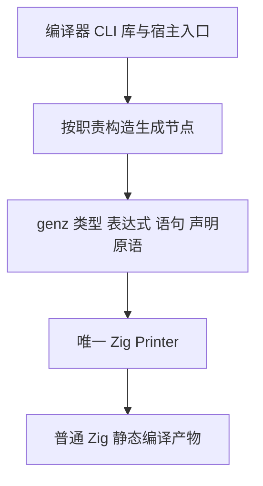
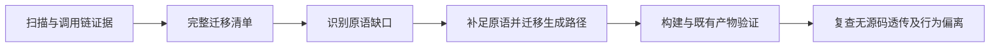

# Zig 代码生成全面原语化实施计划

## Intent：最终目标

将所有生成 Zig 代码的生产路径统一为 genz 结构化原语构造，再由 Printer 渲染。不得直接拼接 Zig 源码、套用源码模板，或整段嵌入现成实现绕过原语。

执行顺序由用户明确指定：先完成 ZX 的 async/await、parallel 和类型化 try，随后立即实施本计划。用户已授权正式源码修改，无须为启动本计划重复请求确认。

## Data：可用证据

用户指出会话 `01a10e37-8d7e-7573-9298-974077a92cb2` 已发现不符合设计原则的混合实现。已读取该会话的只读审查结论，并在当前源码中确认以下起点：

| 范围                       | 当前问题                     | 首批检查位置                                                               |
| -------------------------- | ---------------------------- | -------------------------------------------------------------------------- |
| Store 状态与生命周期       | writer 直接输出 Zig 源码     | `packages/genz/src/zx/state.zig`、`state/request.zig`、`state/reclaim.zig` |
| Gateway 路由与调用适配     | 字符串拼接 Zig 源码          | `packages/genz/src/gateway/entry.zig` 及关联模块                           |
| Gateway HTTP               | 嵌入现成 `http.zig` 源码     | `packages/genz/src/gateway/entry.zig`                                      |
| ABI 视图                   | 字符串生成导入和声明         | `packages/genz/src/zx/abi_view.zig`                                        |
| CLI 应用入口               | runner 源码直接写入 main.zig | `packages/cli/src/cli/artifacts.zig`                                       |
| 既有 RX Parallel allocator | `.source` 注入整段 Zig 实现  | `packages/genz/src/zx/parallel/allocator.zig` 及调用点                     |

这只是已有证据的起点，不能作为完整清单。实施前还要扫描 CLI、compiler、genz、宿主适配及发布路径，补全生产调用关系。

## Edges：边界与限制

- 原语必须表达 Zig 的语法和语义结构。新增 raw/source/template 节点包裹旧字符串不算完成。
- Printer 输出语法标点和关键字是它的职责；其他层不能生成完整语句后交给 Printer 透传。
- 普通字符串字面量与 ZX 模板字符串属于应用数据，不能误判为 Zig 源码模板。例如 `zx/templates.zig` 的职责是语言字符串插值。
- 原生模块本身是显式静态链接的真实源码。必须核实其角色，不能把被原样嵌入产物的 zxc 专用实现冒称为原生模块来绕过要求。
- 保持 zero runtime，不新增 zxc 专用运行库、解释器、动态加载层，也不引入用于隐藏模板的运行时封装。
- 以最小语法原语补足缺口；共享 Printer，不另建第二套文本生成框架。按独立职责分文件，避免无意义的抽象。
- 保持既有公共契约和行为；不顺手改动无关业务。遵守用户不新增测试用例、不运行全量测试、不用浏览器确认的要求。
- 当前工作区有其他会话的修改，只审阅和提交本任务所属差异。

## Answer：交付格式与成功标准

1. 在 `docs/2026-10-06/Zig代码生成全面原语化/` 建立逐项迁移记录，记录生产入口、旧生成方式、所需原语、修改文件和实际验证结果。
2. 先补充必要的 node/Builder/Printer 原语，再逐条迁移 Store、Gateway、ABI、CLI 入口和其他扫描发现的生产路径。
3. 迁移完成后删除不再使用的模板及 source 逃生入口，不保留双轨生成。
4. 构建编译器并重放既有相关产物，覆盖普通程序、Store、Gateway、并发、库发布消费及实际涉及的宿主。未运行的范围明确记录。
5. 复查全部生产源码生成调用链：生成 Zig 语法仅通过 genz 原语及 Printer 完成。不能凭文件位于 genz 包内或文本扫描空结果宣称成功。

## 自我批判与完成门槛

最大的误区是把模板从一个文件移动到另一个文件、改名成原语或隐藏在 `.source` 中。完成报告必须提供调用链和产物证据，证明生成方式已改变且行为保持。若仍存在任何未迁移的生产路径，必须明确标为未完成，不以主要路径已迁移替代“全部”的要求。

当前状态：已记录并排定紧接执行，尚未开始迁移。
