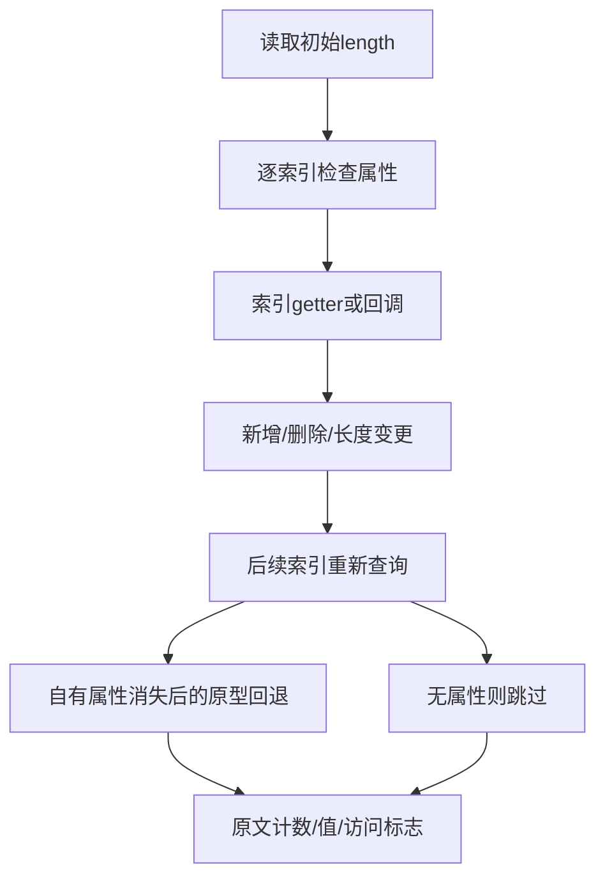

# forEach 动态元素变更审阅计划

## Intent：最终目标

逐份核对循环过程中新增、删除、原型回退、长度变化与不可配置元素的 Test262 断言，保留当前 ZX 静态列表和已撤除接口的边界。

## Data：可用证据

固定检出 7ab7fafa0003f73fc85c1b95d88094d33f7eb8bd。已全文阅读 15.4.4.18-7-{2,3,4,5,7,8,9} 七份和 -7-b- 全组十六份，共二十三份。累计已有2,375份审阅、51,222份待审阅，for_each登记127条。此前两份提交的短暂 SSH 认证失败已恢复，67d2afe0与5996fd65已成功推送。

## Edges：边界与限制

原文依赖稀疏数组、动态删除／新增属性、原型索引、getter 副作用、可覆写 length 和不可配置属性。ZX 不具有该对象模型，且 forEach 已撤除，不以纯静态列表或 loop 返回值替换后宣布适配。-7-b-16 标为 noStrict，不能强行改变其赋值失败语义。-7-b-10 删除 Object.prototype[1]，但回调中排除的是 idx===3；必须如实记录实际观察。

## Answer：交付格式与成功标准

逐份保存操作和实际断言、固定 SHA、flags 与 excluded 原因。按原模式普通23次、严格22次共45次执行原文；核对全部顶层断言、源与生成登记、路径集合和覆盖审计。只追加记录，新增ZX案例为零。完成后独立提交push。

## 执行记录

二十三份原文 SHA 均与固定索引匹配，-7-b- 全组路径集合一致。普通23/23、严格22/22次原文执行通过，不可配置元素的 noStrict 原文仅运行普通模式。顶层原文断言普通29、严格28，合计57个；固定 harness 与原文无改写。

| 原文范围   | 实际观察                                               |
| ---------- | ------------------------------------------------------ |
| 7-2..5     | 删除、截短、新增远索引、原型回退下的回调次数4／3／2／5 |
| 7-7..9     | 修改后新值可见／length0不调用／增大length仍仅2次       |
| 7-b-1..3   | 空洞与undefined、长度getter新增／删除属性              |
| 7-b-4..7   | 前一getter新增下一自有或原型属性，后续值可见           |
| 7-b-8..11  | 删除属性后的实际访问标志；b-10的idx3局限单独记录       |
| 7-b-12..13 | 删除自有索引1后回退原型值1                             |
| 7-b-14..16 | length截短、原型回退及不可配置索引保留                 |

新增23条 excluded。源与生成 for_each 登记均150条，脚本重复运行新增0，生成一致性通过。矩阵审计为80,155个目录案例、2,398份已审阅（690 adapted、103 equivalent、1,605 excluded）、51,199份待审阅、4,933个关联案例。旧127行源码字节未改，ZX案例和关联数量未增加。

本部分无生产实现修改及缺陷消息，未跑全套 Zig 回归。原文参考执行与明确语言排除分别记录，证据及指纹见同名目录。

## 自我批判

同样的计数可以来自不同对象协议，不能删除原型或getter后仅重建最终数字。上游-7-b-10断言位置与删除目标不一致，本轮保留原文并标注局限，不偷偷修正原文再称原始断言通过。无getter调用次数断言的用例不扩大为访问顺序证明，noStrict按固定元数据执行。
