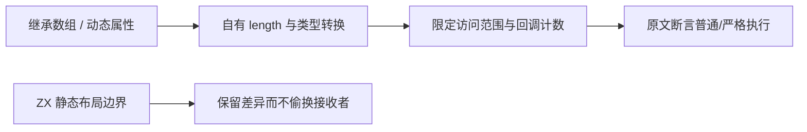

# forEach 动态对象边界审阅

## Intent

继续逐份对齐固定 Test262 原文，明确已实现 forEach 的静态列表语义与 JavaScript 动态对象模型之间的边界，不把相同最终计数冒充相同语言行为。

## Data

固定 Test262 检出 7ab7fafa0003f73fc85c1b95d88094d33f7eb8bd。已全文阅读 15.4.4.18-8-3 至 8-10，以及 8-12，共九份。它们分别覆盖继承数组的自有 length 置为 false、0、字符串零、valueOf 对象、toString 对象、空数组、单零数组、截短为 1，以及额外字符串／布尔键属性不被遍历。本轮开始时 forEach 原文审阅为八份。

## Edges

ZX 当前是静态同质列表；设计 14.3 明确排除 class/this/new/原型链及动态属性。原文中的接收者、类型转换或额外属性是核心证据，不能删除后仅返回 0／1／5 即标记 adapted。回调计数本身并不是动态对象协议的完整覆盖。

## Answer

对九份原文逐项登记 excluded 及具体原因，保留固定索引 SHA；使用 Test262 自有 sta/assert harness 在普通与严格模式执行原文，核验每份完整断言。刷新生成的审阅登记、审计全矩阵并检查生成一致性，不新增虚假的 ZX 目录案例。保存 IDEA 记录、验证证据与自我复核；作为独立部分提交 push。

## 实施结果

九份原文 SHA 与固定索引逐项匹配。使用原 Test262 sta.js 与 assert.js harness，普通／严格两种模式共 18/18 次执行通过，每次保留原文件唯一的计数断言。它们是 JavaScript 原文执行证据，不是 ZX 测试通过数。

| 原文编号末段 | 核心接收者／操作                     | 原始回调次数 | 登记     |
| ------------ | ------------------------------------ | ------------ | -------- |
| 8-3          | 继承数组实例，length = false         | 0            | excluded |
| 8-4          | 自有 length = 0 遮蔽继承长度         | 0            | excluded |
| 8-5          | length = 字符串零                    | 0            | excluded |
| 8-6          | length = valueOf 返回零的对象        | 0            | excluded |
| 8-7          | length = toString 返回字符串零的对象 | 0            | excluded |
| 8-8          | length = 空数组，经过字符串化转换    | 0            | excluded |
| 8-9          | length = 单零数组，经过字符串化转换  | 0            | excluded |
| 8-10         | 自有 length = 1 限制继承数组访问     | 1            | excluded |
| 8-12         | 数组附加字符串键和布尔键属性         | 5            | excluded |

src/data/for_each.jsonl 与生成的 upstream/reviews/built_ins/array/for_each.jsonl 同步为 17 份。原有两个 ZX 目录程序和 16 个案例未改变，生成器 --check 通过；审计结果为 80,171 个目录案例、2,265 份审阅（692 adapted、103 equivalent、1,470 excluded）、51,332 份待审阅和 4,937 个关联案例。审计只检查登记关系与数量，不证明语言执行通过。

[验证结果](forEach动态对象边界审阅/验证结果.json) 保存源码、审计与证据指纹；[原文结果](forEach动态对象边界审阅/原文结果.json) 保存两种模式和 harness 指纹。没有新生产缺陷，也未向实现会话发送消息。

## 自我批判与继续方向

这些原文有相同或相近的最终计数，却通过不同的接收者和转换路径触发行为。单看 description 中的零次回调容易误把全部用例归到现有 empty 案例；本轮保留了原型、自有属性和转换证据，明确排除整个原文。excluded 是当前明确语言边界，不表示原语义已由 ZX 实现，也不增加可执行 ZX 案例数量。

本轮仅覆盖这九份原文，不推导剩余 forEach 原文均不适用。后续继续检查核心元素访问、错误中断与访问顺序原文，按完整断言决定是否可适配；独立语言特性回归继续随实现推进。
