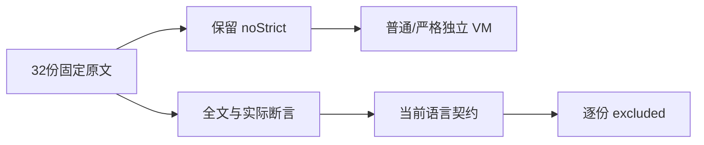
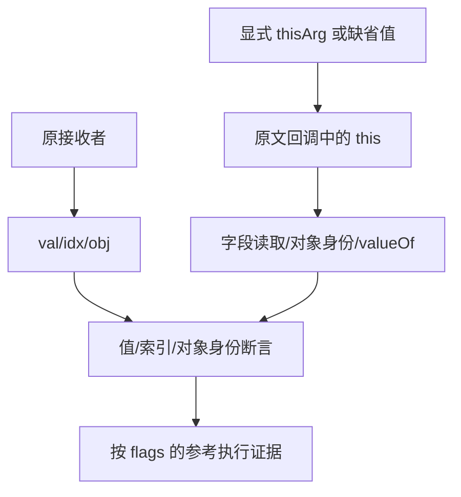

# forEach 回调绑定与参数审阅计划

## Intent：最终目标

逐份审阅 forEach 的 thisArg、严格回调、对象身份与 val/idx/obj 参数协议，保留 Test262 的运行模式约束和真实断言粒度。

## Data：可用证据

固定检出 7ab7fafa0003f73fc85c1b95d88094d33f7eb8bd。已全文阅读 15.4.4.18-5- 全组二十四份，以及 -7-c-ii-{16..23} 八份，共三十二份。此前累计 2,343 份已审阅、51,254 份待审阅，for_each 登记九十五条。forEach 已由当前语言决定撤除。

## Edges：边界与限制

-5-1-s、-5-1、-5-25 带 noStrict 标记，必须按原模式只执行普通脚本；内部 use strict 回调仍由原文保留。其他原文执行普通与严格模式。对象参数用 this.res 或 this===对象观察，原始值参数多数只用 this.valueOf 验证值，不把 description 中的包装对象描述当实际 typeof/instanceof 断言。ZX 不提供 this、原型、动态 arguments 或三实参回调协议，且 forEach 已撤除。

## Answer：交付格式与成功标准

保存三十二份原文的固定 SHA、flags、观察点与具体 excluded 原因。使用原 Test262 harness：普通三十二次、严格二十九次，共六十一次通过，保留全部原顶层断言。两组路径集合、模式集合、生成一致性与当前矩阵均校验；只追加登记并保留旧字节。完成后独立提交，SSH 认证恢复后补推等待提交。

## 执行记录

三十二份原文 SHA 与固定索引一致，-5- 组集合与固定索引完全一致。普通模式 32/32、严格模式 29/29 次通过；三个 noStrict 原文仅在普通脚本模式执行，内部严格回调保持原文。原始顶层断言普通35、严格32，合计67个。

| 原文范围                | 真实观察                                             |
| ----------------------- | ---------------------------------------------------- |
| 5-1-s、5-1、5-25        | 严格回调缺省 this 为 undefined／非严格回调的全局字段 |
| 5-2..6                  | this.res 的自有或继承字段读取                        |
| 5-7、5-9..19、5-21      | eval、函数、内建对象、arguments、全局对象身份        |
| 5-22..24、7-c-ii-16..18 | 显式原始值 thisArg 的 valueOf 保值                   |
| 7-c-ii-19               | 有索引访问但不访问非索引属性值8                      |
| 7-c-ii-20               | thisArg.threshold 字段                               |
| 7-c-ii-21..22           | 两项值／索引对应关系                                 |
| 7-c-ii-23               | 第三参数与原接收者的对象身份                         |

新增32条 excluded。源与生成 for_each 登记为127条；登记重复运行新增0，生成一致性检查通过。矩阵审计为80,155个目录案例、2,375份已审阅（690 adapted、103 equivalent、1,582 excluded）、51,222份待审阅、4,933个关联案例。旧95行源码字节保留，只追加本批。

未新增 ZX 案例、未修改生产实现、未运行全量 Zig 回归；原文参考执行不代表 ZX 支持该方法。结果、运行模式及指纹在同名目录；推送等待已报告的本机 SSH 认证恢复。

## 自我批判

三份 noStrict 原文不能被强制加严格模式，模式差异本身就是测试语义。原始值 this.valueOf 的断言无法区分严格模式中的原始值与非严格装箱对象，因此只记录保值观察。索引和值两项断言保留为两个独立观察，不压缩成一个最终 true。VM 每次隔离，原文和 harness 指纹核对固定检出。
