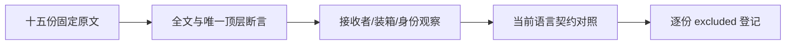
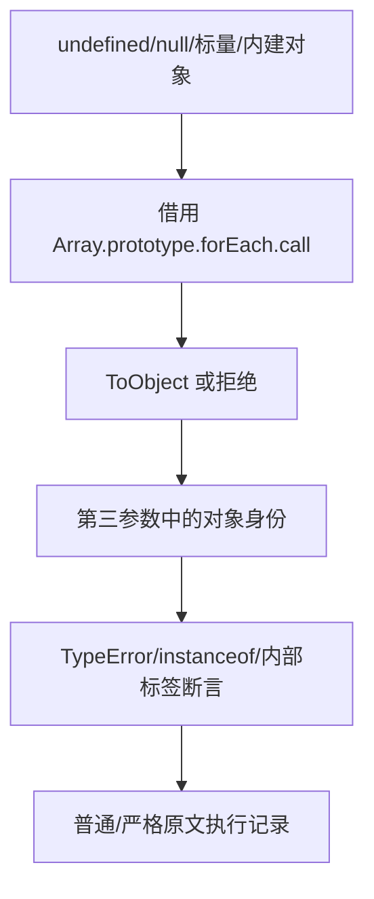

# forEach 接收者转换审阅计划

## Intent：最终目标

继续固定 Test262 原文逐份对齐，检查 forEach 借用调用对十五类接收者的拒绝、装箱和对象身份断言。保留当前 ZX 未提供该协议的明确边界。

## Data：可用证据

固定 Test262 检出为 7ab7fafa0003f73fc85c1b95d88094d33f7eb8bd。已全文阅读 15.4.4.18-1-1 至 1-15，核对实际调用、原型改写和最终断言。当前审计：80,155 个目录案例，2,274 份已审阅、51,323 份待审阅，4,933 个关联案例。forEach 已由语言设计撤除，详见 loop命名与forEach撤除回归计划.md。

## Edges：边界与限制

原文的泛型方法调用、动态接收者装箱、原型继承、instanceof、动态内建对象和 arguments 对象属于核心观察。不能将 Boolean/Number 装箱替换成 ZX 静态标量后只返回 true，也不能把不同语言的空值诊断等同于 JavaScript TypeError 构造器检查。整份原文登记 excluded，不生成伪装适配的 ZX 程序。

## Answer：交付格式与成功标准

逐份保存固定索引 SHA、原文断言数量、观察点和排除原因。使用原 Test262 sta/assert harness 在独立普通及严格上下文执行全部原文，两种模式共三十次应通过。同步 for_each 源登记与生成登记，运行生成一致性与全矩阵审计，保存结果指纹并提交 push。JavaScript 原文执行计数与 ZX 案例计数分开报告。

## 执行记录

十五份原文的 SHA 与固定索引完全一致；普通与严格模式共 30/30 次原文执行通过，每份保留 1 个顶层原断言，两种模式合计 30 次断言。原文无改写，harness 使用固定检出的 sta.js 与 assert.js，每次运行的 VM 上下文独立。

| 原文后缀         | 接收者                         | 核心观察                         |
| ---------------- | ------------------------------ | -------------------------------- |
| 1-1、1-2         | undefined、null                | 借用调用抛 TypeError             |
| 1-3、1-5、1-7    | Boolean、Number、String 原始值 | 回调第三参数为包装对象           |
| 1-4、1-6、1-8    | Boolean、Number、String 对象   | 回调第三参数保持对象类型         |
| 1-9              | 带二形参及索引的函数对象       | 第三参数 instanceof Function     |
| 1-10、1-13       | Math、JSON 对象                | 第三参数内部标签                 |
| 1-11、1-12、1-14 | Date、RegExp、Error 对象       | 第三参数 instanceof 对应构造器   |
| 1-15             | arguments 对象                 | 第三参数 [object Arguments] 标签 |

新增 15 份 excluded。for_each 源登记与生成登记均为 41 条，生成器 --check 通过，登记脚本重复执行新增 0 条。矩阵审计为 80,155 个目录案例、2,289 份已审阅（690 adapted、103 equivalent、1,496 excluded）、51,308 份待审阅、4,933 个关联案例。目录案例与关联数量不变。

本次不涉及生产实现，未运行 Zig 全套回归，未向实现会话发送消息。普通/严格 JavaScript 执行仅用于核验原文断言，不能计为 ZX 执行。验证信息及源指纹见同目录 JSON 文件。

## 自我批判

目录描述不足以证明语义；逐份记录是基于已阅读全文的接收者与断言。排除项不增加 ZX 通过数，也不声称已支持对应行为。每次运行使用新 VM 上下文，避免前一原文对原型、Math 或 JSON 的修改影响后续；原文与 harness 指纹必须与固定检出一致。
