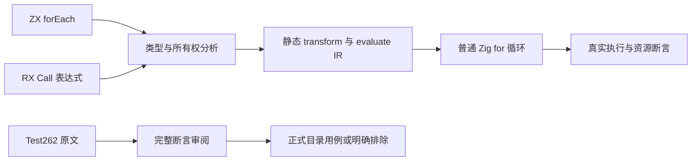
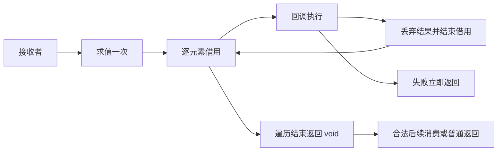

# forEach 正式回归与 Test262 首轮审阅

## Intent

验证新增顺序遍历的完整已实现契约，并将确实可对应的 Test262 原文接入目录用例：接收者只求值一次，按列表顺序执行，空列表零次，失败停止，结果固定 void，不收集结果列表，回调返回引用不延长已经结束的借用。

## Data

实现提交 `f3ce80b7`，当前检出 `2fc05a2d`。契约依据 [顺序遍历与状态迭代设计](顺序遍历与状态迭代设计.md)。第一版仅支持直接单参数、无捕获的表达式 lambda；回调结果允许 void 或普通值，遍历元素默认借用。独立调用语句必须为 void，不能无意丢弃其他普通调用结果。

编译器 ZX 分析、RX 类型推导、所有权检查和 genz 已接入 forEach；现有实施示例只证明三个字符串的输出顺序。成熟测试参考 `tests/collections/reduce` 的生成程序与 Arena/分配失败校验，以及静态构建应用的 CLI 测试。

Test262 固定版本为 `7ab7fafa0003f73fc85c1b95d88094d33f7eb8bd`。本轮已完整读取八份 forEach 原文：空数组、输入不变、空数组 undefined 返回、零正式参数、三实际参数、异构稀疏数组的参数检查、遍历时新增元素、继承数组长度转换。依据完整断言决定适配或排除，不以标题或搜索命中代替逐份审阅。

## Edges

只修改测试包与本轮文档。loop 尚在实现中，不能将其待实现状态与 forEach 混为一谈。生产缺陷发送到用户指定实现会话，由该会话修复。

不把单参数静态回调伪装为支持 JavaScript 三参数、arguments、thisArg、稀疏数组、动态 length 或可变容器；不将 void 的宿主 null 表示冒充 JS undefined。输入保持不变用例保留完整原数组和全部五个值断言；空数组观察由可失败回调及非空控制补足，明确说明观察方式的转换。

生成普通 Zig 静态程序，不引入 zxc 运行库。证明“遍历不分配结果列表”时使用预先存在的输入及不分配的回调；回调显式创建列表的分配单独验证，不把这部分语义分配误报为实现成本。所有副作用观察来自真实标准 process 输出，不模拟编译器结果。

## Answer

1. 新增深层 for_each 目录，覆盖 API 参数/类型/捕获/所有权边界、生成程序的分配和失败行为，以及 CLI 顺序、接收者单次求值、失败停止和 RX 推导。
2. 将空列表回调与输入保持不变两个 Test262 原文适配为正式 JSONL 用例；其余六份分别记录具体的静态语言边界，保留哈希与原始断言，执行原文普通/严格模式。
3. 为生成程序注册聚合入口并接入全量测试；新目录用例接入现有 callback 目录及审计。Debug、ReleaseSafe、类型检查、目录审计通过后记录结果并提交推送。

## 实施结果

新增 `test-for-each` 聚合入口，包含编译 API、四种真实生成程序、`test-for-each-catalog` 与 `test-for-each-cli`，并接入全量测试包。正式目录用例位于 `built_ins/list/callbacks/for_each/{preserve,empty}`，由独立 `generate_for_each.ts` 生成；上游审阅从对应数据文件生成，`--check` 保证可重现。

两个模式最终均退出 0，完成 42/42 构建步骤，44/44 Zig 测试全部实际执行；CLI 的三个项目测试也全部实际执行，每种模式构建三个应用并执行 25 个输入。

| 范围       | 实际验证                                                                                                                                       |
| ---------- | ---------------------------------------------------------------------------------------------------------------------------------------------- |
| 编译 API   | 12 个独立参数/类型/捕获/所有权场景；一个编译分配失败测试，生成源码含普通 for 且不含直接 allocator.alloc                                        |
| 生成程序   | 26 个测试声明；输入规模 0、1、2、17、257，借用引用返回后可消费独占父列表，显式创建回调列表时所有 OOM 点清理正确                                |
| 无结果分配 | 对标量与借用行回调禁止 Arena 的任何分配，结果仍正确，容量和成功分配数为零，且没有触发分配失败事件                                              |
| 失败行为   | 第一行和后续行索引错误必须执行并传播，不能因返回值被丢弃而消除回调；真实 stdout 前缀证明失败后没有后续元素或 done 标记                         |
| ZX CLI     | 两个应用各执行十个输入，覆盖空列表、顺序、重复、未使用列、空字符串、首/中/尾失败与长输入；接收者 helper 无论输入多少行都只输出一次 source 标记 |
| RX CLI     | 静态 void 函数接收 `Call.in` 中的 forEach 结果，再返回输入长度；五个输入覆盖正常、空列表和首/后续失败，证明丢弃计算结果不等于跳过计算          |
| 正式目录   | 7 个输入保持不变用例与 9 个空/可失败回调用例，共 16 个新增具名用例                                                                             |

类型检查、目录审计、生成器重现检查、本轮格式与 diff 检查均通过。最终目录共有 80171 个具名用例；Test262 已审阅 2256 份，其中 adapted 692、equivalent 103、excluded 1461，待审阅 51341 份。关联目录用例为 4937 个，不将 API 场景、分配失败点或应用重复执行计为新的 Test262 目录用例。

- [Debug 最终日志](forEach正式回归/Debug日志.txt)
- [ReleaseSafe 最终日志](forEach正式回归/ReleaseSafe日志.txt)
- [原文清单及哈希](forEach正式回归/原文清单.json)
- [原文普通/严格模式结果](forEach正式回归/原文结果.json)
- [目录覆盖审计](forEach正式回归/覆盖审计.json)
- [结果与源码、证据指纹](forEach正式回归/验证结果.json)

## Test262 对齐与自我复核

`15.4.4.18-8-11.js` 的原数组 `[1,2,3,4,5]`、回调返回 true 和五项不变断言全部保留，并通过完整数组深比较额外检查长度。其未使用 idx/obj 参数可省略，不移除实际被断言的行为。

`15.4.4.18-8-1.js` 只断言空数组的回调次数为零，未断言返回值或正式参数数目。本轮将外部计数观察转为可失败的索引回调，保留原空数组，并添加非空成功、空行失败等控制，防止整个 forEach 被跳过仍被误报通过。新增 ZX stdout 用例另行提供真实执行次数和顺序证据。这种观察转换不推广到明确测试零正式参数的 `7-c-ii-9`，也不覆盖 `8-13` 的 undefined 返回断言。

另外六份完整排除：稀疏数组与回调中新增元素、异构稀疏数组的三参数对象身份、arguments.length 三实参、零正式参数协议、原型继承后的动态 length 转换，以及 typeof/undefined 返回。具体原因逐份记录；不是因某个测试临时失败就排除。八份原文哈希与固定索引一致，原文普通/严格模式 16/16 次执行、30 个原始断言通过。

执行中出现的两处测试错误分别保留在 [库层首轮日志](forEach正式回归/库层首轮日志.txt)和 [RX 夹具修正前日志](forEach正式回归/RX夹具修正前日志.txt)：前者误把 Code 当作 Diagnostic 内嵌类型，后者误造了 Call.value 属性。均依据真实类型和 Schema 修正测试，不修改生产代码或放宽预期。格式命令最初工作目录错误也已在仓库根纠正；最终源码指纹只对应通过格式检查后的文件。

零分配结论只适用于不分配的回调和预先存在的输入；回调主动构造列表仍有应用语义所需分配，测试验证这些失败传播与函数结束时 Arena 清理，不宣称每轮立即回收。当前验证不覆盖全部原生副作用或未来多参数回调，不能将活动共享检出的本特性通过推断为全仓库或 loop 已完成。本轮未发现新的生产缺陷，未发送实现会话消息。
