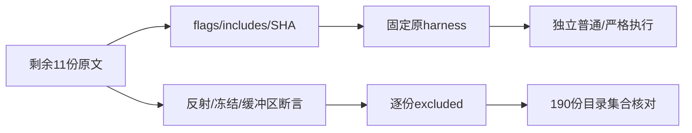
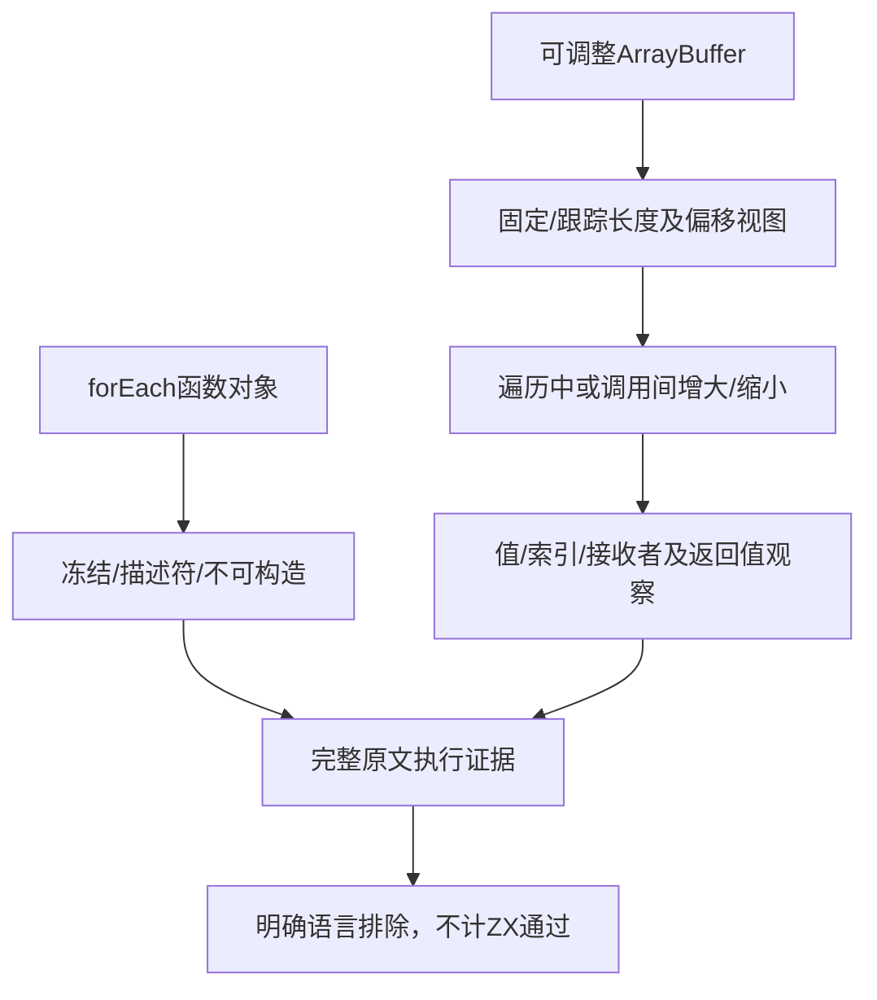

# forEach 目录收尾审阅计划

## Intent：最终目标

完成固定 Test262 forEach 目录剩余十一份原文的逐份审阅，并核对目录全部190份原文均有准确登记。保持当前语言已撤除接口的边界，不将排除等同于实现支持。

## Data：可用证据

固定检出7ab7fafa0003f73fc85c1b95d88094d33f7eb8bd。已全文阅读冻结函数对象两份、Boolean接收者返回值一份、length/name/prop-desc/not-a-constructor四份，以及可调整缓冲区四份。当前for_each登记179条，总审阅2,427、待审阅51,170。各原文的includes来自固定metadata并加载对应原harness。

## Edges：边界与限制

冻结用例没有显式assert，成功标准是完整原文正常完成；属性描述符通过verifyProperty进行多项检查。TypedArray用例包含构造器循环，源码中的assert调用点数量不等于动态执行次数；不把它们按调用点数量虚增上游案例。ZX没有可冻结动态Function对象、原型属性反射、构造器内部方法或可调整ArrayBuffer视图，且forEach已撤除。原文允许buffer.resize抛错时的分支必须保持，不把通过解释成所有宿主都允许调整大小。

## Answer：交付格式与成功标准

逐份保存SHA、flags、includes、观察与excluded原因。加载原sta/assert及明确includes，在普通和严格上下文共22次执行，检查完整原文正常完成；保存harness指纹、参考运行时版本及实际可用构造器清单。同步登记，证明全部190份路径集合与索引一致、目录待审阅为0；全矩阵审计和生成一致性检查后独立提交push。没有新增ZX适配案例。

## 执行记录

剩余十一份固定SHA全部核对一致，普通与严格模式共22/22次完整原文执行通过。冻结两份以正常完成为判据，其余保留原assert及verifyProperty辅助检查；类型数组循环的源码断言调用点不统计成动态断言执行次数。

参考运行时为Node v25.8.1。callbackfn-resize-arraybuffer的原harness实际使用10种非BigInt类型数组构造器，包含可选Float16Array；三个resizable-buffer原文的原harness使用15种构造器，包括BigInt、Float16及三个子类。构造器名称和harness指纹保存在原文结果JSON，执行次数按原文和模式计，不按构造器数量虚增上游案例。

| 原文类别          | 完整判据                                            |
| ----------------- | --------------------------------------------------- |
| 冻结函数对象2份   | 回调中冻结forEach后正常完成                         |
| Boolean接收者1份  | true与false调用均返回undefined                      |
| 反射及不可构造4份 | length/name/原型属性描述符、isConstructor及new异常  |
| 可调整缓冲区4份   | 值序列、索引、array身份、返回值及四类视图的增缩边界 |

新增11条excluded，for_each源与生成登记均190条，完整目录集合差为空，所有固定SHA匹配。目录剩余查询为0；生成一致性和登记重复执行（新增0）通过。矩阵审计为80,155个目录案例、2,438份已审阅（690 adapted、103 equivalent、1,645 excluded）、51,159份待审阅、4,933个关联案例。旧179行源码字节未改。

本轮七个分部分共补齐164份原文审阅，与此前26份构成完整190份目录登记；本部分没有新增ZX案例或生产实现修改，未跑全量Zig回归。原文执行与语言明确排除分别记录，目录闭合不能代替整个Test262目标完成。

## 自我批判

属性描述符辅助函数内部含多个断言，不能只算外层verifyProperty一个调用来声称动态断言数。冻结测试不能被遗漏为零测试，必须保留正常完成的判据。类型数组构造器由原harness依据运行时能力决定，本轮记录实际清单，不能声称涵盖此运行时不存在的可选类型。目录审阅完不表示整个Test262对齐或所有ZX特性测试已经完成。
