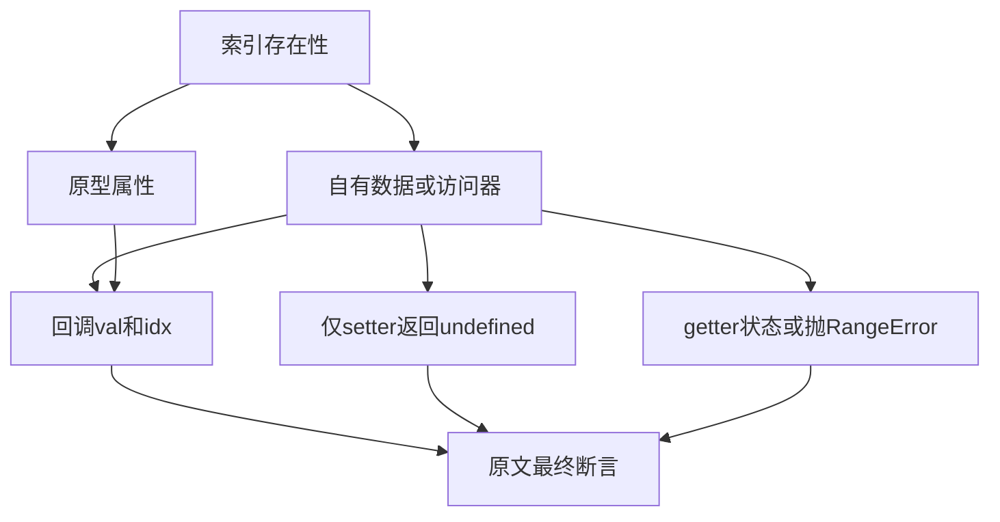

# forEach 索引属性读取审阅计划

## Intent：最终目标

逐份审阅动态索引数据属性、访问器、继承、缺少getter、arguments值与读取异常的 Test262 原文，保持完整观察和静态语言边界。

## Data：可用证据

固定检出7ab7fafa0003f73fc85c1b95d88094d33f7eb8bd。已阅读全文的15.4.4.18-7-c-i-组共二十九份：1..22、25..31；固定索引没有23、24。上一部分已有2,398份审阅、51,199份待审阅，for_each登记150条。forEach的撤除由当前语言决定及公开回归确认。

## Edges：边界与限制

原文通过特定idx与val判断属性读取、通过typeof undefined检查仅setter属性、通过getter状态与RangeError检查副作用和中断。ZX没有动态索引属性描述符、原型、arguments对象或独立undefined模型，且forEach已撤除。描述中有Array／Array-like写错的情况，以实际接收者为准。arguments两份原文虽然有called变量，最终只断言testResult，不扩大为精确次数证明。

## Answer：交付格式与成功标准

保存二十九份原文固定SHA与实际观察，按完整断言登记excluded。普通与严格模式各29次、合计58次参考执行应通过，保留全部顶层断言。验证该前缀集合与索引完全一致、源与生成登记一致、旧字节保留及当前矩阵；没有新增ZX适配案例。完成后独立提交push。

## 执行记录

二十九份原文SHA全部与固定索引相符，该前缀路径集合一致。普通29/29、严格29/29次原文执行通过，顶层断言每模式31个、合计62个；固定harness及原文没有改写。

| 原文范围 | 实际观察                                       |
| -------- | ---------------------------------------------- |
| 1..8     | 自有／继承数据属性及覆盖，指定idx处val值或身份 |
| 9..16    | 自有／继承getter及覆盖数据／getter的读值       |
| 17..22   | 索引存在且仅setter，回调val的typeof为undefined |
| 25..27   | arguments对象中指定idx对应的val与最终结果      |
| 28..29   | 前一getter状态对后一getter结果的影响           |
| 30..31   | RangeError构造器及后续访问未发生               |

新增29条excluded。源与生成for_each登记均179条，登记重复执行新增0，生成一致性通过。矩阵审计为80,155个目录案例、2,427份已审阅（690 adapted、103 equivalent、1,634 excluded）、51,170份待审阅、4,933个关联案例。旧150行源码字节保留，本批没有新增ZX目录或关联案例。

forEach目录还剩11份反射、冻结和可调整缓冲区原文，不能据此称该目录已审阅完。本部分无生产代码修改、缺陷消息或全套Zig回归。验证结果与指纹保存在同名目录。

## 自我批判

原文description只用于定位，接收者、属性形态与最终断言以源码为准。仅setter索引存在，所以值undefined仍会调用回调；不能把它与不存在索引的跳过行为混淆。读取异常原文保留RangeError构造器和后续未访问双断言，不缩减为一般错误中断。执行仍是JavaScript原文参考证据，不是ZX行为实现。
