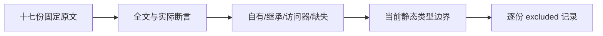
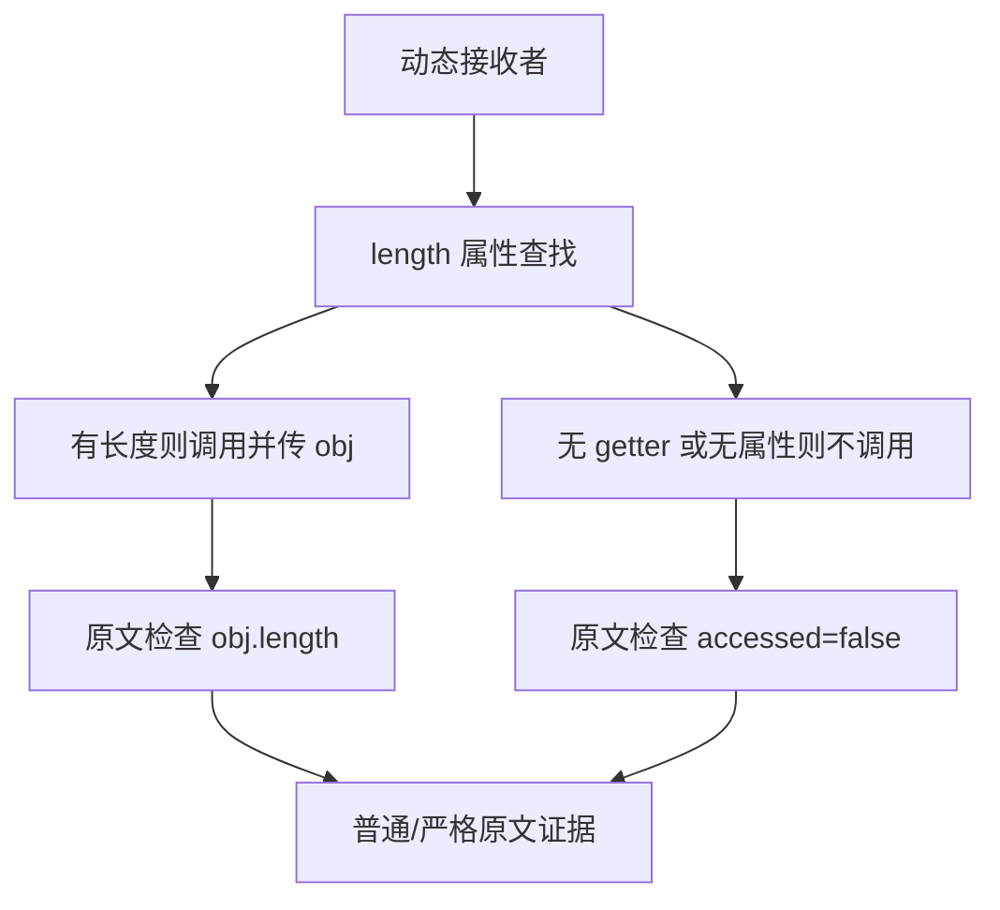

# forEach 长度属性查找审阅计划

## Intent：最终目标

逐份审阅 Test262 forEach 的 length 数据属性、访问器、继承与缺失属性原文，保留当前 ZX 明确排除的动态对象协议。

## Data：可用证据

固定原文检出 7ab7fafa0003f73fc85c1b95d88094d33f7eb8bd。已全文阅读 15.4.4.18-2-{1..14,17..19} 共十七份，索引中这一组仅有这十七份。上一部分后已有 2,289 份审阅、51,308 份待审阅。forEach 的撤除决定与公开回归见 loop命名与forEach撤除回归计划.md。

## Edges：边界与限制

原文接收者包括普通类数组对象、数组、arguments、String 和 Function 对象。属性存在用例的最终观察主要是第三回调参数的 obj.length 值；无 getter 或无 length 的用例检查回调未执行。不能据此声称原文断言了准确回调次数、getter 读取次数或完整访问顺序。ZX 静态列表长度不提供这些可覆盖、可继承或缺失的动态属性，且 forEach 已撤除，不替换接口生成适配项。

## Answer：交付格式与成功标准

保存十七份完整断言的具体观察与排除原因，核对固定索引 SHA；原 Test262 harness 在独立普通和严格上下文共三十四次执行通过。只追加登记，保留既有四十一行源码登记字节；同步生成审阅并检查一致性。全矩阵审计后保存指纹，独立提交 push，新增 ZX 案例为零。

## 执行记录

十七份原文指纹均与固定索引一致，这组路径集合与完整索引的 15.4.4.18-2- 前缀集合一致。普通和严格模式共 34/34 次原文执行通过，合计 34 个顶层断言。每次原文运行独立创建 VM 上下文，保留 sta.js 与 assert.js 的固定指纹。

| 后缀             | 属性关系                         | 实际最终观察         |
| ---------------- | -------------------------------- | -------------------- |
| 2-1、2-2         | 类数组／数组自有数据 length      | obj.length===2       |
| 2-3、2-4         | 自有数据遮蔽继承数据             | obj.length===2       |
| 2-5              | 自有数据遮蔽继承 getter          | obj.length===2       |
| 2-6              | 继承数据 length                  | obj.length===2       |
| 2-7、2-8、2-9    | 自有 getter 及覆盖数据／getter   | obj.length===2       |
| 2-10             | 继承 getter                      | obj.length===2       |
| 2-11、2-12、2-13 | 自有／继承仅 setter，无 getter   | accessed===false     |
| 2-14             | 缺失 length                      | accessed===false     |
| 2-17、2-18、2-19 | arguments／String／Function 对象 | obj.length 为2／3／2 |

新增 17 条 excluded。源与生成 for_each 登记均为 58 条；登记重复运行新增 0 条，生成一致性检查通过。矩阵审计为 80,155 个目录案例、2,306 份已审阅（690 adapted、103 equivalent、1,513 excluded）、51,291 份待审阅、4,933 个关联案例。源登记原有 41 行字节均保留，本次只追加新行。

本部分没有新增 ZX 程序，没有生产修改或实现缺陷消息，也没有运行全套 Zig 回归。JavaScript 原文执行和 ZX 目录计数分别报告；结果与指纹保存于同名目录。

## 自我批判

description 是选题线索，实际能力声明必须来自最终断言。多数存在属性用例只保留最后一次回调的长度结果，不能以它们证明所有索引访问正确；本轮登记保持原始观察粒度。VM 上下文逐次隔离，避免原型 length 改动泄漏到后续原文。原文执行证明 JavaScript 参考仍符合断言，不证明 ZX 实现了已撤除接口。
