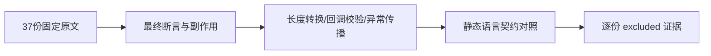
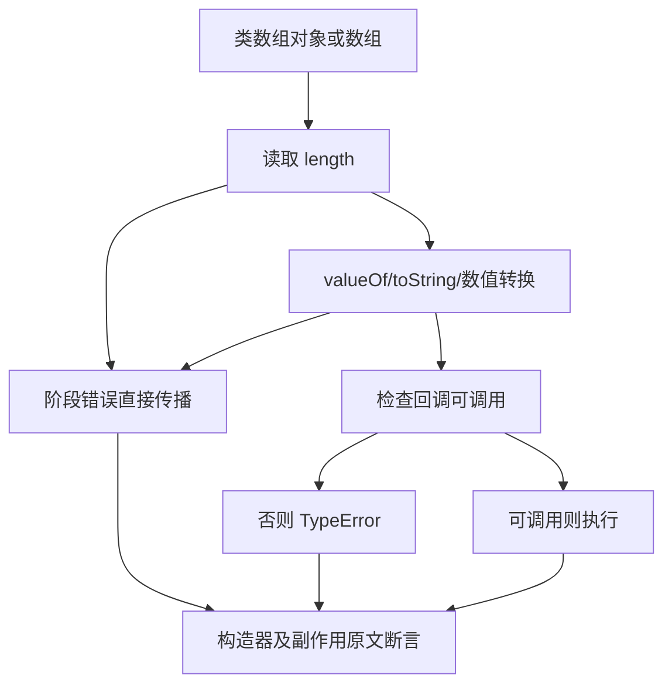

# forEach 长度转换与回调校验审阅计划

## Intent：最终目标

继续逐份核对 Test262 forEach 进入循环前的长度转换、回调可调用性及异常优先级，保持当前 ZX 静态语义与 JavaScript 动态协议的明确边界。

## Data：可用证据

固定原文检出 7ab7fafa0003f73fc85c1b95d88094d33f7eb8bd。已全文阅读 15.4.4.18-3- 组二十四份和 -4- 组十三份，共三十七份。上一部分累计 2,306 份审阅、51,291 份待审阅，for_each 登记五十八条。当前 forEach 已撤除，见 loop命名与forEach撤除回归计划.md。

## Edges：边界与限制

长度转换覆盖 undefined、布尔、零值、负数、NaN、数字字符串、valueOf/toString、继承转换方法及不可产生原始值的对象。回调校验覆盖缺省、未声明变量、不可调用值、正确函数和长度阶段错误／副作用。原文使用动态 length 与外部标志，不能替换为 ZX 显式长度或静态签名拒绝后称为适配。多数长度数值例只观察最终 val>10 标志；false 不必然证明零次调用，两个转换标志为 true 也不是完整顺序轨迹。

## Answer：交付格式与成功标准

逐份保存核心断言、固定 SHA 和 excluded 原因。原 Test262 harness 在独立普通与严格 VM 上下文中执行七十四次；保留全部顶层断言。只追加登记并同步生成审阅，检查两组路径集合与固定索引一致、生成一致性、当前矩阵与原文指纹。新增 ZX 案例为零，通过后独立提交 push。

## 执行记录

三十七份原文 SHA 全部与固定索引相符，两组路径集合与索引中的 -3-、-4- 前缀集合一致。普通与严格模式共 74/74 次实际执行通过，每种模式 46 个顶层断言，合计 92 个；每次使用独立 VM 上下文和固定 sta.js/assert.js harness。

| 原文组                                              | 实际观察                                                     |
| --------------------------------------------------- | ------------------------------------------------------------ |
| 3-1、3-3..5、3-9..10、3-14、3-18                    | accessed 标志保持 false                                      |
| 3-2、3-6..7、3-11..13、3-15..17、3-19..20、3-24..25 | 指定长度值下最终 val>10 标志                                 |
| 3-21                                                | 最终标志真，valueOf 与 toString 两个调用标志真               |
| 3-22                                                | 转换失败 TypeError 且 accessed=false                         |
| 3-23                                                | 继承 valueOf 已执行，自有 toString 未执行                    |
| 4-1..7                                              | 缺省／错误回调值的 TypeError，未声明 foo 的 ReferenceError   |
| 4-8..9                                              | 回调 TypeError 发生后长度阶段副作用可见                      |
| 4-10..11                                            | 长度 getter／转换的 Test262Error 直接传播                    |
| 4-12                                                | 正常函数回调确实访问                                         |
| 4-15                                                | 缺省回调 TypeError，length getter 已执行，索引 getter 未执行 |

新增 37 条 excluded，for_each 源与生成登记均为 95 条；脚本重复运行新增0，生成一致性检查通过。矩阵审计为 80,155 个目录案例、2,343 份已审阅（690 adapted、103 equivalent、1,550 excluded）、51,254 份待审阅、4,933 个关联案例。已有58行源码登记字节保留，仅追加本批37行。

本部分不涉及生产代码，也没有将 JavaScript 原文执行当 ZX 行为通过；没有全套 Zig 回归或缺陷通知。验证结果及指纹见同名目录。

## 自我批判

对 getter 副作用和指定异常构造器的原文保留完整断言，不能只保留 TypeError。未声明 foo 的 ReferenceError 是调用实参求值时发生，不能标成方法内部的回调拒绝。数值／字符串长度的原始最终标志不等于一般 ToLength 的完整证明；本批只登记实际观察。原文执行不代表 ZX 支持已撤除接口。
