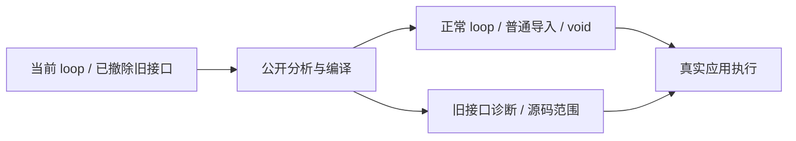

# loop 命名与 forEach 撤除回归

## Intent

使回归门禁与用户最新语言决定一致：公开内置名为 loop，旧 iterate 内置入口和 forEach 方法不再接受；普通导入函数名称不被文本匹配劫持，独立 void 调用继续有效。Test262 登记保留原文差异，不用其他操作冒充已删除方法。

## Data

实现会话中用户明确“只移除 forEach，其他不变”，后续将公开 iterate 更名为 loop。当前源码和 loop 使用参考已同步，IR 版本为 16。实现会话已移除 forEach 专属入口、16 个目录案例，并将旧两个 adapted 登记转为 excluded；验证期间为共享改动，随后实现会话已在 d5123254 提交撤除与命名迁移；本轮提交只包含测试与审阅新增内容。本轮已全文阅读九份 7-c-ii 原文，覆盖索引顺序、逐次访问、this/arguments、错误中断、前次回调修改元素，以及一／二／三正式参数。

## Edges

不重建 forEach，不通过 loop 替换后声明同一 Array 方法已实现。只新增公开接口的拒绝／保留门禁、原文审阅和验证记录，保留实现会话的撤除及改名差异由其提交。源码和诊断采用当前规则，早期通过结果保留为历史，不宣称它们验证了当前 API。

## Answer

新增 test-loop-policy，库层检查 forEach 与旧 iterate 的拒绝诊断、源码范围和分配失败，并确认 loop 与导入名遮蔽合法。CLI 验证 ZX/RX 拒绝、无应用产物与源码不变；普通导入函数 loop、旧名称 iterate 作为普通导入函数及独立 void 调用仍可真实运行。九份原文按完整断言登记 excluded，并使用原 Test262 harness 重放普通／严格模式。对齐源码数据与审阅登记，审计当前矩阵，Debug／ReleaseSafe 后记录自我批判并提交 push。

## 执行结果

| 检查                      | Debug       | ReleaseSafe |
| ------------------------- | ----------- | ----------- |
| test-loop-policy 构建步骤 | 16/16       | 16/16       |
| Zig 声明实际执行          | 4/4         | 4/4         |
| CLI 声明实际执行          | 2/2         | 2/2         |
| 预期拒绝构建              | 5/5         | 5/5         |
| 真实应用构建与成功调用    | 3 个 / 9 次 | 3 个 / 9 次 |

四个 Zig 声明覆盖四种 forEach 回调形状、旧 iterate 名称诊断、拒绝分析的全部分配失败，以及有效 loop 编译的全部分配失败。诊断范围分别是完整列表调用和旧入口标识符。CLI 包含 ZX 独立／返回调用、RX 调用、ZX／RX 旧名称；拒绝时检查没有应用产物、没有标准输出、输入源码逐字不变。三个正向应用分别验证普通导入 loop、普通导入 iterate 和独立 void 输出，每个使用 0、7、123 三个输入。

九份原文为 `15.4.4.18-7-c-ii-{4,5,6,7,8,10,11,12,13}.js`。固定 Test262 版本 `7ab7fafa0003f73fc85c1b95d88094d33f7eb8bd`，逐份 SHA 与索引相符；普通／严格模式 18/18 次实际执行、22 次断言均通过。新增九条 excluded、没有新增目录案例或 ZX 通过映射。源码登记及上游审阅共 26 条，生成器仅同步审阅，`--check` 通过。

类型检查通过。语义空行、Zig fmt、Prettier 与本轮 diff 空白检查通过。当前矩阵为 80,155 个目录案例，已审阅 2,274 份原文（690 adapted、103 equivalent、1,481 excluded），未审阅 51,323 份，关联案例 4,933 个。相对上一阶段减少的 16 个目录案例与两个 adapted 转 excluded 来自实现会话撤除 forEach，不是本轮用删案例规避失败。矩阵审计没有测量执行通过率，也没有在本轮重跑全量 Test262。

## 自我复核与边界

前三次失败来自测试预期：旧入口夹具使用了当前只在 loop 规则位置允许的 while 字段、把实际的 `unknown imported function` 猜成另一条消息、把标识符诊断范围猜成完整调用。阅读公开分析路径后修正夹具及预期，两个模式全部重跑通过；没有发现生产实现错误，因此没有向实现会话发送消息。三份失败日志保留，便于区别夹具纠正和生产修复。

本部分对 loop 的正向检查是公开编译与分配失败门禁；聚合状态、真实循环和归档执行由上一部分覆盖。本次 CLI 的名称检查使用普通导入函数，不能用它声称内置 loop 的执行语义已被此组独立验证。验证来自活动共享检出；此前 iterate 名称下的聚合回归记录保留为当时的执行证据，命名迁移后的完整组应另行执行，不能直接沿用旧日志。

文档依照 IDEA 记录目标、证据、边界和交付标准。源码指纹、命令、退出码、原文及日志指纹见同目录验证结果 JSON。提交范围限定为测试登记、测试实现、审阅同步脚本、九条新增审阅及本轮文档证据。
