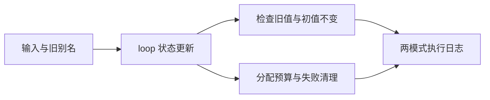

# loop 聚合与列表命名迁移验证

## Intent：最终目标

补齐当前 loop 名称下的聚合调用、不可变列表更新、归档库消费及资源门禁执行证据。历史 iterate 日志不能代替更名后的实际执行。

## Data：可用证据

生产实现 d5123254 已更名，既有 iterate_buffer 与 iterate_calls 夹具同步使用 loop。上一轮 bdb319fa 完成名称策略门禁。聚合调用与归档组原有 119 个 Zig 声明、一个 CLI 声明；列表组原有 66 个 Zig 声明。当前实现会话正在收紧 RX 值边界，本部分只有 ZX 夹具，不依赖 RX 内联调用。

## Edges：边界与限制

重用已有真实测试，不增加镜像用例、不改生产源码。本次检出允许实现会话并行工作，记录源码和日志指纹，不将结果外推为固定版本全仓库通过。列表资源预算只证明既定复用路径的累计分配约束；归档执行要求释放原分析、原库与输入归档字节后仍可独立消费。RX 编排迁移另行记录。

## Answer：交付与成功标准

执行 test-iterate-buffer 与 test-iterate-calls 的 Debug、ReleaseSafe 两种模式，核对实际 Zig/CLI 声明和真实应用执行，保留完整日志。遇真实生产问题才向实现会话报告；夹具或预期错误按最小范围修正。完成结果、自我复核与指纹后独立提交 push。

## 执行结果

Debug 与 ReleaseSafe 均退出 0：105/105 构建步骤、185/185 Zig 声明全部实际执行，一个 CLI 声明通过。185 个 Zig 声明由列表复用 66 个与聚合调用／归档链路 119 个组成。CLI 每种模式构建 12 个应用，执行 64 次调用，其中 62 次成功、2 次预期越界失败。两条消费路线仍先删除源项目及原发布目录、使用独立空缓存，再消费迁移后的编译库与再发布 manifest；源码和包文件不变检查保留。

循环次数 1 与 4096 的累计分配比较、禁用 resize 的重复比较、静态列表路径复用、旧局部／分支／跨轮别名、两个字段独立缓冲和全部分配失败清理均通过。没有新增目录案例、没有新增 Test262 原文审阅；本部分只补齐现有门禁在当前公开名称下的执行证据。

## 自我复核

这次重新执行补上此前不能从旧名称日志推断的缺口。两种模式均没有新失败，也没有发现生产缺陷，因此没有向实现会话发送消息。只有既定资源路径与输入边界获得证据，未放开的动态嵌套列表、聚合列表元素等优化不因本次通过而变成已验收。

RX 值边界在执行期间由实现会话继续调整，本组输入只有 ZX，不依赖 RX 内联调用。当前检出与编译缓存来自活动共享工作树，不能据此宣称固定 HEAD 全仓库通过。日志仅清理行尾空白和末尾多余空行；源文件及日志指纹见验证结果 JSON。本次提交只有计划与执行证据，不代提交其他会话或本轮下一部分的源码差异。
