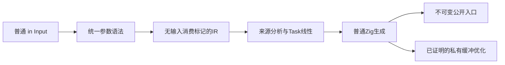
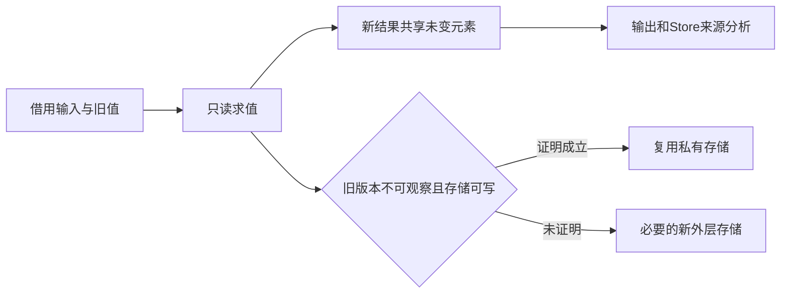

# 不可变输入与显式消费语法移除

## Intent：最终目标

移除 owned Input。所有普通 ZX 函数输入保持不可变借用；普通列表更新产生新值，不要求调用方放弃旧值。安全存储复用由编译器内部证明，不成为源码参数契约。完成后再实施 lint 禁止嵌套三元表达式和默认四空格缩进。

## Data：可用证据

用户明确要求“那就不要这个 owned Input”。当前 parser、AST、IR、链接、发布库和缓存都携带 consumes_input；ownership 根据它把参数当独占可消费数据。genz 的 reverse/sort 直接 constCast 后修改接收者；push/concat/splice 默认分配新外层数组，pop 只生成借用切片。自举 RX/ZX helper 大量使用该参数标记，不能只删关键字。

现有循环容量优化首次复制借用 seed 到私有 ArrayList，之后在静态 lane 与版本检查通过时复用；这些算法有可保留的基础，但必须脱离 owned 声明重新审计旧值观察和逃逸。

## Edges：边界与限制

- 输入不可变同时约束源码调用和公开 Zig/CLI/Wasm/NAPI 入口；不得把借用参数暗中标为 owned。
- 普通持久数据与 Task 线性资源分开：await/cancel/任务转移仍禁止同一任务被重复消费。
- 新外层容器不保证内部引用独立；输出归属、Store 来源与请求生命周期仍需分析。
- 默认 reverse/sort 复制外层缓冲；不深复制不可变元素，不添加引用计数、运行库或解释层。
- 旧消费型编译库/缓存不可重新解释为借用型；同步提升 IR 版本并保留严格版本检查。
- 不新增用例、不运行全量测试；迁移既有源码和与新语义直接冲突的既有断言。测试会话的并发修改不纳入本次提交。
- 暂停统一语义类型表迁移，不能继续依赖已被用户否定的 owned 输入设计。

## Answer：交付格式与成功标准

1. 同步移除 seed/generated header、AST/IR 与跨模块/发布契约中的输入消费标记，旧语法明确报错。
2. 保持输入的默认只读行为，集合更新不破坏旧值，保留任务线性与 Store 生命周期安全。
3. 默认生成路径正确；循环/跨 helper 私有缓冲只保留有独立版本、别名与逃逸证明的优化。
4. 批量迁移真实自举源码和当前应用示例，完成发行构建、相关现成专项及旧/新输入可观察性复核。
5. 记录证据和未覆盖边界，提交并推送；之后处理两个 lint/格式化要求。

## 当前实施

已移除 seed/generated 语法、AST/IR、模块签名、缓存与发布链的 consumes_input，并将 IR 版本同步到 22。真实 ZX 自举源码已迁移为普通 Input。尝试使用 grit text 规则后，工具报告不支持该规则语法；因此改用限定文件和精确字段的批量迁移，再以编译与本次 diff 复核。

普通持久值不再因绑定、返回或列表更新而失效；Task 根句柄仍按真实 task 类型执行移动检查。列表操作只读求值，返回来源保留共享子值和 pop/splice 切片的借用关系。reverse/sort 已改为复制外层存储。

跨 helper 缓冲审计补充了顺序版本证明：复用既有 iteration_buffer 的 version/aggregate/stale 事实与分支合流，按函数语句顺序检查输入版本、受审计子调用和所有 return。它会拒绝先计算 a=append(old)、b=append(old) 再选择 a/b 的提前求值分叉；真正互斥的分支分别检查后合流。首次复制、lane 唯一性、容器逃逸和副作用门禁继续保留。

发行构建已通过。当前编译器成功生成 program.rx 与 native.rx 的 Zig 源码，旧 owned Input 语法被拒绝。输入、字段、缓存专项通过；同次运行的取消专项暴露一个旧断言仍要求禁止对捕获列表生成反转副本，已按不可变语义调整并单独复跑通过。Task 重复 cancel/await 的拒绝断言保留。没有新增用例或跳过测试门禁。

## 验证与自我复核

- `zig build dist -Doptimize=safe -j2`：通过，构建使用现有本地 Zig archive。
- `test-owned-input test-field-ownership test-cached-ownership test-zx-cancel-analysis`：首轮 302/303 通过；失败项为上述旧列表消费断言，更新后 `test-zx-cancel-analysis` 单独通过。
- `test-iterate-buffer test-object-append test-native-references-transfers`：全部通过，覆盖私有缓冲、旧版本快照、引用槽、输入保持、分配增长与分配失败；原生引用经源码和编译库两条路径执行。
- 真实自举 program.rx、native.rx：当前发行编译器生成成功；历史 owned Input 应用：语法拒绝。

此次修正改变了普通值的语义，不能仅机械删除参数单词。对 reverse/sort 的外层复制是保证公开输入不被覆盖所必需的成本，不宣称所有集合操作都能零分配。跨 helper 复用保留专门的顺序版本证明，没有把不可变输入改成隐含的独占参数。只读审计没有发现新版本证明的可行动漏洞，但这不构成形式化证明，也不能替代尚未完成的完整自举工作。
