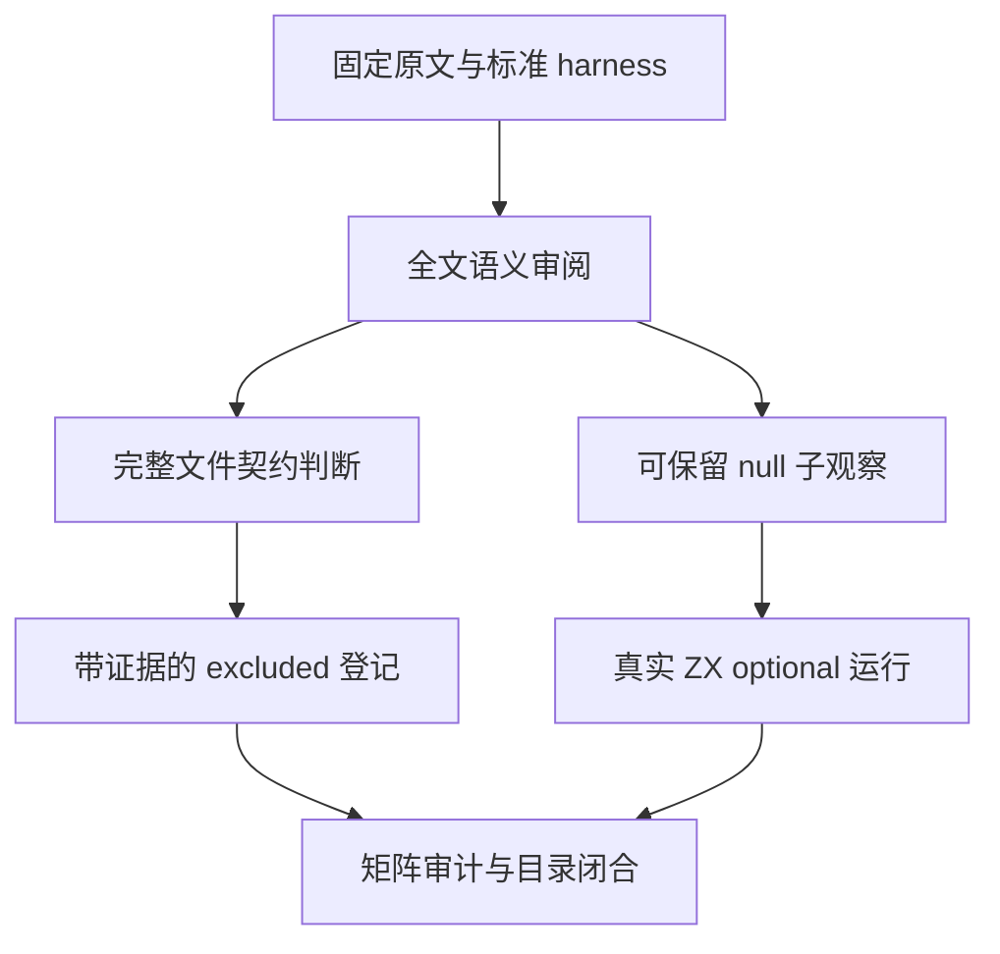
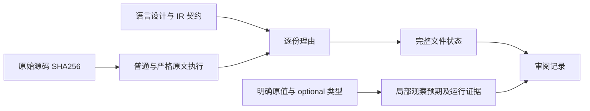

# 不等表达式目录收尾审阅计划

## Intent：最终目标

逐份审阅 does-not-equals 目录剩余 20 份 Test262 原文，明确完整观察与 zxc 现有语义的关系。保留可实际验证的 null 子观察，避免将 undefined、动态对象转换或 BigInt 的行为改写成同型标量后冒称兼容。

## Data：可用证据

固定快照为 7ab7fafa0003f73fc85c1b95d88094d33f7eb8bd，本机原文缓存已可离线读取。目录共 38 份，18 份已有登记（14 adapted、4 equivalent），剩余 20 份的逐份全文分析已完成并核对 SHA-256。

现有 compiler README 明确不提供 JavaScript 隐式转换与大整数；IR 契约只承诺固定宽度数值、同型比较及显式 optional。现有类型表没有 undefined、BigInt 或 Symbol。optional 聚合可以与 null 比较，但不提供一般聚合地址相等。

## Edges：边界与限制

按整份原文的实际观察判定，不按目录、标题或 features 字段直接排除。A7.8/A7.9 的实际操作数方向与标题相反，应以源码为准；A7.1 包含普通对象别名，不能声称全部是包装对象。

前三份包含可保留的 null 子观察，同时包含不支持的 undefined、void 运算或 eval，整份不能登记等价。八份 BigInt 原文包含超出固定宽度与浮点精确表示的比较，删除 n 或转 f64 会损失核心观察。

离线执行普通/严格原文只是确认审阅解释，不计为 ZX 兼容通过。排除须关联明确现有契约；如果实际发现已承诺语义违约，则通知实现聊天。不得通过生产硬编码满足具体原文。

## Answer：交付与成功标准

把待审清单、逐份结论、标准 harness 和源指纹、离线原文执行结果、矩阵审计、目录闭合结果写入不等表达式目录收尾审阅目录。新增 20 条完整文件 excluded 登记，明确局部 null 观察与现有或新测试的关联。

优先复用 bool false、f64 0 和 null/null 的已有 optional 用例，仅为原值尚未保存的 string "null" 和空对象 {} 增加两个 fixture、每个 null/非空两个案例。真实 Debug/ReleaseSafe 运行后才能标为局部覆盖，文件整体仍 excluded。成功后本部分单独 commit/push。

## 自我复核

静态断言数量、原文执行数量、ZX 目录案例数量和整份兼容状态分别记录。不能把 20 份 excluded 的完成称为 20 份行为适配完成，也不能将部分 null 观察覆盖称为文件整体兼容。

## 执行结果

20 份完整原文均登记 excluded，其中前三份明确保留局部 null 观察关联。固定原文普通/严格模式共 40/40 次实际执行通过；八份 BigInt 的 179 个 sameValue 调用点是静态源码数量，未当作 ZX 通过数。三个 1024 位极值字面量用独立整数公式核对为最大有限 f64 的精确整数值加 {-1,0,1}；它们转 f64 后全部相同，证明近似转换会删除核心比较。

新增字符串 "null" 和空对象 {} 的可空原值/空值对照共四个具名 JSONL 案例。连同既有 bool 九例和 f64 十六例，固定生产 `4d807ccd` 的 Debug/ReleaseSafe 各为 29/29 案例实际执行、46/46 构建步骤通过，无运行测试缓存。类型检查和新生成器 --check 通过。

首轮审计拒绝草稿中指向 expected.value 内部字段的 assertions.field；该公共审计字段仅支持 expected 的顶层字段。最终以完整 value 对象做精确一致性检查，并保留 observation_field 表明局部对应关系，未改变测试预期、未放宽审计规则。失败日志和最终审计均保留。

该目录共 38 份，最终为 14 adapted、4 equivalent、20 excluded，未审阅集合为零。全局矩阵为 80,159 个目录案例，2,459 份已审阅（690 adapted、103 equivalent、1,666 excluded），51,138 份未审阅，4,939 个关联案例。矩阵审计不测量全量执行通过率。

逐份语义、SHA-256、局部关联、原文执行、真实 ZX 日志、生成文件指纹和自我复核均见 `不等表达式目录收尾审阅/`。没有发现已承诺语言语义的生产缺陷，未通知实现聊天。下一部分优先审阅 Array.prototype.reverse 的剩余原文，并重新验证新内部布局生产版本的既有原生引用运行门禁。
