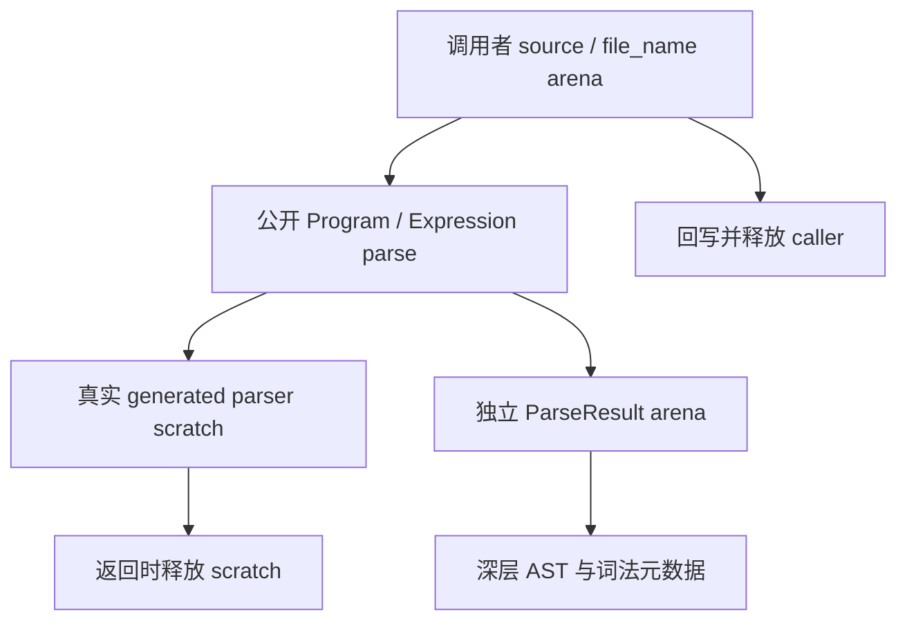
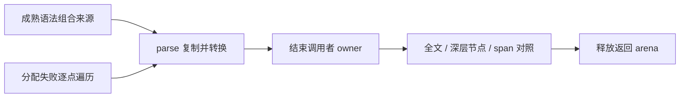

# 公开解析 AST 生命周期测试计划

## Intent：最终目标

为真实生成 Program 与独立表达式解析的结果所有权建立正式细粒度证据：调用者来源与文件名缓冲区回写并释放之后，返回 arena 内的深层 AST、词法元数据和文本仍可读取，直到结果 deinit。

## Data：可用证据

已有 language/parser_test.zig 在 parse 返回之后读取多类节点，覆盖内部 scratch 已销毁后的 AST；但来源多数是静态字面量。ParseCache 的 caller source/path 声明只回写缓冲区且未先释放，并仅检查顶部文本。generated public parse/parseExpression 复制来源与路径，adapter 分配类型、声明、导入、表达式、块及集合；需要组合证明深层文本切片与集合也归属于返回结果。

## Edges：边界与限制

测试落 compiler/tests/frontend/lifetime/，通过原 test-frontend 接线，绑定真实 frontend/generated parser。只新增 Program 与 Expression 各一个深层拥有权声明及一个分配失败声明，不引入测试通用框架、不改生产 adapter。来源借用者用独立 caller arena，回写后在 parse 返回前后规范地销毁；不提前销毁返回结果。已有 parser 的广泛语法声明保留，本部分不声称穷举全部 AST 变体，不替代诊断结果生命周期测试。

## Answer：交付格式与成功标准

按 IDEA 保存完整代码草稿、固定来源、实际 Debug/ReleaseSafe 门禁日志及指纹。各声明必须先结束 caller owner 再逐层比较来源、路径、词法 tokens/comments、类型、导入、块、调用、lambda、模板、对象和 match；分配失败遍历必须释放结果和调用者 arena。正式新增声明数与原 frontend 声明总数分开记录，独立提交 push。

## 自我批判

只读审计的“没有调用者释放后深层组合测试”不代表原 parser_test 没有 scratch 生命周期证据。两种维度必须准确区分。本部分使用组合来源验证拥有关系，不能把组合中的每个访问算作新的目录案例，也不能以程序语义分析代替对 AST 的直接读取。

## 最终执行记录

固定95854c90加本部分三份测试源码，以及独立诊断部分的测试覆盖，Debug/ReleaseSafe各28/28构建步骤、372/372完整编译器实例通过。前端各313/313实际通过、无测试缓存，原309个声明实例与新增4个声明分别记录。两份拥有权声明在source/path回写并释放caller arena之后，直接读取深层类型、导入、块、表达式集合、template片段、match及词法tokens/comments；两份OOM声明遍历全部实际分配点并检查释放。源码、完整草稿与固定检出逐字节一致，未修改生产adapter，未发现该成功结果所有权的新生产缺陷。目录矩阵与上游审阅数量不变。
