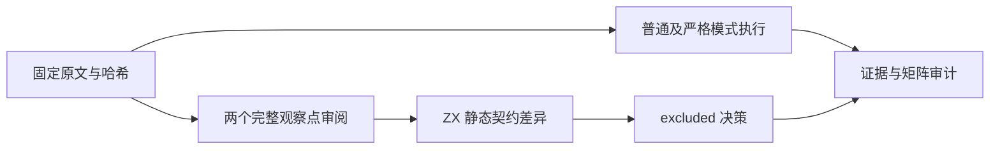
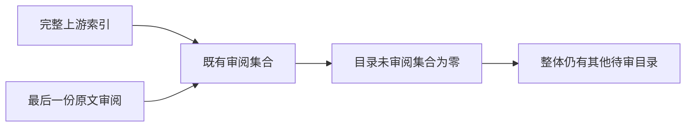

# 关系表达式目录收尾审阅计划

## Intent：最终目标

审查固定 Test262 `language/expressions/relational/` 中最后一份未登记文件 `S9.1_A1_T4.js`，保留完整原文行为和语言差异，闭合该目录的审阅集合。

## Data：可用证据

上游固定 `7ab7fafa0003f73fc85c1b95d88094d33f7eb8bd`，原文 SHA-256 为 `89427f1aa0a8d99bfd99d0fe2130fa31cc6f2275b7500aae844742defaa15498`。元数据查询确认目录仅剩此文件。

原文有两个 `if` 式检查：第一项对象的 valueOf 返回数值 -2，检查字符串 "-1" 与对象的 `<` 为 false；第二项对象的 valueOf 返回字符串 "-2"，检查对象与字符串 "-1" 的 `<` 为 false。toString 分别返回字符串 -2 和数值 -2，但原文没有调用次数或轨迹断言。

## Edges：边界与限制

ZX 使用静态操作数类型，没有对象隐式 ToPrimitive 协议。该原文依赖动态调用对象转换方法，不能改成显式数字或字符串比较并称为完整适配。登记 excluded 的依据沿用既有关系运算协议审阅与 IR/语言契约，不新增生产机制。

本机已有固定上游缓存；原文及标准 harness 全部离线读取，校验源码哈希后按普通和严格模式执行。原文执行只是理解其完整断言的证据，不表示 zxc 支持这些行为；静态检查点数量不当作运行断言计数。

## Answer：交付与成功标准

新增一份逐项审阅记录，普通/严格原文执行各通过一次，矩阵完整审计通过，目录未审阅集合为零，再独立提交并推送。源码清单、harness 指纹、原文结果、审计与闭合查询保存到 `关系表达式目录收尾审阅/`。

## 自我复核

原文只观察两次比较的布尔结果，没有证明两种转换方法的完整执行次序，不能额外宣称它覆盖所有 ToPrimitive 回退。excluded 是语言差异记录，不计入 ZX 执行通过或新增本地测试数。

## 执行结果

固定原文普通/严格模式共 2/2 次实际执行通过，标准 harness 和原文哈希均保存。矩阵审计通过：已审阅 2,439 份（690 adapted、103 equivalent、1,646 excluded），未审阅 51,158 份。目录查询 `matched_unreviewed: 0`，该关系表达式目录集合闭合。

原文结果、完整审计与闭合查询分别保存在 `原文结果.json`、`覆盖审计.json`、`目录闭合.json`。新增本地案例数为 0；80,155 个 JSONL 登记与 4,933 个关联案例保持不变。未发现生产缺陷，没有通知实现聊天。
