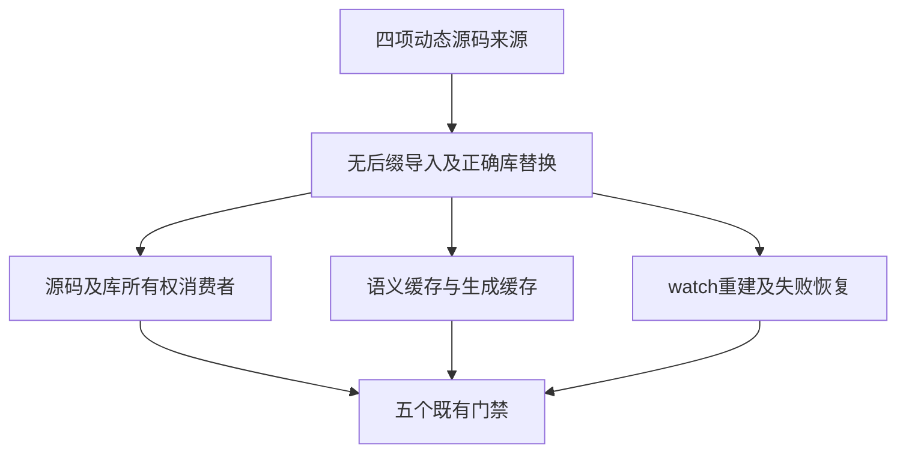

# 动态导入夹具同步计划

## Intent：最终目标

同步测试临时生成的 ZX 导入与当前无后缀契约，让所有权库消费者、持久缓存、生成缓存和 watch 的原断言继续验证对应功能。

## Data：可用证据

固定 bd5b60f5 的全量日志显示所有权生成工具 UnexpectedDiagnostic、生成缓存三项模块诊断、watch 库构建等待失败。所有权 compile.zig 仍匹配 ./consume.zx，但嵌入 main.zx 已改为 ./consume，替换未生效，消费者误尝试读取未提供的源文件。公共缓存 fixture 与 watch 库动态源码仍 import ./helper.zx。另已有 watch recovery 同样残留旧模板，直接读取正式来源确认；它的缺失依赖断言仍应针对无后缀导入后的真实文件缺失。

## Edges：边界与限制

只改四份来源的确切导入匹配字符串。真实 .zx 文件名、CLI 入口参数、库映射、缓存数据损坏构造和恢复断言全部保留。不改生产、不放宽断言、不新增声明。固定检出升级到 defce881 后覆盖四份本轮草稿，生产源码始终保持该提交；主检出其他会话 WIP 不进入验证。

## Answer：交付格式与成功标准

四份同路径草稿与正式来源一致。在固定检出执行五个既有门禁：test-owned-input、test-persistent-cache、test-generation-runtime、test-watch-library、test-watch-recovery，ReleaseSafe、-j2，保留完整总结和退出码。门禁通过才提交 push；真实实现缺陷另留复现并反馈指定会话。来源、基线、日志指纹及实际运行与缓存分别收录。本轮不增加用例数或 Test262 原文审阅数。

## 自我批判

无后缀替换只能消除当前最先发生的错误，不能证明后续所有权或 watch 过程正确。必须运行完整原门禁，包括破坏缓存、缺失依赖和再次恢复；不能把“不再出现旧诊断”当成成功。watch recovery 之前没有失败证据，本轮保留其完整验证，明确属于同一模板迁移而不是声称已定位新实现缺陷。

## 首轮与格式化复核

首轮五个既有门禁退出 0，62/62 步骤，97 个 Zig 实例及 10 个 Node 声明实际通过；Zig 来自 37 个前端声明与 10 个运行声明在六种产物上的 60 次实例，不把它们记作 97 个新增声明。提交前 Prettier 重排了三份 TS 来源的语句行；因此保存首轮原字节来源与日志，覆盖最终草稿后再复验，避免将格式化后的文件冒充首轮实际输入。

## 最终执行记录

最终五门禁退出 0，62/62 步骤。10 个 Node 声明实际重新运行并全部通过，未变化的所有权 Zig 来源对应 97 个实例缓存命中；首轮 97 个实际实例已全通过。既有声明总数为 47 个 Zig（37 个前端、10 个运行）加 10 个 Node，共 57 个，不将六种产物重复当新增声明。正式四份来源与实际最终固定检出、草稿逐字节一致；生产源码没有修改。结果收录两个阶段，明确各自真实输入及格式化差异。
