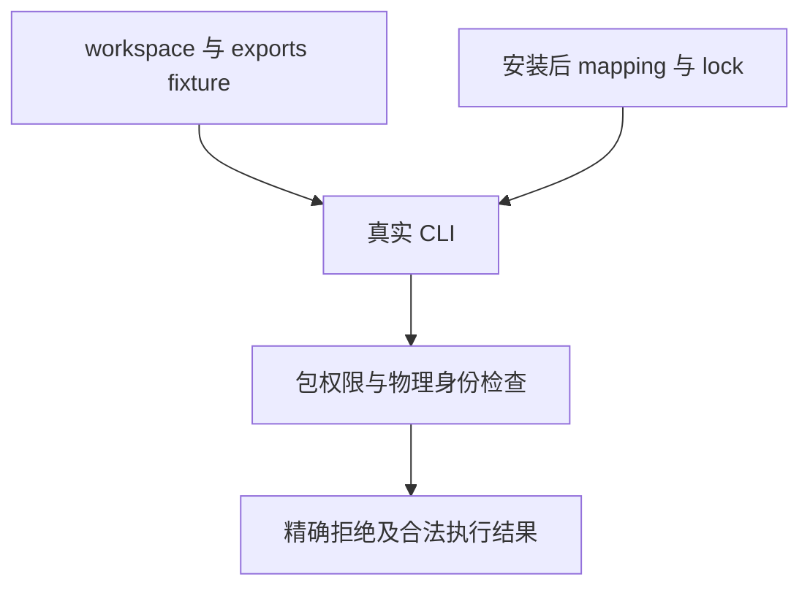

# 包清单与边界夹具同步计划

## Intent：最终目标

恢复包 manifest 和安装后边界测试，让合法引用到达原包权限检查，保证负例仍拒绝跨包、未声明依赖和伪装物理身份。

## Data：可用证据

根第二轮安装测试有跨 workspace、跨 archive 和 root alias 三项失败；前两项旧 .zx 引用被导入后缀诊断先阻断，第三项混合 package 与 root alias 导入未分组。import_cases.ts 的正常引用及同职责边界负例存在同类旧契约；exports 内部闭包也仍引用 ./secret.zx。文件映射及 entry 则是实际文件路径。首轮进一步确认两个正常 exports 组合案例的 math/nested/two 与 math/one 应按路径排序；函数表达式仍是 two(one(in))。原生 flags 的 243 组旧期待遗漏 concurrent=false、errors=null 两个既有实现默认字段；保留五字段的 3^5 组合及输入省略行为，只补完整规范输出期待。

## Edges：边界与限制

只同步四份测试来源。保留精确边界诊断、安装 metadata/lock、真实路径、symlink 目标、49 与 102 等既有语义结果和公开 exports。明确保留 math/secret.zx、math/one.zx 两项公开面拒绝负例，不在 call helper 中全局剥离后缀。不新增测试或修改生产包解析。

## Answer：交付格式与成功标准

IDEA 计划、原材料和完整草稿、来源指纹及日志；固定检出执行 test-package-manifest 和 test-package-install ReleaseSafe。成功后独立提交 push；提交来源、证据与实际门禁相符。两图表示结构与数据流。

## 自我批判

负例应只触发它实际要验证的错误。去掉跨包引用后缀是在恢复原边界检查，不能放宽诊断。root alias 应在 package 导入后独立成组；实际 helper.zx 文件、archive 路径与 symlink 目标都不可去后缀。

## 首轮复核与执行修正

首轮 ReleaseSafe 在固定 246be5f3 上完成，37/40 步骤，退出 1：包导入 30 项中 28 通过、两个未排序 imports 失败，原生清单 inspect 的 243 项仅因新增默认字段缺失而失败；安装边界六项全部原断言通过。保持完整首轮日志，不把部分通过当作全门禁通过。

仓库提交钩子对修改的 TypeScript 文件使用 Prettier；本次 import_cases.ts 与 boundaries_test.ts 的既有长行需要展开，因此最终来源同时保留钩子所需的纯格式变更。先完成格式、同步完整草稿和固定检出，再对最终来源重跑既有门禁。另一份误启动未覆盖来源的门禁已经中止，退出 143，日志保留；依赖链接改成被忽略的真实目录后固定检出清洁，未改仓库 ignore、依赖版本或正式生产来源。

## 最终执行记录

固定 246be5f3 加四份最终测试来源，第二轮 ReleaseSafe 门禁退出 0，40/40 构建步骤；9 个 Node 运行步骤全部实际执行，2035/2035 原声明实例通过，运行缓存、跳过、取消与新增声明均 0。其中 imports 30、inspect 399（含原 243 组 native flags）、workspace 31、graph 1534、init 27、installed runtime 1、failure 5、boundaries 6、integrity 2。

跨成员、跨安装 archive、root alias 权限、symlink 物理身份、隐藏公开模块后缀、安装 metadata/lock 保护全部原精确断言保持。原生 flags 仍枚举五字段的三种输入状态，只补规范输出中的 concurrent=false、errors=null。最终格式、完整草稿与固定检出字节一致；首轮的 245 个失败和误启动中止日志保留。目录案例与 Test262 审阅均 0；原根回归仍待完整结果，不用本门禁代替根成功。
