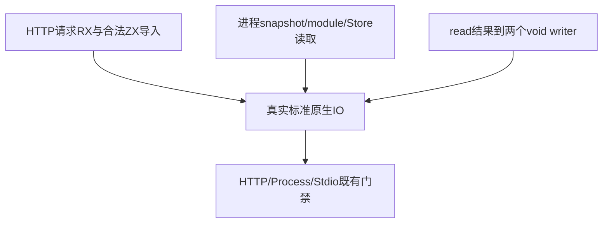

# 原生IO入口来源同步计划

## Intent：最终目标

完成 HTTP 客户端、进程入口和标准输入输出 RX 编排来源的最终契约迁移，保持原原生 IO、环境参数、字节/UTF-8、结果输出策略及错误行为。

## Data：可用证据

六份正常 RX 主检出 WIP 仅 out→name，仍读旧 ctx；Process service 的 Call.service 仍为旧字段。HTTP request.zx 在 HEAD/WIP 都把 type import 放在 value import 前且未分组，当前格式门禁先拒绝它。现有 application/fixture 递归复制各自来源，驱动以 ZX 及 RX 入口分别验证原语义。

stdio 的 read 非void产生值，两次 stdout/stderr writer 返回void且目标不同，应保留真实两个调用；没有需要增加的结果名或返回值。Process state 保留 Store 原签名、读取与 snapshot/count 协议字段。

## Edges：边界与限制

仅写六份 RX 与一份 HTTP ZX 的导入分组，保存迁移前 WIP 字节。Call.module 只替换 process/service 的调用字段；其余路径/输入不变，Route.service 不参与。输入输出断言、错误域、HTTP fixture server、真实网络请求、UTF-8拒绝和进程权限约束均保留，不新增测试、不改生产。已有最终迁移的 grit 预览证明 RX 表达式不适合通用 HTML 变换，本部分按具体 driver 的明确清单处理。

## Answer：交付格式与成功标准

七份正式来源与同路径草稿一致。固定新生产检出执行既有 test-http、test-process-entry、test-process-stdio，ReleaseSafe、-j2，保留完整退出码及实际脚本检查次数、Zig实际/缓存。Node脚本打印 ok 的检查与Node:test声明分别记录，不能混合统计；成功后独立提交push，真实实现缺陷另保存复现并反馈。

## 自我批判

读取结果更新不能给void writer生成虚假绑定；去掉写入也无法保留stderr与stdout原证据。HTTP import排序只排除早期格式障碍，仍需完整HTTP响应、限制及失败案例。进程数据来自宿主真实上下文，不能用固定argv/env/cwd代替调用。

## 最终执行记录

固定 a68b7588 执行既有 test-http、test-process-entry、test-process-stdio，ReleaseSafe、-j2，退出0；54/54构建步骤，136/136 Zig声明实例全部实际运行，无运行缓存。HTTP四组为22、15、36、14，标准输入输出两组为25、24。

三个原Node应用脚本完成进程入口46、标准输入输出50、HTTP70项连续编号检查。它们是脚本内检查，不能等同166个新增Node:test声明。七份正式来源、固定检出和草稿逐字节一致；新增测试声明、目录案例及Test262审阅均为0。网络、环境参数、字节/UTF-8、双输出、Store和输出策略的原断言保持不变。
