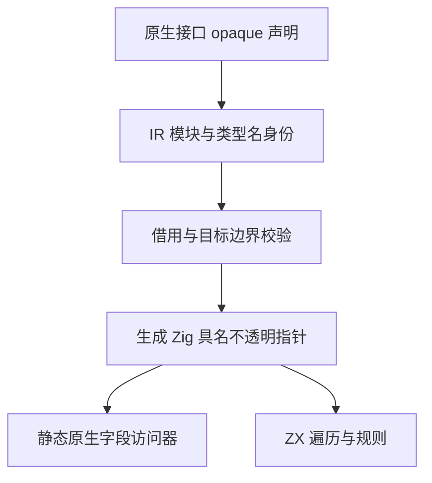

# 原生借用引用实施计划

## Intent：最终目标

让 ZX 通过静态原生模块读取现有宿主数据结构，保持类型身份和借用生命周期，不复制整个数据模型。用于后续 RX Schema 自举，但能力必须适用于任意显式静态原生模块。

## Data：现有机制

DSL AST 使用递归连续结构数组；ZX 对象使用不可变结构指针，且不支持递归类型别名。现有 native 外部调用直接传递生成 ABI，不能靠改写声明复制布局。普通 native 引用返回已有借用检查；新增宿主引用需要明确它与 ZX 管理的内存的区别，不引入句柄注册表。

## Edges：语言和实现契约

原生接口采用 `export type Node = opaque` 声明只读借用引用。仅 native declaration 解释该 RHS，普通 ZX 不获得构造裸指针的能力。名字是接口导出类型名，身份为原生模块 key 与名字；同名但不同模块的引用不能混用。

```zx
export type Node = opaque

export declare function childCount(node: Node): u64

export declare function childAt(node: Node, index: u64): Node throws { IndexOutOfBounds }
```

- IR 是独立叶类型，保存模块身份和类型名称，生成具名 `*const opaque {}`；不使用整数、anyopaque 或字节数组冒充名义类型。
- 只读不意味着底层宿主对象自动线程安全，带引用的异步／并行边界必须静态限制，除非未来有独立契约。
- 引用不能通过 ZX 构造、数值转换、比较地址或序列化；可作为输入、返回、optional、局部聚合和辅助容器中的借用值。
- native 访问器只读字段、长度及原有元素地址，不持有引用、不释放其对象。宿主必须保持底层数据存活至借用结束；ZX 不取得对象所有权。
- Store 不能保存这一局部宿主借用；原生引用不能直接成为 JSON、N-API、Wasm 或 FPGA 的公开数据边界。
- 所有权、类型身份、IR 校验、缓存、模块链接、生成 ABI 和目标限制必须一起覆盖，不能仅让一个示例编译。
- 不新增测试用例、不跑全量。使用已有相关专项和真实 AST 的代码草稿验证；不修改其它 session 的文件。




## Answer：交付与成功标准

交付通用类型、完整静态编译链及生命周期门禁；真实 AST 数据不复制，ZX 控制访问流程，原生边界只处理物理布局。普通 ZX 构造能力不变。阶段结束记录实际通过与未覆盖部分，完整 Schema 解码仍是后续任务。

## 执行顺序

1. 核对 native 声明、名义身份、现有借用规则和目标出口。
2. 实现 IR 叶类型、native-only 声明解析、链接及持久化。
3. 生成静态具名不透明指针与共享 ABI，补齐类型敏感路径。
4. 检查所有权与 Store／并行／外部数据边界，完成真实 AST 草稿核查。
5. 运行相关既有专项、构建，复核本次 diff，再提交并同步通用能力到原生 zig 分支。

## 生命周期决策

原生引用指向宿主持有的只读数据，ZX 没有创建或销毁该数据的操作。指针值可复制；局部列表可以拥有保存指针的缓冲区，但不会因此拥有宿主对象。这与借用 ZX 列表自身的存储不同，不能把两者混为一个“容器已借出”的状态，否则连遍历栈都无法追加节点。

因此引用叶值按可复制值跟踪，宿主生命周期由类型边界约束：原生函数返回引用时必须接收宿主引用，结果只能来自这些引用所指的数据；不允许零参数创建引用，也不能把普通 ZX 数组转为引用。原生实现属于显式可信边界，必须遵守此借用契约。字符串／数组等普通 native 返回值继续沿用现有 borrowed 规则。

输入宿主负责让对象在调用期间存活；返回值包含引用时，宿主继续保留底层 owner。ZX 没有保存到 Store 或把引用交给异步任务的权限。局部 owned 容器仅拥有自己的缓冲区，里面的宿主引用没有自动释放、复制底层对象或延长 owner 生命周期的含义。

名义类型身份复用 enum 的来源表，IR 版本同步更新；独立 IR 验证还要求每个引用类型有唯一原生模块所有者及原始声明绑定，防止伪造叶类型后绕开声明。

## 当前验证证据

- IR 版本为 21。原生声明／类型导入、名义来源表、类型复制、模块及库重映射、共享 ABI、缓存版本和独立 IR 校验已接通。
- 发行构建通过；既有 `test-native-declarations`、`test-zx-tasks-analysis` 专项通过。没有新增 packages 测试用例，也没有执行全量。
- `generate.zig` 使用正式 compiler API 编译 `walk.zx`，`ast.zig` 只读原 AST 的 children 长度和元素地址；`run.zig` 从已有真实 RX 文件解析 AST，并让 ZX 控制深度优先遍历。五份既有材料得到 5、3、3、8、5 个节点，见 `既有AST遍历记录.json`。
- 同一遍历发布为库，复制到消费方 workspace，以公开 Root 类型导入后再次发布；普通 Zig 通过生成的 build.zig 消费产物，得到相同五个结果。类型身份按库实例重映射，生成名的摘要会随实例命名空间改变，不把摘要相同当作成功标准。
- 对实际遍历入口执行普通 JSON app 构建，已由编译器以 `UnsupportedHostReference` 拒绝。N-API、Gateway、Store 和任务边界也有显式类型门禁，但未增加新材料逐一动态验证它们。

## 复现

在本目录运行 `zig build -Doptimize=safe -j2`，然后以 `zig-out/bin/walk <现有 RX 文件>` 读取真实 AST。该构建通过 compiler API 自动生成普通 Zig 与共享 ABI，访问器与宿主使用同一 DSL 模块。

库路线从仓库根目录执行：

```sh
zig-out/bin/zxc build docs/2026-10-06/原生借用引用/walk.zx --mode lib --project docs/2026-10-06/原生借用引用/pkg.yaml --out docs/2026-10-06/原生借用引用/generated/library
```

将产物复制至本目录 `consume/pkgs/walker`，再使用 `consume/pkg.yaml` 把 `consume/main.zx` 发布至 `generated/consumer`。最后在 `consume/zig` 中运行 `zig build -Doptimize=safe -j2`，可用同样的 XML 输入执行生成的 walk。产物和复制目录不提交，由命令重建。

## 自我复核与下一阶段

引用本身生成一个指针，访问器直接返回原节点地址；没有 AST 复制、句柄注册表或专用运行库。但现有 loop 生成仍有状态与元组装箱、逐次栈缓冲分配，不能宣称整个遍历达到零额外分配。后续需通用地完善原生纯函数契约及相应值生成／缓冲复用，不按这份遍历源码特判。完整 Schema 验证和解码尚未迁移。

普通 native 返回字符串或数组仍沿用原有借用检查；新引用只能指向宿主持有的数据。原生代码属于明确的可信边界，编译器检查声明及使用约束，不能证明任意 Zig 实现遵守只读和生命周期契约。

另外，直接 CLI `--out` 的作用域原生 ABI 侧文件目前只有 `native_by_identity`，不会提供原生源码期望的 `native` 别名；这不是引用类型独有的问题。草稿运行路线通过正式 compiler API 的未作用域接口，以及会生成 ABI view 的 lib 路线验证。该源码输出别名缺口保留为后续修复项，不能把 lib 路线通过当作直接源码输出也已通过。

## 最后复核

查询类型是否含引用已按 IR 类型的拓扑顺序扫描，共享子类型不重复递归展开；没有引用时不分配标记表，含引用时分配失败按原错误链传播。跨超过五个文件的调用更新先尝试了 Grit Zig 模式，工具返回模式语法错误后，才使用限定路径的脚本完成更新。

模块产物还会保存间接导入的原生引用的所属模块，即使该 ZX 模块只导入另一个源码模块的类型。草稿 initial 已通过 model 间接导入 NodeRoot 验证此路径。缓存首次 analyzed=3、written=3、native_analyzed=1；再次 analyzed=0、reused=3、loaded=3、written=0、native_reused=1、native_loaded=1。两次生成的 SHA-256 均为 `6af73b8051b0bfdfa266b856083bac05f4d259e074f50a4dd42d6b60f7593d32`。

既有 `test-library-import` 专项也已通过。最终源码经发行构建、真实 AST 草稿构建及再次发布后的 Zig 消费构建检查；通用源码提交为 `23fa7ef9`，原生 zig 分支对应 `24f45832`，均已推送。文档和草稿另行收口，不把自举材料混入原生基线。

原生基线 `24f45832` 构建的 CLI 与当前自举 CLI 对草稿 walk.zx 生成的普通 Zig 摘要一致，均为 `6af73b8051b0bfdfa266b856083bac05f4d259e074f50a4dd42d6b60f7593d32`。这验证本入口的生成一致性，不代表整个编译器已经达到自举固定点。
