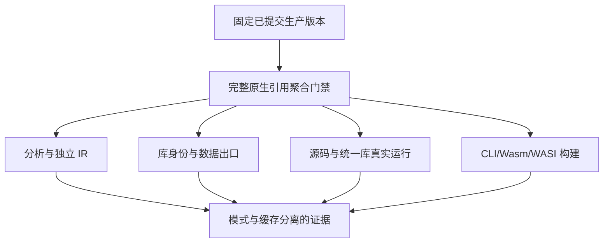
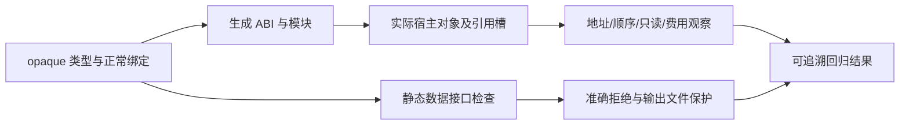

# 原生只读引用布局与自举回归计划

## Intent：最终目标

在新的已提交生产版本上重新验证原生引用既有专项，确认内部值布局优化、模块分类及整数解码自举、语法表发布调整没有破坏地址身份、只读借用、辅助函数缓冲、名义类型或外部数据边界。

## Data：可用证据

上一部分 null 门禁验证固定 `4d807ccd`。此后实现聊天继续提交 `4a6dad6b` 模块分类自举、`9072ae90` 可空标量函数局部状态优化、`d86b57b6` 整数解码自举和 `6f18db89` 语法表与解析状态分离。此次选择开始核对时最新的 `6f18db89` 为固定生产基线；主工作区未提交修改不进入证据。

既有原生引用专项包含 138 个独立 Zig 声明（分析 41、独立 IR 18、NAPI/Gateway 14、统一库 20、真实运行 45），另有九个独立 Node 应用边界登记。运行声明分别沿源码与 codec/统一库消费路线执行，共 90 次每模式 Zig 实例。专项由 test-native-references 聚合到默认 test。

## Edges：边界与限制

这是既有门禁的生产版本回归，不新增案例或增加上游审阅数。实际声明执行、源码/统一库实例、Node 驱动、构建步骤和缓存分别记录。逐份固定输入源及生成产物指纹；观察超时只继续查询同一进程，不据此重启任务。

正确宿主对象必须在引用使用期间存活，可信 Zig accessor 的任意内部行为不由这些测试证明。费用断言采用已承诺的线性上界和拥有权规则，允许合法保守路径的临时对象分配；reverse 或其他消费操作也不强制新地址。

发现失败先定位到真实目标语义，排除夹具或执行错误；若是生产实现违约，保留最小复现与原始日志后通知指定实现聊天。回归期间不追随其他聊天的新提交改变当前基线。

## Answer：交付与成功标准

Debug 与 ReleaseSafe 分别运行完整 test-native-references。保存退出码、日志、实际声明与缓存计数、运行命令报告、测试及生产指纹、自我复核。完整通过后本部分独立 commit/push；有真实缺陷时保留正确断言，等待实现修复并在新的明确基线上重跑受影响门禁。

## 自我复核

此前提交的测试不自动证明后续生产版本通过。只以此次固定基线的实际日志支持结果；重复路线与优化模式不增加独立案例，专项通过也不替代全仓库与发行构建通过。

## 执行结果

固定 `6f18db89`，两模式完整门禁均退出零，各 126/126 构建步骤、93/93 内部声明实际通过；45 个真实运行声明沿源码/统一库两路线各实际执行 90 次。九个应用边界登记各模式实际产生 246 条命令，其中准确拒绝 192 次，成功 54 次，含 12 次直接 Wasm 实例调用。91 份测试依赖指纹与固定检出逐份一致，运行日志与生成文件指纹见 [执行结果](布局与自举回归/执行结果.json)。

没有发现此基线上的生产违约，因此未给实现聊天发送消息。两模式内部声明和外部执行均无运行结果缓存替代；编译阶段缓存按 Zig 正常规则复用。此次不增加独立案例、JSONL 数或 Test262 审阅数。
