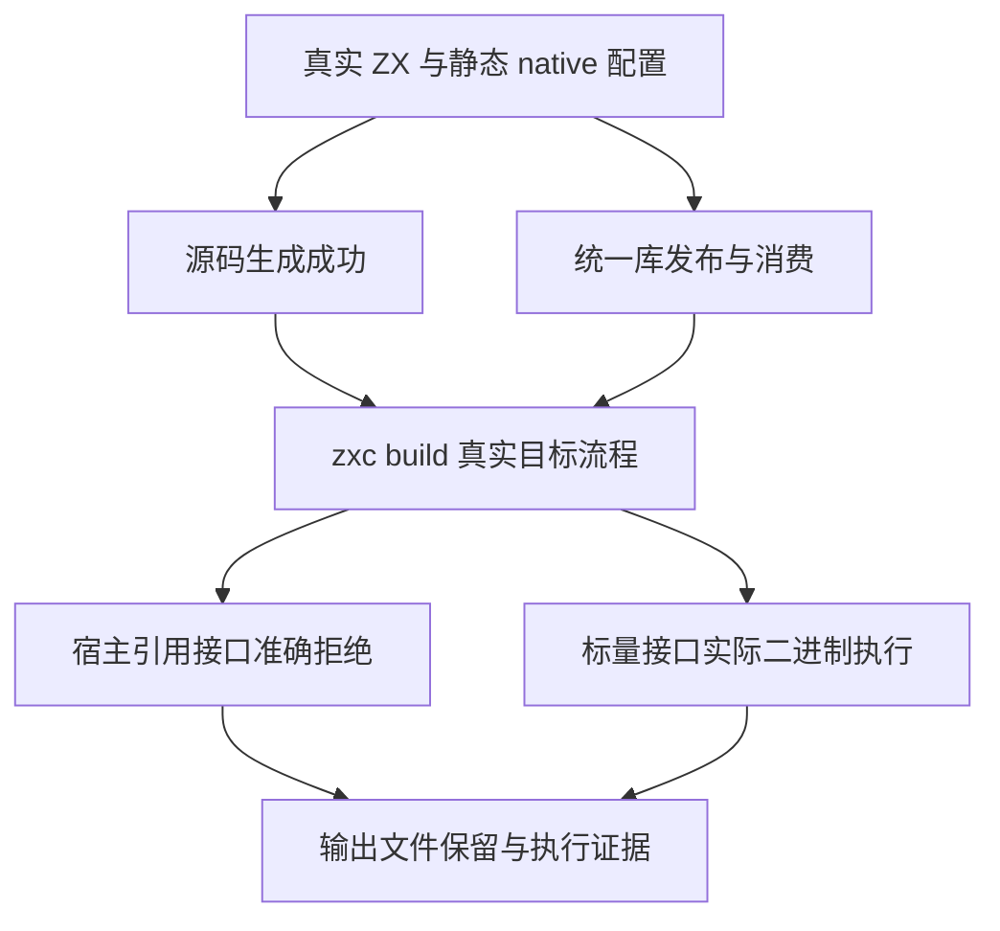
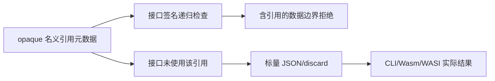

# 原生只读引用应用构建边界测试计划

## Intent：最终目标

通过真实 zxc build 验证 CLI、freestanding Wasm、WASI 的数据接口拒绝原生宿主引用；同时验证只有未使用引用声明、接口为标量的程序仍可构建执行。源码和已发布统一库消费路径、JSON 和 discard 结果策略均不能改变边界。

## Data：可用证据

辅助函数缓冲 `47d699a9` 已提交推送，新的固定检出使用该版本。`cli/build.zig` 的 prepare 对签名 input/output 递归调用 containsNativeReference，并返回 UnsupportedHostReference。已有 NAPI/Gateway 12 个声明验证生成接口，本部分补实际 CLI 应用构建流程。

成熟参考包括 process_entry 的临时项目与命令检查、build_modes/native_declaration 的统一库发布、wasm/host 的真实实例化和 wasi_host 的命令执行。现有项目包格式为 pkg.yaml，原生声明和静态模块分别登记 native_interfaces/native_modules。

## Edges：边界与限制

每份源先成功生成普通 Zig 或发布统一库，确保目标拒绝没有被语法、拥有权或未解析模块遮蔽。失败构建必须给出准确 UnsupportedHostReference，不能产生新目标文件，也不能覆盖已有目标文件。统一库发布成功本身不代表应用数据出口可用。

非空 Node 输出需要有引用来源，但 Node? 的 null 值以及包含 null 的列表可以由纯 ZX 构造。输入引用→标量输出单独验证输入递归检查；标量输入→可空引用或对象内可空引用列表输出单独验证输出检查，防止 input 判断短路遮蔽 output。输出实际为空仍不能让引用类型成为外部数据接口。

所有编译产物仍是普通 Zig 与静态原生模块。测试侧 Wasm/WASI host 只实例化正式二进制，不新增 zxc 运行层。临时项目结束后清理，执行报告保存到构建缓存并复制至本任务证据目录。

## Answer：交付与成功标准

按用途分为 input/leaf、optional、list、object、tuple，output/identity、optional、nested，以及 control/scalar。九个独立登记用例分别在源码与统一库路径上验证三种目标、两种结果策略。标量控制实际执行原生 CLI、freestanding Wasm 与 WASI，检查结果和 discard 输出；不把只生成源码作为成功。

Debug/ReleaseSafe 各保存真实命令、退出码、stderr、输出文件存在性和来源指纹。默认 test 与 test-native-references 聚合包含新的独立构建 gate。实际生产问题通知实现聊天，完整通过后本部分独立提交 push。

## 自我复核

每个语义用例包含目标、路线和策略向量，向量数不增加独立用例数。精确拒绝之外，构建失败的文件保护也是公开流程的一部分。正例应含同一原生声明与模块，避免用完全没有原生元数据的程序证明“未使用引用允许”。

首轮七例全部通过，但复核发现对非空引用来源的约束不能推广至可空输出。补充两份真实纯 ZX 源，先通过生成与发布，再验证输出拒绝；保留首轮证据，最终门禁使用九例版本。

## 执行结果

固定生产提交 `47d699a9`，正式测试与固定检出的 89 份来源逐份校验。最终完整 test-native-references 在 Debug/ReleaseSafe 各为 123/123 构建步骤通过。应用边界九例全部实际执行，每种模式各执行 246 条真实命令，其中 192 次以 UnsupportedHostReference 准确拒绝，54 次成功；标量控制每种模式共 36 次真实结果观察，其中 12 次为直接 Wasm 实例调用。

既有 45 个运行声明在源码/统一库两路线各执行一次，每种模式共 90 次外部 Zig 声明执行。87 个分析、独立 IR、出口与库声明，首轮完整 Debug 全部实际执行通过；最终 Debug 复用这些成功缓存，ReleaseSafe 全部实际执行通过。Node 外部运行与构建检查均未复用运行缓存。pnpm typecheck 通过。

执行结果、原始日志和逐命令报告见 `应用构建边界/`。同步步骤两次因为相对路径与固定工作目录不符失败，属于执行操作错误；最终以绝对路径同步后重新执行门禁。没有发现生产实现问题，未通知实现聊天。九个语义登记用例不加入 JSONL 目录总数；接替后原生引用专项累计新增 141 个独立用例。
