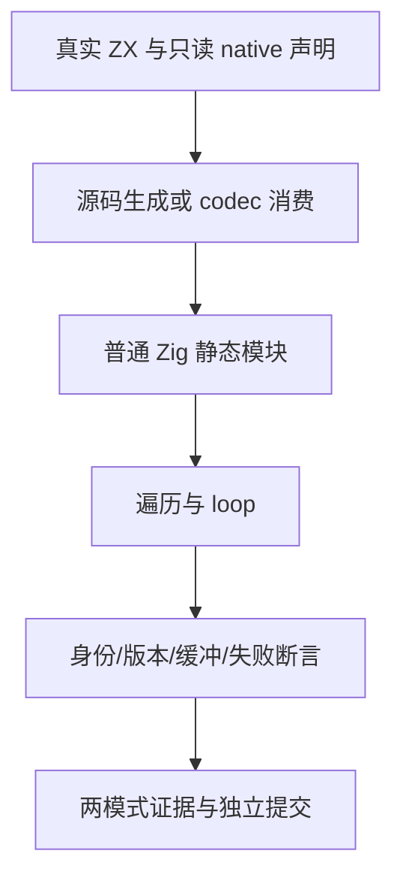

# 原生只读引用循环与借用测试计划

## Intent：最终目标

真实执行 native 引用叶列表的遍历、借用列表写入、loop 首写、旧版本和两个缓冲的独立更新；验证缓冲优化不改变地址身份、不改写宿主借用列表或旧输入。

## Data：可用证据

上一批 `f245985a` 已推送，14 个声明两路线两模式实际通过。新的固定检出使用该提交，包含 `29e10ae8` 的 helper pop 容量修复。成熟参考为 collections/iterate_buffer 的 first-write、history、two_fields 及分配字节检查；沿用上一批真实生成器、普通 Zig 运行驱动及生产 ABI view。

## Edges：边界与限制

宿主显式拥有 Node 对象及只读引用槽列表，直到结果观察结束；ZX 的列表写入需要自己的缓冲，不获得宿主对象所有权。测试不释放仍被使用的 owner，不制造 UAF，不序列化宿主地址。

借用 accessor 直接返回宿主持有的 `[]const Node`，不能由测试临时分配再返回，也不能将 HostNode 数组强转成指针数组。所有元素地址与输入槽分别断言，避免相同数值掩盖身份变化。

只在已有安全静态路径契约下比较短、长循环的已分配字节；旧版本保留路径允许复制。不能把有限向量的成本断言说成任意程序无分配。

## Answer：交付与成功标准

按 traversal、borrowed、loop_write、loop_history、two_buffers 分目录组织真实 ZX 与 Zig 声明。分别验证遍历的实际读取顺序；借用槽首次写入后的隔离；零轮/首轮/长轮更新；旧版本不被后续写入覆盖；两个缓冲从同一输入独立更新。需要的资源路径逐一执行全分配点失败清理。

源码与统一库两路线分别执行 Debug/ReleaseSafe，声明数不因向量、路线或模式重复增加。保存固定生产提交、来源/生成文件指纹、原始日志和退出码。真实失败先区分测试夹具与生产契约，确认生产缺陷后通知实现聊天。通过的部分独立提交和推送。

## 自我复核

测试宿主 trace 是有限的测试记录器，选用向量应不超过它的容量；记录器不是语言运行层。全分配点失败使用独立测试分配器构造原输入，避免输入构造失败冒充生成程序的失败清理。

## 执行结果

新增 traversal 3 个声明，borrowed/loop_write/loop_history/two_buffers 各 4 个，共 19 个。为真实借用列表扩展共享 HostNode 的 references 字段和 accessor，trace 容量扩为 1024，当前最长遍历记录 258 次。共享宿主变化后，上一批 14 个声明随本批一起回归。

固定 `f245985a`，Debug/ReleaseSafe 各 66/66 构建步骤通过，各 22 组 Node 驱动实际运行；源码 33 个与统一库 33 个 Zig 声明各通过，共 66/66。运行测试缓存为零。完整命令、退出码、来源/生成文件指纹和原始日志见 [执行结果](循环与借用/执行结果.json)。

遍历检查所有真实叶地址及准确读取顺序。循环检查零轮/首轮、64 轮的 257 个原槽、历史版本的交替地址与两个缓冲的独立结果。安全静态路径检查 4 轮和 64 轮分配成本相同；history 仅要求版本语义，不限制复制。五条全分配点路径均完成清理并保留 owner 和原槽。

两模式首轮通过，未发现生产缺陷，未通知实现聊天。证据保存脚本在正式创建前有一次 shell 引号错误；随后使用文件复制与补丁保存脚本，失败命令没有修改测试来源。草稿生成脚本从已提交的 `f245985a` 读取共享基础文件，重复运行不会重复追加 accessor。

接替后累计新增 120 个独立 Zig 声明；上游审阅与 JSONL 数量不变。当前 two_buffers 验证 loop 内两个独立槽缓冲，不代表跨 helper 的容量交接已完成；helper pop/append 转移与 CLI/Wasm 构建边界继续保留为待办。
