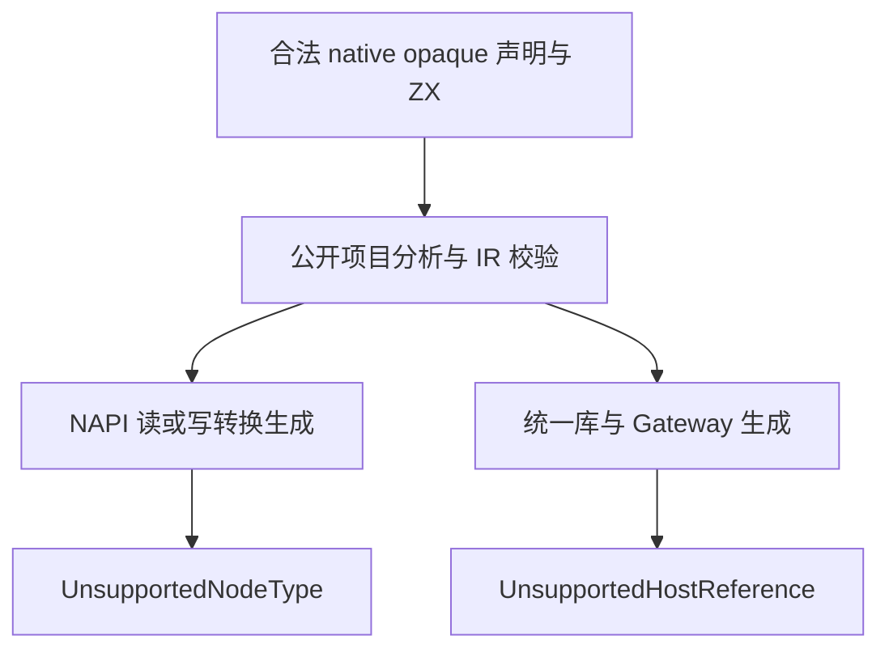
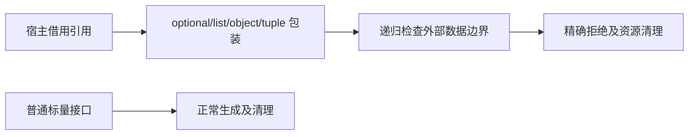

# 原生只读引用数据出口测试计划

## Intent：最终目标

验证宿主引用不能经过 NAPI 值转换或 Gateway 请求/响应边界变成外部数据，同时允许只使用普通标量接口的模块保留内部未使用的引用声明。

## Data：可用证据

NAPI `read.zig` 与 `write.zig` 在实际转换生成时返回 `UnsupportedNodeType`；类型标记会递归到 optional/list/object/tuple。Gateway 的公开生成入口先建立服务状态，递归检查服务输入输出，含引用时返回 `UnsupportedHostReference`。

## Edges：边界与限制

先用公开项目分析构造合法、拥有唯一 native owner 的 IR，不通过非法手写 IR触发别的错误。NAPI 的公开转换生成 API接受类型表与独立输入输出类型，测试分别选择含引用的读或写边界及普通标量另一端，避免一端失败掩盖另一端。Gateway 用实际统一库及生成 bundle 调用公开 `gateway.create`。

本部分不加载 Node 插件、不启动 HTTP 服务、不调用浏览器。预期在生成时拒绝的出口不能伪装成运行成功。CLI/Wasm 的应用构建边界仍须另行验证，不能从本部分推断通过。

## Answer：交付格式与成功标准

测试在 `tests/native/references/exports/` 分类，独立门禁 `test-native-references-exports`。每条读/写或 Gateway 边界独立具名；保留普通标量正例和拒绝路径的逐分配点清理。固定源码下 Debug/ReleaseSafe 通过并保存日志及指纹后提交推送。

## 自我复核

生成时拒绝的证据不代表运行时只读性或任意原生代码安全。内部引用声明存在不应导致所有无引用接口一律拒绝。每个负例必须对应目标错误集合；OOM 继续交给分配失败驱动，不能当作目标语义拒绝。

## 实施与验证结果

正式增加 12 个 Zig 声明：NAPI 7、Gateway 3、分配失败清理 2。NAPI 含直接引用、optional、list 的输入拒绝，以及直接引用、object/list/optional、tuple 的输出拒绝；两个生成器都有普通标量正例。

固定生产 `b4b4bcd9`，Debug/ReleaseSafe 各 27/27 构建步骤、12/12 声明实际通过，运行缓存为 0。门禁名称 `test-native-references-exports`，挂入默认聚合入口。Gateway 使用实际统一库和公开生成 bundle，生成成功时交接 arena、失败时释放原 bundle；两条 OOM 声明核查逐分配点释放。

源码指纹、命令、退出码与原始日志见 [执行结果](数据出口/执行结果.json)。本部分首次两模式即通过；未发现生产缺陷，没有向实现聊天发送消息。不增加上游审阅或 JSONL 案例数；CLI/Wasm 构建边界仍未闭合。
