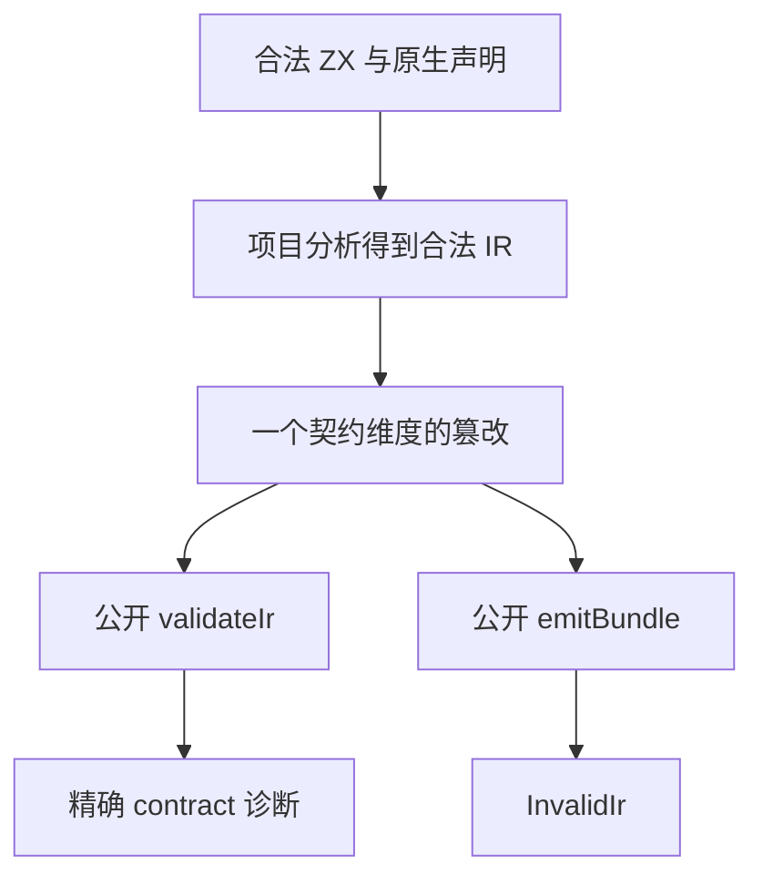

# 原生只读引用独立校验计划

## Intent：最终目标

在声明分析之外，证明非法原生引用元数据、原生 accessor 契约和 Store 持有不能绕过独立 IR 校验并进入普通 Zig 生成。合法同 owner 别名保留共享身份。

## Data：可用证据

`core/native_references.zig` 按 native module key 与类型声明名查找唯一 owner；`compiler/zx/ir/native_modules.zig` 检查绑定与原生参数形状；`ir/validate.zig` 独立检查引用来源和 concurrent；`ir/stores.zig` 递归拒绝 Store 引用字段。成熟实现是 `tests/contracts/ir_test.zig` 与类型化捕获库拒绝门禁。

## Edges：边界与限制

所有被篡改输入先从正式公开项目 API 取得合法 IR，再只修改一个契约维度。未变程序先检查通过，非法程序同时断言精确 contract 诊断与 `emitBundle` 返回 `InvalidIr`。不把格式、解析失败、摘要错误或原生必须使用 bundle 的错误当作拒绝成功。

这部分不执行生成程序，也不验证 NAPI、CLI、Wasm 或 Gateway 出口；出口另行使用实际生成或构建入口。测试不证明任意可信原生 Zig accessor 的实现行为。

## Answer：交付格式与成功标准

草稿放在 `草稿/packages/test/tests/native/references/ir/`；正式测试沿用同路径。独立 `test-native-references-ir` 门禁涵盖 owner、参数形状、concurrent、嵌套来源、嵌套 Store 和分配失败清理。Debug/ReleaseSafe 在固定源码下实际通过后单独提交、推送。

## 自我复核

多个模式复跑同一声明不增加案例数。所有负例必须先证明原始 IR 合法，避免一个不相关的结构错误掩盖目标错误。同 owner 别名接受分支必须单独保留，防止通过无条件拒绝所有引用达成门禁。

## 实施与验证结果

正式落地 15 个独立 Zig 声明：owner 5、原生参数/并发/来源/Store 边界 8、分配失败清理 2。`test-native-references-ir` 挂入 `test-native-references`，默认 `test` 同时依赖第一阶段与独立 IR 阶段。

固定生产版本为 `b4b4bcd9`；Debug/ReleaseSafe 各 27/27 构建步骤、15/15 声明实际执行通过，测试运行缓存为 0。原生 accessor 篡改先移除调用者表达式，另证隔离后的原始 native-only IR 合法，避免调用参数不匹配掩盖引用来源或 concurrent 拒绝。Store 槽位保持普通 object 并含递归 optional 引用列表。

首轮 14/15 通过；逐分配点测试发现帮助函数把合法 OutOfMemory 包成了期待错误失败。最终帮助函数只接受 InvalidIr 为语义拒绝，并传播 OOM 供驱动继续遍历，没有放宽拒绝契约。自我复核同时把临时 Store 槽位显式分配到临时 arena，消除测试自身返回局部存储的风险。

详细来源指纹与原始失败/最终日志见 [执行结果](独立校验/执行结果.json)。新增 15 个声明不增加 Test262 审阅或 JSONL 目录案例。未发现生产缺陷，没有向实现聊天发送消息。测试实现已提交并推送为 `c35043ef`；证据脚本的 stdin 编码错误导致记录生成晚于测试提交，现改用显式 UTF-8 文件保存并核对最终来源字节。

目标出口、统一库身份及真实 ABI 运行仍待后续部分。
