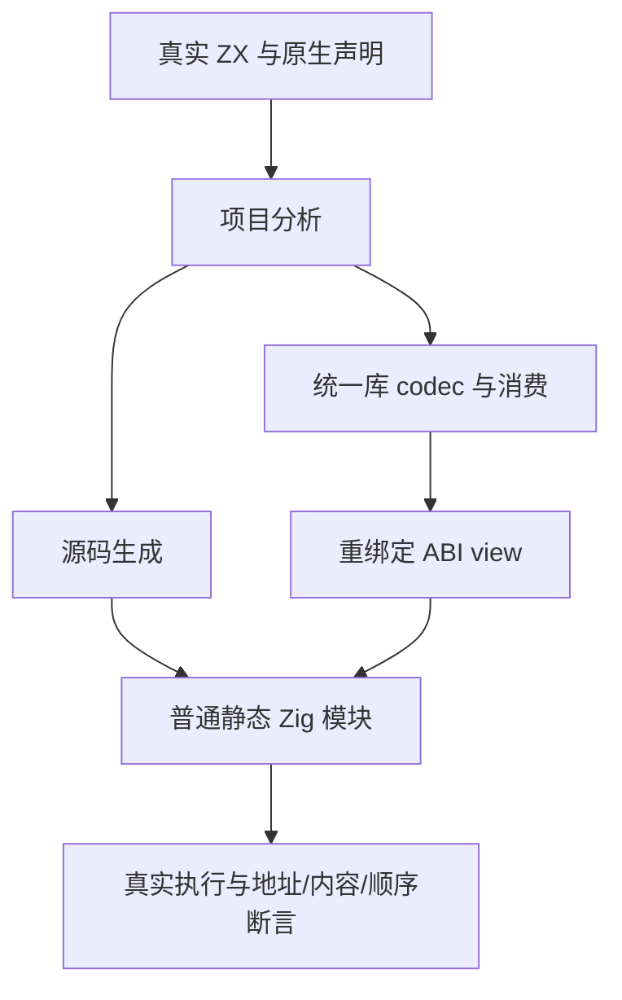

# 原生只读引用真实运行测试计划

## Intent：最终目标

直接编译执行普通 Zig 产物，验证宿主引用保持真实地址、只读内容和明确生命周期；源码与统一库 codec/消费两条路线共用语义测试，不用生成字符串搜索代替运行。

## Data：可用证据

声明、独立 IR、外部数据生成及统一库身份已分别新增 87 个声明。固定生产仍为 `cd70a631`。`genz/zx/types.zig` 将 native_reference 布局生成为 opaque，语义类型为其只读指针；ABI 中的 `.native.<specifier>.Node` 已是指针。

成熟样例包括 `build/native_runtime.zig` 的双路线、`tests/library/runtime/emit.zig` 的模块和 ABI view、`run_test.ts` 的实际 Zig 编译参数，以及 AST 自举静态宿主的 `@ptrCast/@alignCast` 桥接。

## Edges：边界与限制

测试宿主显式持有 const 结构体和子数组，直到所有观察结束。ZX 容器仅持有引用槽和自己的缓冲，不延长宿主 owner 的存活；不制造真实 UAF。全分配点检查必须重置宿主 trace，并释放每轮 arena。

统一库将 owner 加 scope，宿主的 `zxc_abi` 绑定生产生成的 ABI view，view 绑定 canonical 类型表。不得在测试宿主另造同名 opaque 类型或改写生成源码导入名。

编译器只能检查有限来源、任务/Store/出口边界，不能证明任意可信 Zig accessor 不写宿主、返回地址属于 owner 或不保留临时借用。本部分证明的是这份静态宿主和实际生成程序遵守契约。

## Answer：分部分交付与成功标准

第一批按用途分类为 identity/read、optional、coalesce、containers、order/failure。独立测试检查地址、完整宿主内容、准确长度、调用 trace、有限错误截断和容器 OOM 清理。源码与编译库各运行相同声明；Debug/ReleaseSafe 再运行，不增加独立声明数。

生成器保存真实模块依赖、native 描述和 ABI view；Node 驱动按元数据拼接普通 `zig test`，显式传入构建模式，要求实际退出 0。固定源码、来源指纹、原始日志与运行报告均保存，通过后独立提交推送。

后续批次再覆盖引用遍历、借用叶列表、loop 首写/旧版本及双缓冲转移。不能把首批成功称为所有引用运行或性能路径已闭合。

## 自我复核

相同值可能掩盖错误复制或访问了另一节点，因此顺序用例必须使用不同地址而相同数值的宿主。原生错误截断的检查独立于 OOM；发生 OOM 不要求原生调用已发生，也不把非预期编译错误当作 ABI 通过。

## 第一批执行结果

固定 `cd70a631`，新增 14 个独立 Zig 声明。Debug 与 ReleaseSafe 各 46/46 构建步骤通过，各 12 组 Node 驱动实际运行，分别执行源码 14 个和统一库 14 个声明，共 28/28；运行测试缓存为零。`packages/test` 的 `pnpm typecheck` 通过。

identity/read 各 2 个、optional/coalesce 各 2 个、containers/order 各 3 个。容器检查真实子地址与重复别名、释放 ZX 缓冲后的宿主存活及全分配点清理；求值顺序使用不同地址但相同数值，分别检查正常、首个错误、第二个错误。

统一库实际完成 link→codec→消费→emit，codec 字节在消费前填充覆盖。宿主使用生产 ABI view 对接 scoped native 身份；所有 Zig 模块显式传入相同优化模式。完整来源和生成文件指纹、退出码、命令及原始日志见 [执行结果](真实运行/执行结果.json) 和两个运行报告。

首轮两模式均通过，未发现生产实现缺陷，未通知实现聊天。保存证据脚本首轮因正则未启用多行匹配而计算出零个声明，修正脚本后完整核对 14 个声明和两模式的 24 份执行报告；这个记录脚本错误没有改动测试源码或门禁结果。

本批使接替后的新增独立 Zig 声明达到 101；不增加 JSONL 登记数或 Test262 上游审阅数。loop 遍历、借用叶列表、旧版本和多缓冲转移，以及 CLI/Wasm 构建边界仍待执行。
