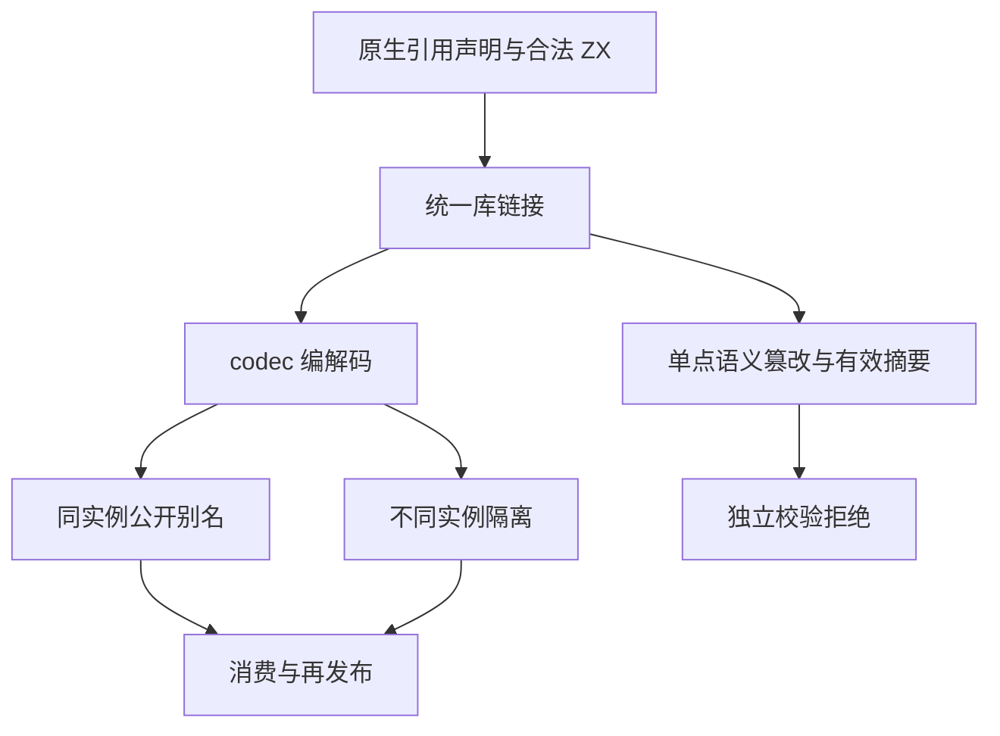
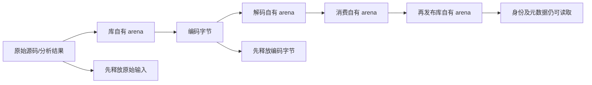

# 原生只读引用统一库身份测试计划

## Intent：最终目标

验证 native opaque 引用的名义身份在统一库链接、编码、消费及再发布后保持一致：同一实例的公开别名共享，不同实例的同名类型隔离，元数据由结果独立持有。合法摘要不能掩盖非法 owner 或引用契约。

## Data：可用证据

上一部分为声明、独立 IR、NAPI/Gateway 增加 67 个独立声明，已分别验证并推送。当前生产固定 `cd70a631`，包含 `d4308f00` 的普通调用循环缓冲复用。原固定检出的本任务改动均已提交并与主检出逐字核对，安全更新到新提交，生产源码不随并行实现变化。

成熟入口为 `tests/library/imports/native_fixture.zig` 与 `native_test.zig` 的原生枚举身份，以及 `typed_try/library` 的 codec、消费、再发布和有效摘要语义拒绝。opaque 引用须另行验证，不能用枚举通过代替。

## Edges：边界与限制

统一库包含原生模块及公开接口，ZX/RX 不分库。本部分测试编译期名义身份与拥有的描述，不把 codec 元数据称为运行时宿主地址序列化。真实指针 ABI、宿主存活、运行只读性及生产资源成本属于下一部分。

所有篡改先从公开 API 得到合法库。重新计算外层 SHA-256 后，encode/decode 仍须因语义非法而拒绝。失败清理覆盖正常消费、再发布及非法解码；OOM 由逐分配点驱动处理，不当作语义拒绝通过。

## Answer：交付格式与成功标准

在 `tests/native/references/library/` 分类实现独立声明，门禁 `test-native-references-library`。先保存配套草稿，再正式落地；固定生产下 Debug/ReleaseSafe 实际通过，来源及日志指纹与提交一致后独立提交推送。实际缺陷才通知实现聊天。

## 自我复核

多条公共路线必须保持同一语义对象，不能为别名路线伪造两个独立 owner。类型 ID 数字本身不能证明身份，必须同时检查 owner key、native 模块与实际调用类型接受/拒绝。复跑和参数路由不增加声明数。

## 实施与验证结果

正式增加 20 个独立 Zig 声明：身份与实际传参接受/拒绝 5、codec 与重新发布拥有权 5、有效摘要下语义篡改拒绝 8、逐分配点清理 2。纯类型篡改库没有原生 accessor，避免参数形状或函数体错误掩盖 owner 校验。合法原名与别名绑定并存的正例保留。

固定生产 `cd70a631`。首轮 Debug 为 17/20 通过；三项失败来自最终消费者使用未支持的 `Input as Contract` 类型导入语法。正式夹具改为普通 `contract.zx` 类型中转模块，保留全部再发布链路和 owner 关系断言。

最终 Debug 29/29 构建步骤通过：7 个声明实际执行，13 个未改来源的身份/拒绝声明复用首轮成功缓存；ReleaseSafe 同样 29/29 步骤通过，20/20 声明全部实际执行、测试运行缓存 0。两种模式和路由不增加声明数。来源与原始日志见 [执行结果](统一库身份/执行结果.json)。

解码测试先覆盖编码字节再释放原始库与字节，继续读取类型名、owner、公开别名及重新编码，证明所测元数据独立持有。统一库消费和再发布保留一个或两个 owner，并再次消费验证对应调用接受；跨实例传参拒绝精确检查诊断、源索引与参数 span。

未发现生产缺陷，没有发送修复请求。下一部分须真实执行普通 Zig 产物，不能把本次 metadata/IR 成功当作宿主指针 ABI 或生命周期已验证。
