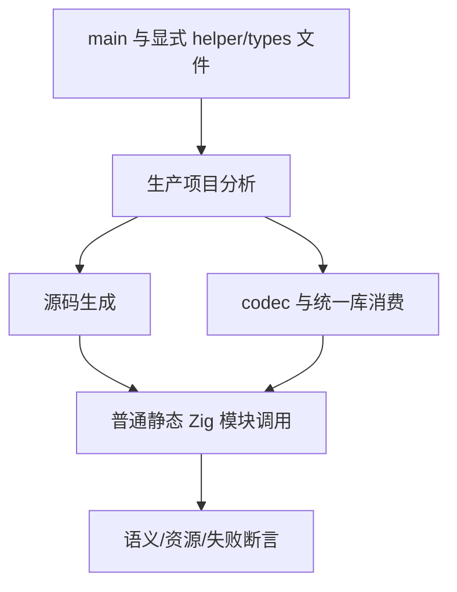

# 原生只读引用辅助函数缓冲测试计划

## Intent：最终目标

验证 Node 引用列表通过普通 ZX helper 的 owned 参数与返回值交接时，pop/push 容量及两个 append 缓冲保持正确。实际执行、地址身份、原输入保留、失败清理和受限资源成本共同构成通过标准。

## Data：可用证据

固定已提交 `a452881b`，包含 `29e10ae8` 的 helper pop 容量修复。前两批 runtime 共 33 个声明，源码/统一库双路径的 Debug/ReleaseSafe 均实际通过。现有 object_append/dual 与 capacity 验证普通数值列表的分支交接和线性分配成本；本部分补原生引用叶值，不能直接将数值列表通过算成引用通过。

## Edges：边界与限制

Node 对象与原输入槽显式存活。owned 是编译器的缓冲交接契约，不是宿主对象所有权，也不能改写外部原槽。测试输入和期望结果用独立测试分配器构造，不混入被检查程序的分配成本。

生成器只新增显式传入辅助源文件的能力，路径取真实 basename，所有辅助文件由构建系统登记依赖。不得自动扫描目录、改写生产生成源码、引入运行层或将 helper 内联到夹具来绕过跨模块调用。

性能断言分别针对稳定长度 pop→push 和已有两缓冲 append 的线性增长契约。允许 arena 元数据和缓冲几何增长；历史保留与未知路径不强加此成本标准。

## Answer：交付与成功标准

helper_pop：普通 create 返回 owned 状态，loop 每轮直接转发同类型 step，step 再调用独立 pop 与 push 模块；保留长度、前缀和宿主叶地址，替换末槽。验证零轮、空 seed、首写、长执行、禁止 resize 下按循环次数加 seed 长度的分配上界与全分配点清理。

nested_helpers：保留在 loop 内组装状态并嵌套调用列表 pop/push 的合法路径；当前复用入口不接受这类循环体，允许保守复制，但仍要求结果身份、原输入与全分配点清理正确。

dual_append：reduce 通过独立 step 模块交接两个引用列表，按索引选择一个缓冲 push 或另一个 concat；验证两个 seed 独立、全部结果顺序、条件未写入的别名保留、禁止 resize 下长执行线性增长及失败清理。

新增专项 gate 同时进入既有 runtime 聚合。源码及统一库两路线各执行 Debug/ReleaseSafe，保存真实日志、生成模块依赖、来源指纹和命令；仅实际缺陷通知实现聊天，通过后独立提交 push。

## 自我复核

每个声明可以使用多个边界向量，向量数不计作新增声明。相同数值的不同 Node 地址必须分别检查；不能只断言长度或累计数值。资源失败不接受意外诊断、非预期错误或退出信号。

首轮失败分为夹具和成本预期错误。两个普通值 import 应连续分组；普通 loop 初值按借用检查，不能传给 owned pop。改用临时 owned create 后，逐字段赋值仍使下一轮检查回到借用状态，需以整个 owned State 作为下一状态。当前正式夹具保留两种合法调用形状，不将失败改成只检查普通标量。

容量复用的生产入口在 `buffer_call/iteration.zig` 要求循环体直接转发同类型的 owned 对象 helper。嵌套列表调用不满足该条件，不能强加同一性能保证。受支持的 step→pop→push 已实际生成同一个容量槽，但给下一 helper 的对象指针还有每轮临时分配；首轮要求全部字节常量的断言不成立。

最终成本断言沿用成熟 append 门禁的线性尺度：`8192 + count * 128 + 8 * max(seed_length, 1) * sizeof(Node)`；同时比较 4/8192 轮的增量，并检查 64 轮、8193 槽的长 seed。该约束能拒绝每轮整表复制，允许已观察到的临时对象分配。原错误成本夹具与失败日志保留在辅助函数缓冲目录，不计为生产缺陷。

## 执行结果

三个目录各 4 个声明，共新增 12 个：helper_pop、nested_helpers、dual_append。生成器按显式文件参数分析普通辅助模块，并依据生产 Program 的 consumes_input 属性保留消费入口的 owned 声明；诊断输出附 source_index 和 span，避免把其他模块的失败误归到当前调用。

固定 `a452881b`。专项 `test-native-references-transfers` 最终 Debug 34/34 构建步骤、24/24 实际 Zig 声明执行通过。随后完整 `test-native-references-runtime` 的 Debug/ReleaseSafe 各 79/79 构建步骤通过，源码 45 个及统一库 45 个声明各实际执行，共 90/90；28 组 Node 驱动均通过，运行测试缓存为零。

四条对应的 pop 性能执行（两路线两模式）成本一致：4 轮/257 槽分配 5166 字节；8192 轮/257 槽分配 389816 字节；64 轮/8193 槽分配 148014 字节。所有数据均是 allocator resize 被禁止时的实际测量，具体上界同时记录在原始日志。双缓冲三种选择模式的 8192 轮线性增长与各自全分配点失败清理通过。

完整来源、生成文件指纹、命令和退出码见 [执行结果](辅助函数缓冲/执行结果.json)；早期分组/拥有权/成本预期的失败见 [修正过程日志](辅助函数缓冲/修正过程日志.json)。最终源码与固定检出逐字节一致。未发现违反当前容量复用契约的生产缺陷，未通知实现聊天。

接替后累计新增 132 个独立 Zig 声明，上游审阅与 JSONL 数量不变。CLI/Wasm 的实际构建拒绝及正例仍为下一部分。
