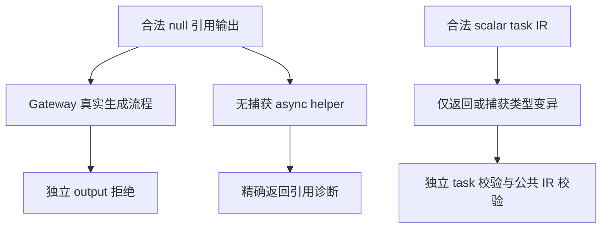
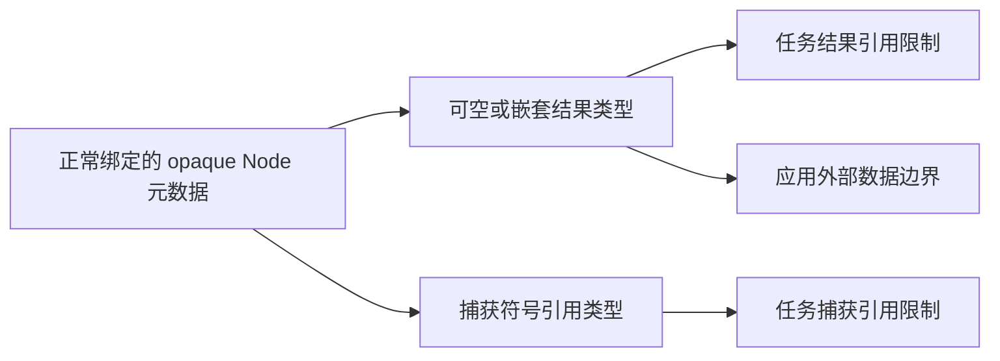

# 原生只读引用输出与任务边界补齐计划

## Intent：最终目标

补齐独立复核发现的两项契约证明：Gateway 对标量输入、引用输出的拒绝，以及 task 不得返回或捕获原生引用的独立分析与 IR 校验。保持正式源码变更限于 packages/test，不改变编译器语义。

## Data：可用证据

已有 Gateway 用例的 Input/Output 同型，因此 input 引用检查会短路 output。真实 CLI 构建已增加 Input=u64、Output=Node? 返回 null，以及对象内 Node?[] 返回 [null] 的源；它们可以先通过普通 ZX 分析，不需要 native accessor 制造引用。

`compiler/src/zx/analysis/types.zig` 分别拒绝 task 返回引用和捕获引用；已有专项只覆盖捕获。`compiler/src/zx/ir/tasks.zig` 也独立检查 task body 的类型和 captures 的符号类型，但现有专项 IR mutation 尚未包含 task。成熟参考为 tasks/analysis 的多源码 fixture 与 shape 检查，以及原生引用 IR 的合法基线、最小变异和公共 validateIr。

## Edges：边界与限制

返回引用的分析例使用无参数纯 ZX helper 返回 Node? 的 null，避免主模块引用捕获或非并发 native 调用提前拒绝。诊断必须精确匹配 capability 和 tasks cannot return host references，检查所属源码和 span。

独立 IR 使用已通过公共 validateIr 的 scalar task 为基线，包含正常绑定的 Node 类型。返回变异同步调整 body 与 task result；捕获变异同步相关符号和引用表达式。必须先确认结构与类型等其他检查仍成立，再证明 task 专项检查和公共校验均拒绝。不得只让不一致的 IR 在无关阶段失败。

内部校验采用仓库 manifest_resources 的缓存复制方式：把 compiler/src/zx 原样复制到构建缓存，由同一个测试 checks 模块导出 expression_rules/scopes/tasks，并复用 frontend 的 import_table。内部源仅用于测试校验，不进入应用产物；不改生产文件，不增加生产公开导出，也不复制实现为另一套维护中的源码。

Gateway 复用同一合法分析、library.link、emitLibrary、gateway.create 的真实流程，分别覆盖可空叶和嵌套输出。成功与错误路径严格释放库和 bundle；OutOfMemory 不得被预期拒绝吞掉。

## Answer：交付与成功标准

代码草稿与说明先写在本目录，正式测试按 analysis、ir、exports 既有职责存放。最小增加两个 Gateway 输出例、一个无捕获 task 返回引用分析例，以及合法 IR 控制和返回/捕获两类独立 IR 变异例；根据实际 IR 结构决定是否拆分 helper 文件，不以行数机械拆分。

Debug 与 ReleaseSafe 精确门禁通过后保存真实日志、源指纹、用例与缓存数量、自我复核，再独立 commit/push。发现实际实现违约才通知指定实现聊天。

## 自我复核

同一类型在两侧出现不能证明两个短路分支都执行。null 值没有宿主地址，但其类型仍含引用能力；生命周期安全约束以静态类型为边界。IR 拒绝必须有针对性的失败原因和合法控制，不能把任何错误都算作专项覆盖。

## 执行结果

新增六个独立声明：Gateway 可空叶与嵌套输出拒绝两例，无捕获纯 helper 的 task 引用输出分析一例，独立 task IR 合法控制一例，返回与捕获变异拒绝各一例。返回变异 captures 为空，捕获变异的结果仍为 u64；两类变异均先通过类型、逐表达式和作用域检查，随后直接 tasks.validate、公共 validateIr 和 emitBundle 拒绝。

固定生产提交为 `a8bd2219`。Debug/ReleaseSafe 的 analysis/ir/exports 联合门禁均为 46/46 步骤通过，门禁共 73 个独立声明。首轮 Debug 已实际执行 58 个声明，其中仅新分析例被 spacing 拒绝，另 15 个复用成功缓存；导入分组修正轮实际执行 41 个分析声明，仍仅该例 spacing 失败；最终 Debug 实际执行 14 个拒绝分析声明并全部通过，复用其余 59 个成功缓存。ReleaseSafe 实际执行 58 个最终版本声明并全部通过，复用 15 个未变化的成功缓存。

夹具错误源于把原生、普通和类型导入放在同一分组；真实 zxc fmt 要求这些分组之间都有空行。修正保留准确 capability 类别、tasks cannot return host references 消息、主源码归属和空 span，不放宽断言。`输出与任务边界/task_result.zx` 仅用于该次 formatter 诊断，其 helper 源保存在正式测试夹具中。

18 份测试来源和 326 份原样复制内部来源保存指纹，原始失败/通过日志保留于 `输出与任务边界/`。本部分没有生产实现缺陷，未通知实现聊天。新增声明不增加 JSONL 目录数量，接替后原生引用专项累计新增 147 个独立用例。
