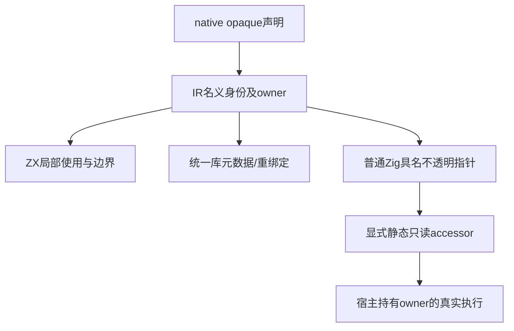

# 原生只读引用测试计划

## Intent：最终目标

为正式opaque名义原生引用补齐packages中的细粒度回归，验证声明与语言限制、独立IR校验、统一库身份、真实普通Zig执行及目标出口；保留宿主owner和ZX容器缓冲区的明确边界。

## Data：可用证据

23fa7ef9实现native-only opaque声明、IR叶类型、名义来源及生成ABI；fd8358f4/e3c17fe8增加有限原生临时值和循环列表容量优化。只读审计固定fc7d3f58未发现正式引用专项声明。docs的AST遍历及再发布记录可定位机制，不能计为本部分重新执行。成熟入口为native/declarations_test.zig、library/imports/native_fixture.zig、native_runtime双生成路线及iterate_buffer资源驱动。当前矩阵审计80,155目录案例、2,438份审阅、51,159待审阅；这些数字不包含本部分尚未落地的声明，也不证明全量执行通过。

## Edges：边界与限制

opaque本身没有ZX字段或指针索引操作，读取由显式静态native accessor完成。引用叶值可复制，optional和局部容器可保存它；容器只拥有自己的缓冲，不拥有或延长宿主对象。编译器可检查引用结果输入含引用、Store/task/concurrent及外部数据出口限制；无法证明任意可信Zig实现只读或指向输入owner，测试不得声称这种证明。codec保存类型/身份元数据，不能把它说成序列化运行时宿主地址。

所有产物是普通Zig与静态原生模块，不新增zxc运行库、解释器、动态加载、句柄表或对案例的硬编码。两轮正在运行的根检出保持固定。正式测试先在docs草稿，再最小落packages/test/tests/native/references；独立gate仅挂对应阶段，不把未完成阶段提前计为通过。

## Answer：分阶段交付与成功标准

1. 声明与语言：native-only opaque、引用/optional/列表/对象/元组局部使用、直接字段/索引/比较/构造拒绝、原生返回来源及concurrent、Store/task边界；通过真实public project API和精确独立诊断断言，含OOM。
2. 独立IR和出口：唯一native owner/声明绑定、伪造来源和嵌套Store/task/native边界；进入真实validateIr、CLI/NAPI/Gateway生成拒绝，不只搜索生成字符串。
3. 名义身份及统一库：同实例公开别名共享、不同owner同名类型隔离、间接type-only来源、codec独立拥有权/语义拒绝、消费再发布与OOM。
4. 真实普通Zig运行：宿主地址不变与只读访问、可选引用及辅助栈缓冲、原生副作用/求值顺序/失败截断、source与linked路线、first-write/长运行/分配失败和多缓冲转移；保留owner存活和原输入未被改写的断言。

每阶段按IDEA交付完整中文实施与执行记录、草稿、固定检出和来源指纹、原始日志、声明/实例/缓存独立统计。每部分通过后独立commit/push；完整特性以四阶段证据闭合为标准，不能把声明成功缩减成整个特性完成。

## 自我批判

缺少opaque专项不等于已有通用门禁完全没走过共享代码；本部分只补该类型可观测的契约。不得把native local推断成pure，也不得以“避免元组装箱”扩大为通用逃逸证明。循环容量复用仍可能扩容、复制及OOM，必须检查旧输入、旧版本观察和结果准确长度，不承诺整个遍历无分配。

## 第一阶段：声明与语言边界已验证

接替原六份草稿后，新增九条独立边界，正式落地40个Zig测试声明：接受13、原生声明12、语言拒绝13、分配失败清理2。`packages/test/build/native_references.zig` 提供 `test-native-references-analysis` 并挂入默认 `test`。

固定生产版本 `b4b4bcd9f0ffb9c3f27d6a19aa169a0911be1caf`；Debug和ReleaseSafe各29/29构建步骤、40/40声明实际执行通过，运行测试缓存0。多模式合计80次执行仍只有40个声明，不增加80,155个JSONL登记数或2,438份Test262审阅。

完整来源指纹、命令、退出码和原始日志见 [第一阶段执行结果](原生只读引用测试/声明与语言/执行结果.json)。首轮失败证据保留：旧草稿有两条过时诊断文字、import文本长度常量和const空行分组问题；补充复核中我又误将换行计入import span，最终改为文本精确比较。未发现生产缺陷，未通知实现聊天。

本次只证明公开分析结果、引用名义owner、精确诊断、接受后的独立IR合法性与两条OOM清理。待办仍包括非法IR/目标出口、统一库身份/codec及真实宿主ABI/生命周期运行；不能把本阶段通过称为原生只读引用全部完成。

提交钩子只删除两份Zig来源的import组后空行；最终字节已重新在固定检出执行Debug与ReleaseSafe，各40/40实际通过。执行结果已更新到最终来源指纹，格式化前日志另存保留。

## 第二阶段第一部分：独立 IR 校验已验证

新增 15 个 Zig 声明，固定 `b4b4bcd9` 的 Debug/ReleaseSafe 各 15/15 实际通过：唯一 owner/合法别名、参数绑定、隔离 native-only 程序的来源与并发、嵌套 Store、两条 OOM 清理。完整说明与证据见 [独立校验计划](原生只读引用测试/独立校验计划.md)。测试提交 `c35043ef` 已推送；目标数据出口属于本阶段下一独立部分，尚未验证。

## 第二阶段第二部分：NAPI 与 Gateway 数据出口已验证

新增 12 个独立 Zig 声明，两模式各 12/12 实际通过。实际转换/服务生成拒绝宿主引用，普通标量接口保留正例，含两条分配失败清理。完整说明见 [数据出口计划](原生只读引用测试/数据出口计划.md)。接替后累计新增 67 个声明；统一库身份、真实 ABI/宿主生命周期和 CLI/Wasm 构建仍为待办。

## 第三阶段：统一库名义身份与 codec 已验证

新增 20 个声明，固定 `cd70a631`；Debug 最终 7 个实际执行、13 个未改来源成功缓存，ReleaseSafe 20/20 全部实际通过。涵盖同实例别名、跨实例拒绝、类型中转、metadata 自有字节、codec/消费/再发布及八种有效摘要语义篡改。说明和证据见 [统一库身份计划](原生只读引用测试/统一库身份计划.md)。接替后累计新增 87 个独立 Zig 声明，JSONL 与上游审阅数量不变；真实宿主 ABI 与 CLI/Wasm 构建边界仍待闭合。

## 第四阶段第一批：真实宿主 ABI 运行已验证

新增 14 个声明，在固定 `cd70a631` 的源码及统一库路径真实生成、编译和运行。Debug/ReleaseSafe 各 28/28 实际 Zig 测试通过、46/46 构建步骤通过，运行测试缓存为零。涵盖地址与只读内容、optional/coalesce、引用容器与 OOM、求值顺序及有限错误截断；`pnpm typecheck` 通过。详见 [真实运行计划](原生只读引用测试/真实运行计划.md)。接替后新增独立声明累计 101；引用遍历/loop/多缓冲及 CLI/Wasm 构建仍待验证。

## 第四阶段第二批：循环与借用列表已验证

新增 19 个声明，固定 `f245985a`。Debug/ReleaseSafe 各通过源码 33 个及统一库 33 个声明（含上一批 14 个回归），共 66/66 实际执行；构建步骤各 66/66。覆盖真实叶列表遍历、借用槽隔离、loop 首写、历史版本、两个独立缓冲及五条全分配点清理。详见 [循环与借用计划](原生只读引用测试/循环与借用计划.md)。接替后新增独立声明累计 120；跨 helper 的 pop/append 容量交接与 CLI/Wasm 构建边界仍待完成。

## 第四阶段第三批：辅助函数缓冲交接已验证

新增 12 个声明，固定 `a452881b`，涵盖同类型 owned State 的 step→pop→push 容量交接、保守嵌套列表调用、两个条件 append 缓冲、长执行及全分配点失败。完整 runtime 的 Debug/ReleaseSafe 各 90/90 实际执行、79/79 构建步骤通过；共 45 个独立运行声明，不乘路线和模式。线性成本允许当前每轮临时对象分配，未宣称全程常量或无分配。详见 [辅助函数缓冲计划](原生只读引用测试/辅助函数缓冲计划.md)。接替后累计新增 132 个独立 Zig 声明；CLI/Wasm 实际构建边界仍待完成。
