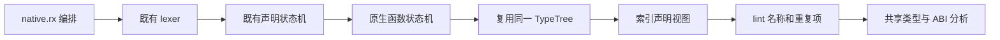
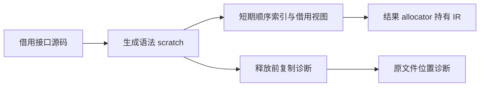

# 原生声明 RX/ZX 自举

## Intent：最终目标

生产 .d.zx 使用 RX 编排、ZX 状态机解析，同一类型表直接进入类型与 ABI shape 分析；旧 Zig 声明解析仅作为构建种子。

## Data：可用证据

modules/declarations.zig 当前创建 Type AST，native.zig 与 native_types.zig 消费该树。已有 declarations 与 types 状态机支持保留同一 TypeTree 后重新启动子类型解析；生成 lexer 保留源码 span 与换行边界。

## Edges：边界与限制

单次扫描，不按参数重扫，不制造普通 Program。declare/throws/concurrent/allocator/io/process 只在当前语法位置解释，不增加全局保留字。命名与重复项使用 lint 和原生接口校验，不复制命名算法。保留注入顺序、有限错误集、并发及 host reference 约束；生产失败不回退旧解析器。多处错误同时存在时，完整语法解析先于名称校验；单项错误的类别、消息和起始位置保持原约定。

## Answer：交付格式与成功标准

新增 native.rx 与按语法职责拆分的 ZX 状态机，输出连续 function/parameter/error 表和共享类型表；native loader 与 ABI shape 使用共同静态 view；接通生成器与 seed 边界，复用现成原生接口、缓存和发行验证。没有新增测试或运行全量测试。

## 实施进展

新 native.rx 已完成 scan→parse→finish 编排；parse 在 loop(initial(in), ...) 内执行真实初始化，遵循现有消费循环的所有权入口。状态机复用顶层声明和共享 TypeTree，不重新扫描每个参数。函数头、参数、类型推进、修饰符、错误名和发布各有明确文件。已移除起草阶段携带源码的本地单词扫描器，复用 lexer 已有 contextual_words 表增加六个词；is_keyword 未变，这些词仍可用作普通标识符。

生产 native loader 已选用 generated_native，并在独立 scratch 中完成索引读取、名称检查和类型顺序处理；seed 分支保留旧声明解析器。两者复用 analyzeView，保留名义类型、namespace、void 参数、native reference、并发和错误集合行为。ABI shape 共用 TypeView，object 只排序临时数值位置，通过 atPosition 常数时间读取原字段，不复制 TypeField 表。

## 验证结果

test-native-declarations、test-scanner-metadata、test-native-references-analysis、test-typed-try-native-contract、test-native-runtime 与根目录 dist 全部以 safe、j2 和本地工具链归档通过。没有新增用例或运行全量测试。

当前发行 CLI 与 Zig 种子分别编译同一份 native.rx 和 program.rx，生成源码逐字节一致。SHA-256 分别为 a7c379249efa02f98e1b918285e03ccd9d3dbea07b340924e7c8dbfee7a43c3b 与 071e8709f6a8b181f74817c1cdcb5cab5b76adda24184f7a6bf9236b787dbbe9。验证未使用旧摘要推定一致，因为 contextual_words 新增词会改变生成源码。

## 自我复核

本次移除了生产原生声明的 AST 物化，仍有短期索引和解析工作内存，未测量吞吐或峰值。公开兼容 parse API、种子、类型分析、所有权和后端仍含 Zig 实现；不能将本阶段称为完整编译器自举。名称错误在完整语法之后检查，组合错误的报告顺序与旧解析器可能不同；单项诊断和现有原生契约专项已通过。没有添加生产回退或专用运行库。
