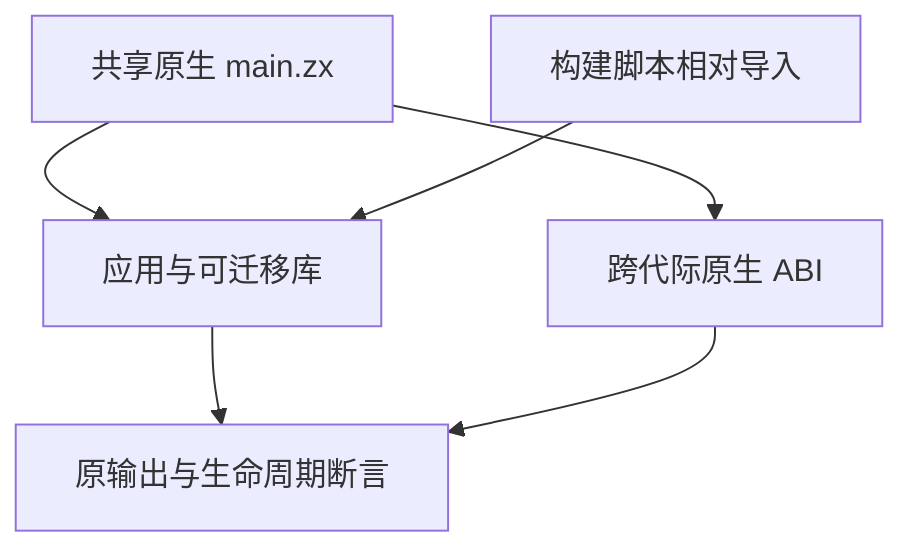

# 原生构建夹具导入同步计划

## Intent：最终目标

让既有应用/库构建和原生 ABI 跨增量代际测试在当前导入契约下继续执行完整断言。

## Data：可用证据

根第二轮原生 generation 测试在 main.zx 的 spacing 诊断处停止。native_test.ts 复制 build_modes/native_declarations/main.zx；该共享源的普通导入和类型导入之间缺少空行。同职责 querystring/parse/cases.zx 已按组留空行。build_test.ts 另有正常相对导入 ./nested/increment.zx，现契约引用 ./nested/increment，而实际文件和 CLI 入口保持 .zx。

## Edges：边界与限制

只同步两个既有测试来源。原生声明、桥模块、ABI 对象返回、资源释放、名义类型身份、声明重排、缓存统计及应用/库重定位断言全部保持。不新增运行库、测试声明或兼容入口，不修改生产实现。

## Answer：交付格式与成功标准

保存原材料、完整草稿、来源指纹和实际门禁日志。固定检出上执行 test-build-modes 与 test-native-generation 的 ReleaseSafe 门禁。通过后独立提交 push，并核验提交来源及证据。文档使用 IDEA 框架；两图分别表示模块结构和数据流。

## 自我批判

原生测试动态写入的是声明重排内容，失败的主源码来自共享目录，不能修改 native_test.ts 伪造通过。构建脚本中的实际 increment.zx 文件路径不可随引用一起去后缀。当前仅能证明对应门禁，不能宣称根回归已通过。

## 最终执行记录

固定 61ee52a6 加上述两个测试来源，ReleaseSafe 的 test-build-modes 与 test-native-generation 均通过，33/33 构建步骤；两项 Node 运行步骤真实执行，无运行缓存。原生代际声明 1/1 通过，保留原缓存统计与声明重排/名义身份/ABI 断言。构建脚本的应用、可迁移 Zig/ZX 库、原生资源、72 次聚合引用调用、两条分配失败遍历、25 个原生调用输入及 264 次压缩应用调用全部原断言通过。

两次首次运行因固定检出缺少 yaml 的 Node 依赖链接而退出 1；日志完整保留。仅补被忽略的依赖链接，未安装或改变依赖版本，第三次实际门禁退出 0。新增测试声明、目录案例及 Test262 审阅均 0。正式来源、草稿和固定检出一致；根第二轮仍保持旧固定快照收集失败证据。
