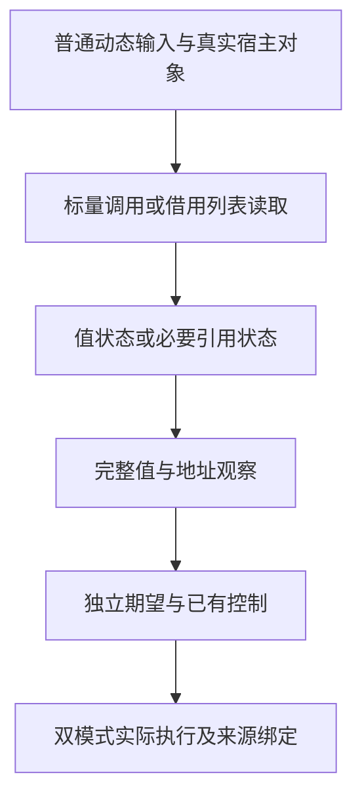

# 原生标量与借用列表值布局回归计划

## IDEA

Intent：验证 e78d3130 的原生标量调用、借用只读对象列表和按值循环状态复用，保持结果、引用身份、错误传播与生成缓存正确。

Data：生产修改仅涉及 genz 的 native_value、value_call/analysis、iteration_layout、iteration 四份文件。上一轮原生引用专项绑定 f38d9b4f，不能当作该修改的证据；6ec98c71 的 querystring 双模式正式门禁与三目标应用已经通过。value_eligibility 夹具的 native.check(u64):bool 符合新 scalarBoundary，但旧断言仍要求原生调用阻断 callValue。

Edges：先实际执行现有测试，再依据公开契约区分旧预期与生产缺陷。修正错误的断言前保留原始失败记录和源码来源，并保留完整生成缓存比较、恢复与重复调用观察。只补缺失的独立语义边界，不重复增加已有 native 或输入声明计数。发现真实生产缺陷才通知实现聊天；根目录 ebe3d605 回归仍独立运行。

Answer：固定 6ec98c71 隔离检出，对 module generation、value return、iterate buffer、typed try 与 native reference 执行针对性 Debug/Safe 门禁；必要夹具调整先放草稿，保存每阶段实际退出码、完整日志、生成源码、原生运行报告和 SHA，完成后单独提交 push。

## 具体步骤

1. 只读审阅四份改动与同职责成熟测试，记录现有覆盖和具体缺口。
2. 验证 URI 隔离检出的七个改动与已提交正式文件一致后，将其切换到 6ec98c71，保留原始 URI 证据。
3. 运行当前门禁，区分旧“原生全部不纯”假设与实际语义违约。必要时补足标量和携带引用的对照，不凭源码文本判断运行结果。
4. 草稿格式化后同步固定检出，分别完成 Debug/Safe；记录缓存复用与实际运行的不同计数，不能将 cached 叶子当作本次执行。
5. 核对正式 diff、类型和来源 SHA，自我批判后提交 push。整体 Test262 对齐仍继续。
