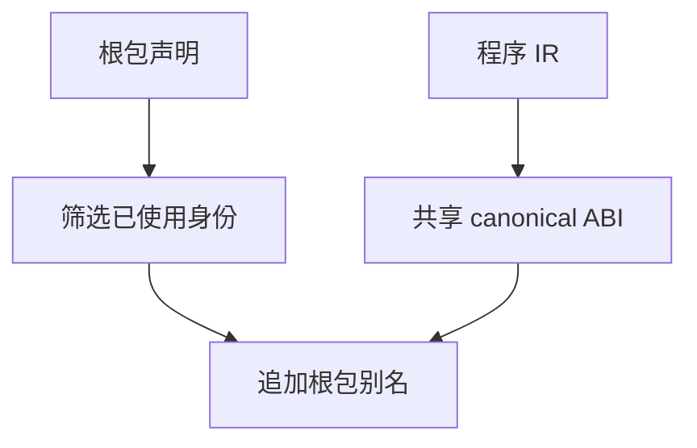
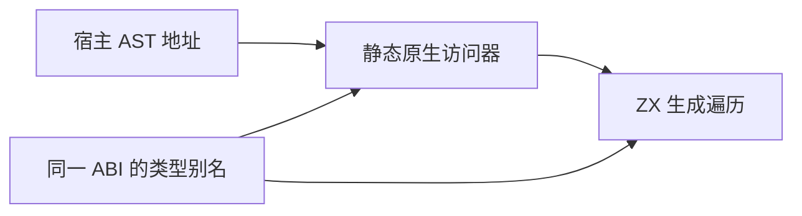

# 原生源码 ABI 修复

## Intent

直接源码输出的共享 ABI 提供根包原生实现可用的 native/layouts 别名，保持名义类型和包隔离。

## Data

verified_compile.render 仅写 bundle.types；有 identity 时 genz 只生成 native_by_identity/layouts_by_identity。CLI app/lib 的 abi.render 已根据根包配置构建别名。原生借用引用草稿通过 app/lib 接线，但直接输出缺少 native 名称。

## Edges

只补根包公共视图；不改变 canonical 类型、不复制宿主数据、不把依赖包同名接口混入根包。底层 emitBundle 仍是无项目上下文的 canonical 输出。源码消费方仍显式静态接线原生模块；依赖包可按 identity 使用对应类型，完整自动接线由 build/lib 提供。

## Answer

在 compiler 的 verified source 输出边界，根据 project 的根包接口及无作用域模块生成别名。真实 AST 草稿增加直接 CLI 输出构建选项，沿用已有输入核验，不新增测试用例。





## 验证与自我复核

发行构建通过。直接 CLI 输出后，草稿以 `-Dcli-source=true` 成功编译；五份既有 RX 输入的节点数仍为 5、3、3、8、5，与 compiler API 及再次发布的 lib 路径一致。结果存入原生借用引用的既有 AST 记录。

修复只追加编译期类型别名，生成程序仍传递宿主节点指针，没有值转换或 AST 复制。别名去重并排除同名不同身份的歧义；无作用域输出保持原格式。当前专项验证并不证明所有跨包组合均已覆盖；已有 app/lib 视图机制未修改。

复现时从仓库根目录运行：

```sh
zig-out/bin/zxc docs/2026-10-06/原生借用引用/walk.zx --project docs/2026-10-06/原生借用引用/pkg.yaml --out docs/2026-10-06/原生借用引用/generated/cli.zig
```

然后在原生借用引用目录执行 `zig build -Dcli-source=true -Doptimize=safe -j2`，运行 `zig-out/bin/walk <已有 RX 文件>`。

既有 `test-native-aliases` 专项通过 10/10，涵盖默认名、显式别名、共享 canonical 类型、重复映射、未知／冲突目标、空映射及失败发布保护。该专项主要覆盖 app/lib 既有接线，直接源码输出由上述真实 AST 消费补充证明。本轮未新增测试、未执行全量。源码提交 `a5d5ff33`，原生分支对应 `355d2427`。
