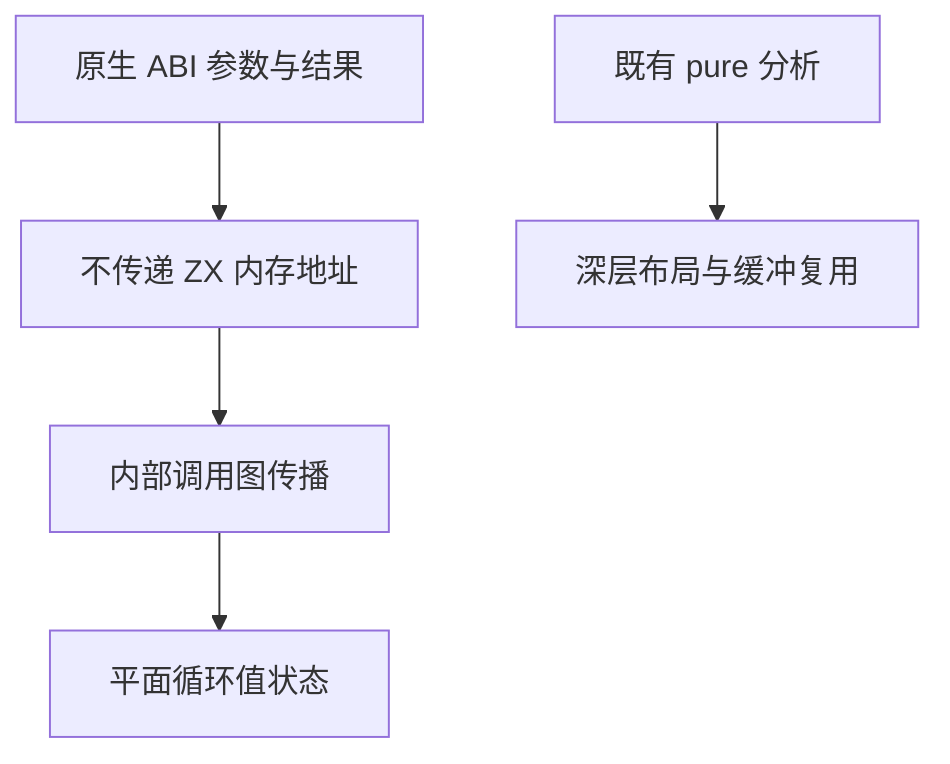

# 原生调用临时值优化

## Intent

让静态原生访问器参与的 ZX 遍历采用普通 Zig 值状态，去掉不必要的聚合装箱，同时保留调用副作用和借用边界。

## Data

现有 AST 草稿中的 native childCount 接收宿主引用，childAt 的声明多参数在 external.expand_tuple ABI 下逐字段传递；原生函数不接收编译器包装元组的地址。当前 pure 同时阻挡循环平面值状态；push/pop 结果投影仍装箱临时元组。pop 不复制元素，push 每次重新分配并复制元素。

## Edges

原生函数不被标为 pure，不新增纯函数语法。单独分析不会传递 ZX 内存地址的调用：数值、枚举、错误集、宿主引用及其 optional；排除 string、list、object，以及没有展开的 tuple。展开元组必须逐项满足边界，返回值也须满足相同叶值约束。

内部 ZX 函数按调用图传播这一事实；Store、并行、任务和未知原生调用仍阻挡。只放宽平面循环状态；深层布局、静态列表和缓冲复用继续沿用原 pure 条件。调用仍原位执行，不做删除、合并、提升或重排。

直接字段投影可使用集合返回元组的值布局，因为投影不会暴露元组包装的地址；已有缓存必须优先复用。集合元素和切片的原有存储仍保留。

## Answer

增加独立调用边界事实，供平面循环布局和展开的原生参数元组使用。验证真实 AST 草稿生成及执行、相关既有专项，记录剩余容量分配。不得把辅助栈必要存储宣称为零分配，不新增用例、不跑全量。




关键生成形态为先物化带类型的元组，再同步调用已有包装函数；包装函数只把各字段值传给原生代码，局部元组地址不会跨越该边界。

## 实施与生成证据

`native_value.isolated` 检查真实 ABI，`value_call.analysis` 保留 pure 并新增 local 调用摘要，后者仅供平面循环布局使用。展开参数仅在直接 tuple 且未缓存时在调用 block 中物化；声明显式 layout 类型，之后传地址给只展开字段的包装函数。

集合结果直接投影复用已有值生成入口，缓存优先级和求值顺序不变。真实 AST 遍历的 execute 中，源码级 create 调用位置由 7 处降为 0 处；两处 alloc 和两处 memcpy 均保留，分别用于 frames 与 indices 的 push。此计数是生成代码位置数，不是跨所有输入的运行时分配次数。

生成代码的关键片段：

```zig
var state_1: (zx_abi).zx_type_15 = operand_3;

const operand_21 = @as((zx_abi).zx_type_12, block_20: {
    const operand_18 = ((&state_1)).node;
    const operand_19 = ((&state_1)).index;

    break :block_20 .{ operand_18, operand_19 };
});

const child = try function_1(allocator, &operand_21);
```

执行仍由先前的 CLI 源码输出草稿驱动，五份既有 RX 文件得到 5、3、3、8、5，未修改输入、遍历算法或原生访问器。

## 自我复核

local 摘要是受限 ABI 的充分条件，不是一般全程序逃逸证明。原生代码可能有副作用，也可能保存宿主引用；只是没有经这些参数获得 ZX 临时聚合地址。未知聚合参数、普通 borrowed 返回、深层视图和可变缓冲仍不能使用这一事实放宽生命周期。只读复核确认了缓存优先、参数先后顺序与调用作用域；实际运行补充证明这份遍历的结果一致。

剩余 push 容量管理需要独立分析旧列表版本是否还能被观察，再决定复用缓冲，不能直接改用 local 门槛。

## 核验结果

最终 `zig build dist -j2` 通过。packages/test 中既有 `zig build test-iterate test-iterate-buffer test-native-generation test-array-callbacks -Doptimize=safe -j2` 通过，包含循环 CLI 的五项求值顺序与错误传播检查、原生 ABI 缓存重用与声明重排执行，以及 Zig 专项。未新增用例、未执行全量。

最终生成源码与实际编译运行的草稿 SHA-256 均为 `812b7f4216c165c92e989b7b2d9bcff915814c47aae5a33ce282d4faf60824fd`。

通用生成器源码提交 `fd8358f4`，原始 Zig 分支对应 `6ffd38ab`，均已推送。原生 CLI 已重建，对同一草稿生成的普通 Zig 摘要也为上述 `812b7f...824fd`；这只证明该入口一致，完整编译器自举仍未完成。

后续 [循环列表容量复用](../循环列表容量复用/实施计划.md) 已完成独立版本与逃逸检查，并在满足条件时复用辅助栈容量；本记录中的两处逐步 alloc/memcpy 计数是容量阶段之前的证据。
