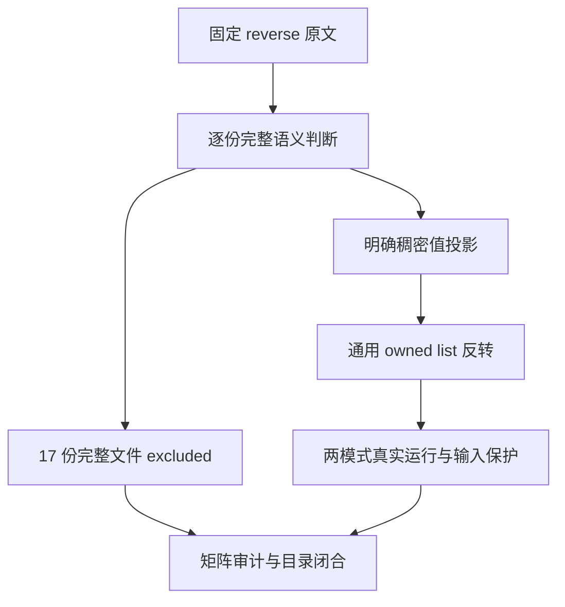
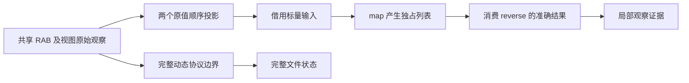

# 反转目录收尾审阅计划

## Intent：最终目标

逐份完成 Array.prototype.reverse 剩余 17 份原文审阅，并验证可保留的稠密值观察。完整原文的接收者身份、稀疏属性、动态 length、原型、Proxy 或可调整共享缓冲区协议不能被普通列表反转替代。

## Data：可用证据

固定 Test262 快照 7ab7fafa 的 reverse 目录共 18 份，17 份未审阅；全部物理源 SHA-256 与索引一致。独立只读分析已逐份全文查看。唯一旧登记 A1_T1 已撤回仅保留值的 adapted，现为 excluded，因为遗漏了三个返回接收者身份断言。

ZX 的 reverse 消费独占 list，返回 [列表, void]，允许 std.mem.reverse 原地复用经过拥有权证明的存储。既有 i64 owned/0..5 六组共 126 个具名案例，含 [1] 与 [0,1] 的精确输入，不能重复添加这些原值凑数。

## Edges：边界与限制

按实际源码而非标题判断；A1_T2 实际是混型原始值和空洞，A2_T1 是普通 array-like 对象。普通对象改 length 不会自动截断数值键。A2_T2/T3 还包含 Number/String 包装对象的 ToLength，负 length 例检验钳零同时保留原属性。

冻结单元素例虽没有 assert 调用，正常完成仍证明没有执行会失败的属性写入。Proxy 例必须保留 29 项精确 trap 轨迹、首错误截断和已完成的部分写入。RAB 例每个实际构造器有 20 次反转/whole-view 比较，核心是共享缓冲、offset、固定/跟踪视图在缩小与增长时的差异；这些静态数量不当作动态执行计数。

新增局部观察只取 RAB 原值的 [0,2,4,6]→[6,4,2,0] 与 [0,2,4]→[4,2,0]。同一通用 ZX 程序通过 map 建立独占标量列表再 reverse，适用于任意输入长度和值，不为两个输入写特殊分支。列表支持检查原借用输入未被改写；不声称该投影实现 RAB、视图别名或 resize。

## Answer：交付与成功标准

记录 17 条带完整观察理由的 excluded，明确可保留局部观察的行号、原值和案例关联。离线按 flags 与 includes 运行标准 harness 和完整原文，保存源及 harness 指纹；原文参考执行不计为 ZX 兼容通过。

先写代码与登记草稿，再落地两条具名 i64 稠密投影、一个通用 fixture、新生成器及默认一致性门禁。与既有 126 例共同在 Debug/ReleaseSafe 真实运行，矩阵审计及 reverse 未审阅集合为零。保存自我复核后本部分独立 commit/push；仅实际生产违约通知实现聊天。

## 自我复核

不得把“新列表语义”解释成必须新地址，不得把没有 assert 的正常完成例称为零测试。排除依据为现有明确语言边界，不用于掩盖已承诺 reverse 顺序、长度、拥有权或资源清理的缺陷。

## 执行结果

测试固定生产提交 `cf4c9e33`（包含 `00208e21` 外部签名索引视图），代码及登记草稿与正式测试同步。Debug/ReleaseSafe 各 58/58 构建步骤、128/128 目录案例实际通过，无运行结果缓存替代，涵盖既有 126 条和新增两条原值投影；类型检查和新增生成器一致性均退出零。30 份依赖源逐份与固定检出核对，见 [执行结果](反转目录收尾审阅/执行结果.json)。

17 份完整原文按 flags/includes 使用标准 harness 离线执行普通/严格模式，共 34/34 通过。RAB 参考实际包含 15 种构造器及子类，未将静态循环数量当成动态断言计数。全部 18 份目录物理原文 SHA-256 与索引一致。本次 17 份均完整 excluded；旧 A1_T1 已在此前撤回 adapted，因此本目录 18 份 excluded、零未审阅。

矩阵审计通过，累计 80,161 个 JSONL 案例，其中 runtime 62,618；2,476 份已审阅（690 adapted、103 equivalent、1,683 excluded），51,121 份未审阅，4,943 个关联案例。四个新关联只说明局部值观察，两个复用准确原值、两个新建；不说明四份完整兼容。

自我复核发现起草 suites 时 Python 的 JSON 缩进扩展了无关单元素数组格式；立即用既有 prettier 规范恢复，仅保留五行登记 diff，同步草稿与固定检出。JSON 内容、执行夹具及案例均未改变；两模式实际执行结果和最终源指纹分别保存。没有真实生产实现违约，未通知实现聊天。
