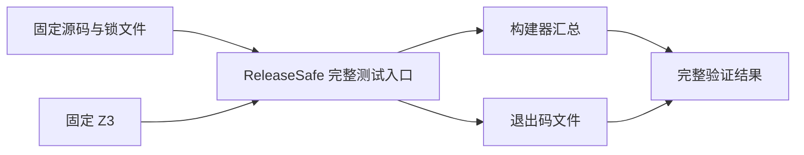
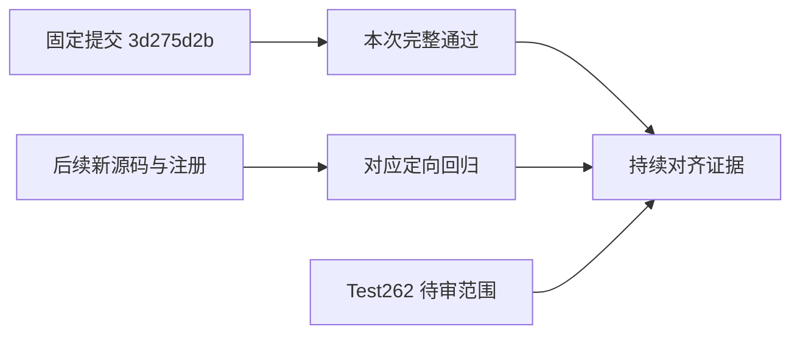

# 固定检出 ReleaseSafe 全量验证

## Intent

在持续并行开发期间，用固定且干净的源码快照验证完整 packages/test 入口，避免旧构建依赖图与更新后的源码混用。

## Data

固定提交为 3d275d2bb616a64ea18caf9529b7162471fd7245，tree 为 3c005862f9810fefc3ab8a3ddfd1480fc96cdb68。检出启动及结束时均干净，HEAD/tree 未改变；锁文件及 Z3 二进制指纹与启动记录一致。

命令在固定检出的 packages/test 中执行：

```sh
ZXC_TEST_SOLVER=/tmp/zxc-z3-5.1.0/z3-5.1.0-x64-osx-13.3/bin/z3 zig build test -Doptimize=ReleaseSafe -j2 --summary all
```

进程正常退出 0，外层命令写入的退出码文件同为 0。完整日志汇总为 5199/5199 构建步骤成功、86146/86146 测试通过；未出现顶层 error: 或 failed command:。

## Edges

这是固定提交的完整构建结果。之后新增的类型解析、模板预处理、表达式预读、导入路径与上游适配注册不自动进入旧构建图，仍以相应定向结果为证据。

日志含 61 处缓存测试条目，保留这一事实，不声称所有测试都在续跑期间重新执行。测试数量使用构建器汇总，不与 JSONL 目录数量或 Test262 审阅份数混为同一指标。

首轮句柄丢失且系统进程消失的未证实终态记录保留；本结果只属于后来重新启动并取得完整退出码的续跑。整体 Test262 对齐仍有待审文件，不因本次全量成功标记任务完成。

## Answer

完整结果、命令、快照身份、退出码、日志和依赖指纹保存在固定检出ReleaseSafe全量结果.json。原始日志为 ../2026-10-05/测试包全量回归/固定检出ReleaseSafe续跑.log；旧续跑记录同步改为 completed 并指向新结果。





## 自我复核

成功结论同时依赖实际进程退出、退出码文件、完整汇总及源码快照核对。Node 集成命令也是构建步骤的一部分，整个构建成功才支持总入口通过。缓存命中、固定版本和待审范围均明确保留，未把当前共享工作区描述为同一全量快照。
