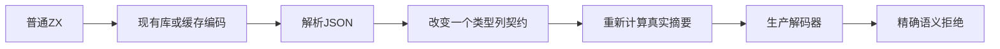
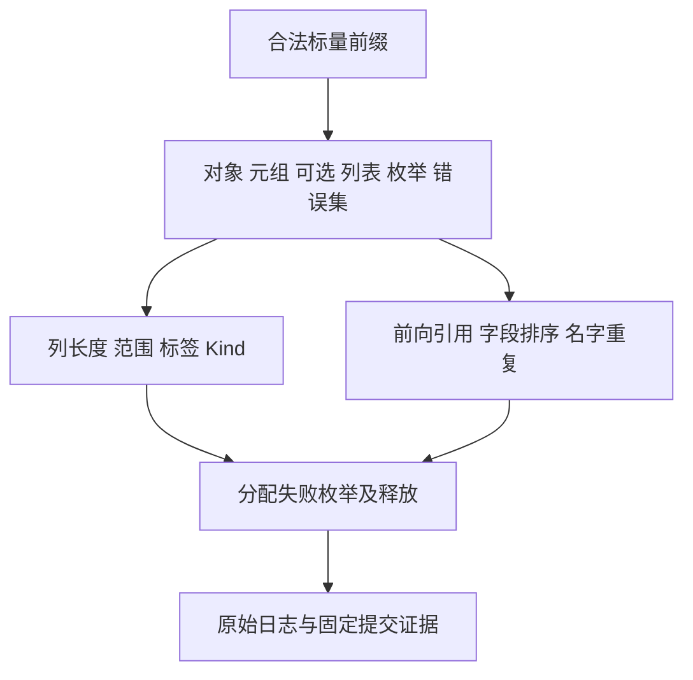

# 外部类型列解码回归

## IDEA

Intent：证明摘要匹配的合法 JSON 仍必须通过类型表结构与语义验证；损坏列不得触发越界投影，解码失败必须清理全部分配。

Data：固定 79cc01c8，包含名义来源自举 5a523edd 与存储修复 ba9dde18。现有缓存仅用空类型表检查语义拒绝，库已有导出及名义身份拒绝，但尚缺逐列范围、引用与字段排序输入。

Edges：普通 ZX 生成合法基表，每次只损坏一个契约。独立校验摘要及 JSON，错误必须分别为 InvalidCache、InvalidLibrary。仍允许 OutOfMemory 传播，不将分配失败改写为语义错误。没有新增生产实现、运行库或解释器；本部分不宣称证明缓存恢复后的应用执行。

Answer：两个解码路径复用同一普通复合源与定向列变换，各边界独立测试声明；沿用现有门禁和分配失败工具。先写草稿，双模式执行，保存实际计数、来源 SHA 和自我批判，完成后提交推送。

