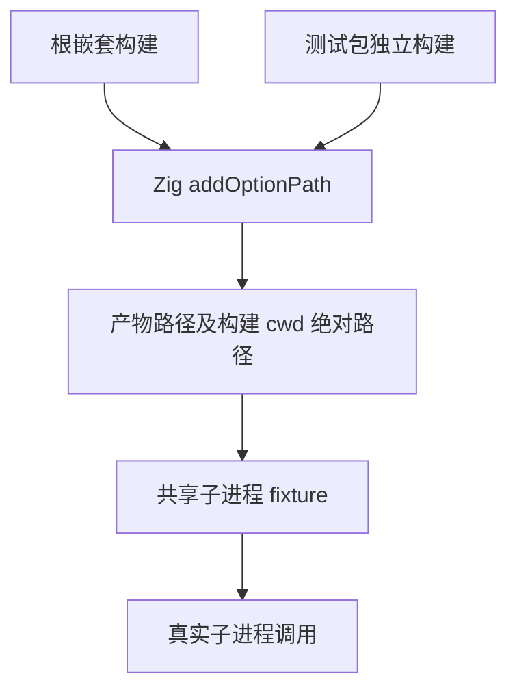

# 子进程夹具构建路径同步计划

## Intent：最终目标

使原子进程与带输入子进程测试在测试包单独构建及根嵌套构建时，都使用 Zig 构建系统提供的同一可执行产物路径。

## Data：可用证据

第二轮根日志已出现 child input 的 FileNotFound。实际根生成 options.zig 的 root 是 packages/test，child 是 .zig-cache/o/…/child-input-fixture；fixture 再拼接 root 后指向不存在的 packages/test/.zig-cache。child_process 同职责实现同样重复拼接。原单包门禁通过，因为单包 root 为当前目录。addOptionPath 已提供相对整个构建工作目录的产物路径，各 run 未更改 cwd。

## Edges：边界与限制

只将两个 build owner 的 root option 改为构建配置进程的实际工作目录绝对路径；已有 fixture 继续将它与 addOptionPath 提供的相对产物路径组合。保留所有真实子进程输出、环境、限额、清理、分配失败与并发错误断言；不改生产 child API、不新增案例。正在运行的两轮根检出保持不变。临时根门禁只选择两个原 top-level 子门禁，不修改正式根接线。

## Answer：交付格式与成功标准

按 IDEA 保存两种构建入口的真实 ReleaseSafe 日志、原来源、完整草稿和指纹。先由隔离根嵌套门禁复现旧路径错误，再覆盖两份最终 build 来源，根入口及测试包入口均通过原 test-child-process/test-child-input。结果统计区分实际与缓存；独立提交 push，再由新固定根全量验证。

## 自我批判

路径问题属于测试基础设施，不能当作生产子进程 API 缺陷反馈。不能硬编码仓库绝对路径，也不能按某个失败用例修补命令；动态获取整个构建工作目录作为相对产物路径的基准，保持 command 绝对路径，才同时满足独立、嵌套和 child.cwd。复现日志必须说明未执行全根矩阵，局部通过不能替代全量根成功。

## 初次修正的反证

旧根入口退出1，98个原实例中29通过、69失败，明确为 FileNotFound。直接使用相对 child 路径消除了重复包目录，但根门禁随后使原 explicit cwd 场景失败：子进程工作目录会改变相对 command 的解析基准。因此该初稿不足以满足原契约，完整草稿与真实日志保留；最终收束为两个 build option 的路径基准修正，两个 fixture 恢复原实现，不加 runtime 分配或特殊用例条件。

## 最终执行记录

最终根入口与测试包入口 ReleaseSafe 均退出0，原98/98 Zig实例全部实际通过；各11个实际测试运行步骤无缓存。根入口68/68构建步骤；两种入口保留explicit cwd、输出/环境/限额、真实取消与进程回收、分配失败等全部原断言。最终仅两个build文件的一行路径基准同步，fixture完全恢复原字节。初次反证与旧根失败日志完整保留；新增声明/目录案例0。两个入口各自的98实例不能相加为新增覆盖或全量根通过。
