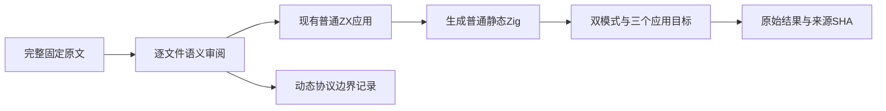
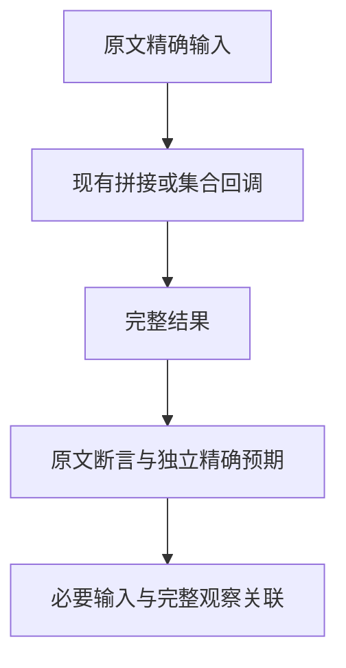

# 字符串空尾与常量回调原文适配计划

## IDEA

Intent：完整审阅 String.concat 的二十二份原文，以及 map/filter 的两个忽略实参回调文件；把现有能力能完整保留的结果观察接入普通应用执行，逐项标明其余文件的动态协议边界。

Data：固定上游 7ab7fafa，当前正式提交 b7f882cc。现有 explicit_strings、map_true、filter_true 普通 ZX 应用已经登记并由默认 runtime 执行；候选精确输入未登记，生成器分别由 generate_addition_strings.ts、generate_collections.ts 管理。

Edges：不能将对象 ToString、boxed receiver、函数属性、构造性或不可转换接收者检查缩成字符串常量检查。map/filter 原文零形式参数回调仅观察结果，不读取函数 length、arguments、this、索引或原数组；适配为显式但未使用的 item 参数时完整保留结果观察，并明确不声明零形参 lambda 或 JS 反射兼容。任何 excluded 都是当前语言契约边界，不计为运行通过。

Answer：先保存完整原文和 SHA、执行未经改写的 JavaScript，再形成逐文件审阅草稿。仅在完整映射成立时给三个已有目录补必要输入和生成来源；通过真实生成 Zig 的 Debug/ReleaseSafe 及原生、Wasm、WASI 应用观察，核对审计、正式来源与自我批判后单独提交 push。

