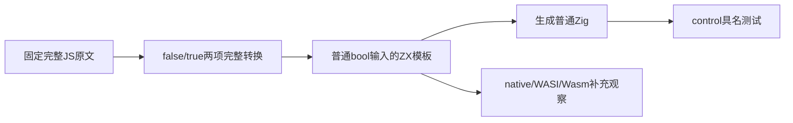
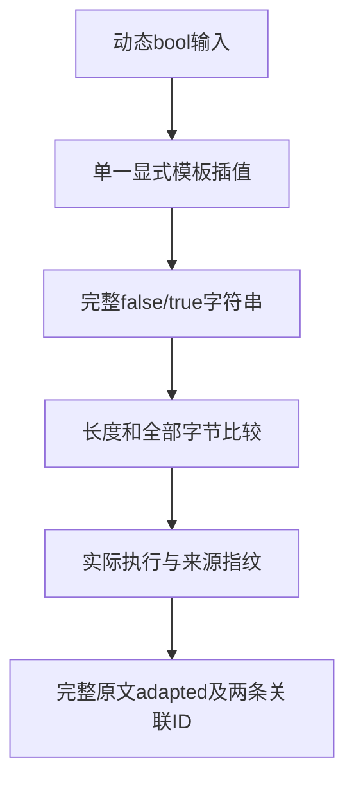

# 布尔转文本完整原文适配计划

## IDEA

- Intent：完整适配固定Test262的S9.8_A3_T2.js，验证false/true转换为精确文本false/true。
- Data：完整原文仅两项primitive布尔观察，SHA为b2ebdfab8c9b4cd341dcb86aab412b7f57889ce8b4d0b510983d222dffa66b2b；现有模板支持动态bool插值，已有dynamic夹具输出混有其他字段，不能以子串代替原文完整结果。
- Edges：把JS隐式拼接转换适配为ZX已有显式模板插值。保留两项完整观察，不扩展声称JS通用加法、boxed、null、undefined或对象ToPrimitive支持。只新增一个普通bool输入应用与两条独立目录记录，不增加新的运行库或目标专用逻辑。
- Answer：两个模式实际运行两个具名Zig测试，复用正式control支持及其编译链；另复用正式application_json驱动核验三出口相同数据。保存原样Node普通/严格参考、原文SHA、实际命令与原始报告、生成Zig、正式登记一致性及自我复核，完成后单独提交push。

## 实施边界

草稿与证据写入布尔转文本完整原文适配目录。正式用例复用language/expressions/template_primitives及现有test-template-primitives聚合门禁，不新建独立runner。两条小型手工目录记录不需要新增矩阵生成器；既有模板生成器只维护original/dynamic，保持其职责。

验证编译器复用固定f38d9b4f核心Debug原生边界报告中实际使用的不可变CLI产物，记录其SHA。生成应用的优化模式分别为Debug/ReleaseSafe；CLI自身的优化模式不是应用模式。新的源码与注册在正式写入前先完成可审阅草稿，原生及应用驱动都不根据ID选择返回值。

## 自我复核要求

Node原样通过只是参考执行。模式、三个出口及重复观察不增加独立ID。模板转换是公开能力的明确适配形式；是否支持隐式bool+string不是本次通过声明。根ebe3d605完整回归与输入不可变专项仍各自保留独立基线和证据。
