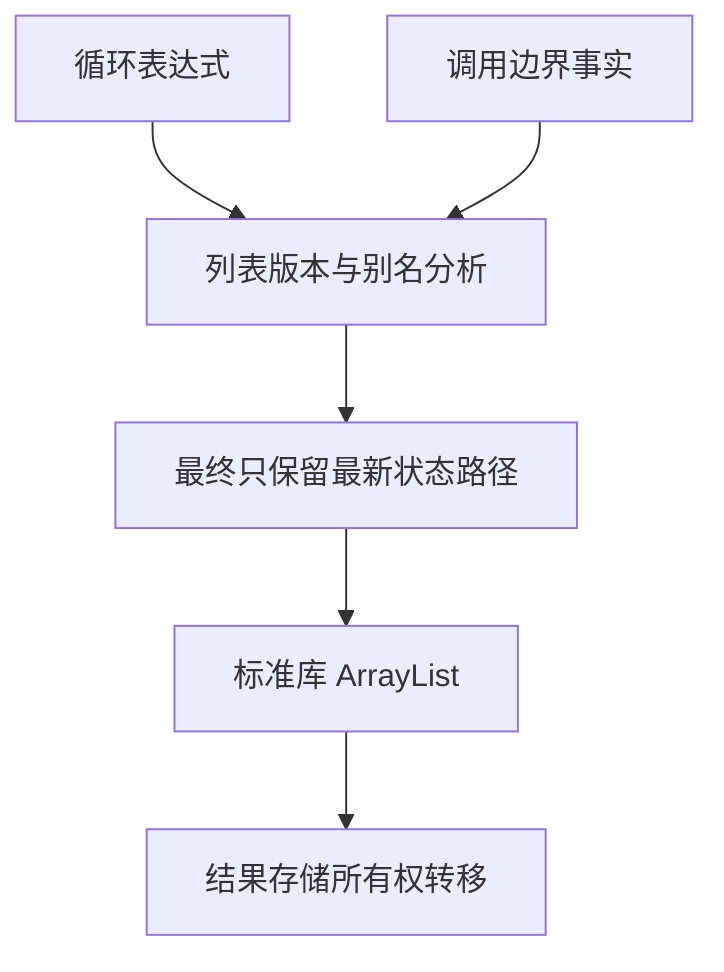
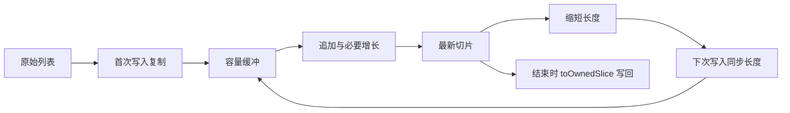

# 循环列表容量复用

## Intent

把安全的循环列表追加生成普通 Zig 容量缓冲，避免辅助栈每次 push 都复制全部元素，同时保持不可变快照与借用语义。

## Data

iteration_buffer 已以 version/stale/aggregate 事实分析 list_update，分支汇合后检查最终状态只保留最新版本。collections 的 push/concat 每次 alloc+memcpy，pop 只缩短切片。object_reduce 已使用标准库 ArrayList，但其追加缓冲不能直接假设循环 pop 后长度不变。

## Edges

只接受单条状态路径上的 push/concat/pop 与索引更新；元素必须是现有可复制叶值。参数不可包含该列表别名，旧版本的元素读取和返回到其它字段均阻挡优化。目标列表不得传给原生函数；内部调用沿用消费输入与返回列表检查，并由完整调用摘要排除 Store、任务及未知原生地址边界。

每条路径第一次写入时复制原始切片，保护调用前已有的别名。随后以当前切片长度同步容量缓冲；pop 本身仍是切片操作。最终 toOwnedSlice 转移实际长度的存储并写回局部状态，defer deinit 负责出错清理。不能把带多余 capacity 的 slice 直接交给通用所有权释放。

动态容量要求可以更新最终状态字段的值布局，或者根状态本身是列表。深层布局仍由原来的纯度条件证明；不能修改不可变输入对象来写回结果。

## Answer

扩展既有版本分析，增加容量存储生成和最终所有权转移。复用真实 AST 草稿及现有循环/快照/资源专项，不新增测试或全量运行。交付生成结构、实际结果与剩余限制。





预期生成形态：

```zig
var items: std.ArrayList(Element) = .empty;
defer items.deinit(allocator);

if (!started) {
    try items.appendSlice(allocator, source);
    started = true;
} else {
    items.items.len = source.len;
}

try items.append(allocator, value);
```

这只是容量生成片段；最终状态的 toOwnedSlice 与错误清理必须同时实现，才能交付。

## 实施边界与自我复核

新增分析把 push/concat/pop 的第一个返回字段标记为新版本；pop 即使不分配，也会让旧版本失效。任何参数计算完成后才核对目标版本，原生调用收到列表或包含列表的聚合一律拒绝。嵌套 iteration/transform 目前不做捕获证明，直接阻挡候选；二元表达式在右侧求值后重新核对左侧版本。

容量仅用于有实际写入的路径，只有 pop 的列表继续使用切片，不创建容量缓冲。索引更新与追加共用同一首次复制标记和 ArrayList；写入及最终转移前都同步当前长度。最终转移出的 slice 在循环外层 block 中配套 errdefer，避免第二条路径转移失败时遗留第一条的结果；未转移的 ArrayList 另由 defer 清理。

发行构建通过。真实 AST 草稿以 CLI 输出构建成功，五份既有输入仍为 5、3、3、8、5。生成执行体现在含两个 ArrayList，各自具有 appendSlice 首次复制、append 增长、长度同步和 toOwnedSlice 写回，不再逐步直接 alloc+memcpy。容量增长仍可能复制元素，不能宣称无分配或无任何复制。

当前动态执行覆盖该真实遍历；未新增容量路径的逐分配点 OOM 用例。只读审查核对了 flat/deep/root-list 写回和多路径清理，但审查不能替代尚未覆盖的运行场景。

## 生成缓存依赖

复核发现调用者生成会读取被调函数的 pure/local/consumes_input 事实。指纹现已显式纳入这些调用依赖，并将输入域标记更新为 v6；仅依赖相关调用的模块受影响，不把所有函数体粗粒度放入每个调用者指纹。

此前循环、循环缓冲、循环调用和对象值返回四个既有专项均通过。缓存补核验中，模块生成单元专项 21/21 通过；完整缓存运行专项与发行打包首次被 Zig 下载的 UnknownHostName 中断，属于环境失败，不记为通过。改用本地官方归档，其 SHA-256 与 releases.json 锁定的 `4f9a1c5269aa17ebda5e6d3c2b89d6cbf36f7d2b22a0306e9ab98f25f95529c6` 一致，通过现有 zig-archive 参数重新打包；不绕过工具链校验。

## 最终核验

本地已校验归档重新打包后的发行构建通过。直接以最终 CLI 运行既有 `tests/incremental/generation_runtime/runtime_test.ts`，3/3 通过，覆盖 cold/warm/changed/disabled 生成、损坏内容恢复和错误键载荷拒绝。没有为环境下载失败改动测试驱动或正式构建规则。

最终 CLI 生成的遍历源码与实际执行版本摘要一致：`1a1760ddd2a653b0779aa03dd4973884a3494c79ee71b07fbe14131a2205c99a`。

通用源码提交 `e3c17fe8`，原始 Zig 分支对应 `73ca6f35`，均已推送。原生 CLI 使用同一已校验官方归档重建成功，对该遍历的生成摘要与当前自举 CLI 相同。

下一阶段应迁移完整 Schema 遍历、规则和首个诊断选择，保留 enter/exit 的检查顺序；不能再用更多 Zig 遍历加 ZX 小谓词代替完整迁移。完整解码的递归语义模型仍需单独实现或显式转换为索引记录，不能把校验成功等同于解码自举完成。
