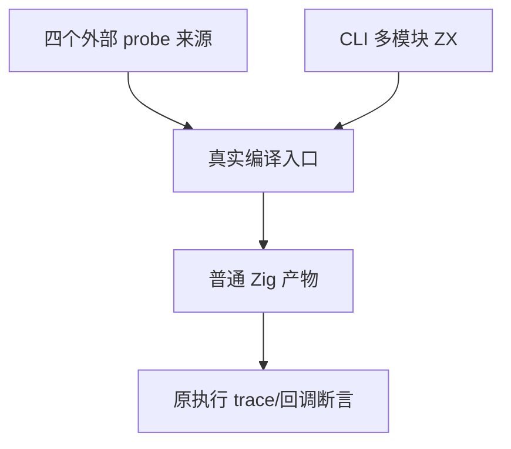

# 执行夹具导入前缀同步计划

## Intent：最终目标

恢复已有求值顺序和 CLI 多模块执行门禁，让原 trace、短路、异常传播和 map 回调断言继续执行。

## Data：可用证据

根第二轮四份 evaluation_order 来源在 analyzeProject 入口被 spacing 拒绝，第一与第二行 import 后有尾随空格；顺序已正确。lint/imports/edits.zig 重建导入区间时将普通语句按换行拼接，旧间隙尾空格产生不相等。CLI modules.zx 则将 type-only root alias 放在 relative 函数导入之前，违反 order.zig。

## Edges：边界与限制

只改五份正常执行来源的 import 前缀。四个 probe 文件不换序，只清理两行的 import 尾空格，函数体中的历史空格不改。CLI 保留 ./add 与 root alias 真实路径、Number 身份、回调与 [1,5] 到 [4,8] 期待。负例、formatter-only 材料和直接分析入口中有意验证 import 顺序身份一致的案例均保持。不新增测试或生产实现。

## Answer：交付格式与成功标准

IDEA 计划、完整草稿/原材料/指纹；固定检出执行 packages/test 的 test-evaluation-order 以及 packages/cli 的 test-runtime ReleaseSafe，记录实际退出与实例/缓存，成功后独立提交 push。两图为结构与数据流。

## 自我批判

求值顺序的证据来自运行 trace，不能通过调整 import 顺序或删除 probe 改变待验证行为。第一行尾空格影响导入区间 canonical 对照；只删除这两行的尾空格即可，不应格式化整个函数体。

两个门禁在同一固定检出、最终五份来源保持不变期间独立运行；各限制 -j1。求值顺序使用显式 probe 生成驱动，CLI 多模块门禁使用独立 CLI 包生成驱动，日志分别记录，未混合为单个测试实例计数。

## 最终执行记录

固定 767e2ae9 加五份最终 fixture 来源，两个 ReleaseSafe 门禁均退出 0。packages/test 的 test-evaluation-order 为 169/169 构建步骤、1085/1085 Zig 原声明实例实际通过、37 个测试运行步骤无缓存。packages/cli 的 test-runtime 为 67/67 构建步骤、30/30 Zig 原声明实例实际通过、一个测试运行步骤无缓存；CLI 多模块 callback 的精确数组输出也通过。

probe 调用顺序、短路、match 条件/值、反向读取、fallback 与异常传播原 trace 全部保持。只调整四份 probe 的两行 import 尾空格及 CLI modules 的前缀顺序/组间空行，函数体、源身份和断言不变。最终来源、草稿、固定检出一致；新增测试声明、目录案例与 Test262 审阅均 0。两个包的实例分别记录，不混同为新案例数或根成功。
