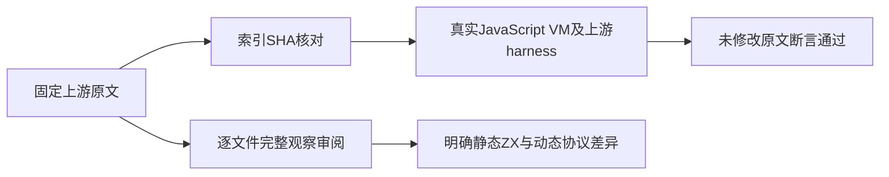
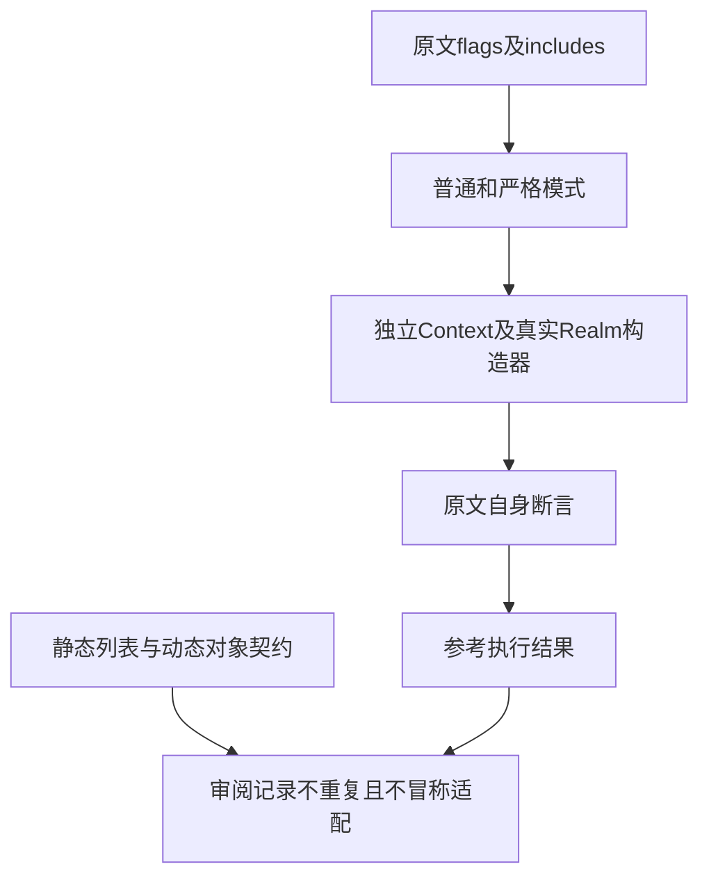

# 数组拼接动态协议原文审阅

## IDEA

Intent：完成固定 Test262 Array.prototype.concat 家族的逐文件原文审阅，防止把仅保留列表值的投影误算为完整 JavaScript 协议适配。

Data：固定上游 7ab7fafa0003f73fc85c1b95d88094d33f7eb8bd 的 69 份原文及 SHA；A1_T1 已明确 excluded，其余 68 未审阅。既有 ZX 列表 concat 只表达静态同类型列表连接，须逐项核对属性、holes、动态 receiver、identity、Spreadable、Species、Proxy 和 Realm 观察。

Edges：Node VM 只执行未修改的上游作为参考，不能计为 zxc 通过。保持一个 noStrict 标记，其余按普通及严格模式运行；Realm 用真实独立 vm Context 的内建构造器，不预置断言答案。不删原文断言，不转换 sparse 数组为稠密列表，不加入专用动态运行库。发现生产违约才通知实现聊天。

Answer：每份原文保存全文及索引一致 SHA，使用上游真实 harness/includes 取得 137 次参考执行结果。仅为未审阅的 68 份新增明确边界审阅；既有记录不重复、目录 ID 和适配数不虚增。完成矩阵审计、来源核对与自我批判后独立提交 push。

