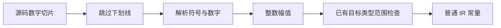

# 整数字面量解码自举

## Intent：最终目标

将语义分析的十进制整数文本解码迁移为 RX 编排与 ZX 逻辑，直接读取源码字节，消除整数分支的去下划线缓冲。保持类型选择、目标范围检查与诊断契约。

## Data：可用证据

analysis/numbers.zig 当前先将全部数字文本逐字节写入 clean，再对整数调用 std.fmt.parseInt(u64, clean, 10)。浮点分支仍依赖 parseFloat 及 u1024 精度检查；此次不以近似算法替代它们。标准 parseInt 允许前导正号和负零，clean 在解析前删除全部下划线，迁移须保持这些内部 AST 输入行为。

## Edges：边界与限制

整数解码返回 u64?，非法文本与 u64 溢出返回 null；原调用方保留 supported range 与目标类型范围两层诊断。所有乘加在执行前检查上限，不允许靠 Zig 溢出错误判断。至少一个数字，符号仅在第一个非下划线位置接受，负号仅接受零值。

输入是借用切片，输出 optional 标量，生成过程不得创建运行期缓冲或对象头。seed 继续使用原生解析，原始 Zig 分支保持不变。未新增测试，不执行全量测试。

## Answer：交付格式与成功标准

草稿与实施记录保存在本目录；生产模块位于 analysis/integer/。接入已有构建期生成机制，核对生成代码无分配并通过发行构建与既有整数专项。浮点文本清理只移动至浮点分支，不改变算法。

## 实施与自我复核

已接入正式 numbers.literal 整数分支；浮点 clean 缓冲仅在浮点分支创建。浮点解析、类型联结和完整语义分析自举仍未完成；这次收益是整数文本不再重复物化，不是整条管线零拷贝。

草稿暴露通用生成缺口：optional 标量返回函数未进入 scalarLocals，导致局部 loop 状态在入口和出口各装箱一次。修复在 genz 中沿 optional 递归检查底层标量资格，沿用原无副作用与逃逸门禁；不按整数模块名选择，也不绕开分配检查。编译缓存版本同步更新。修复后重新生成已确认无分配，再接入零容量适配。

通用优化已提交并推送 master `9072ae90`，并同步到原始 Zig 基线 `515828e7`。修复前草稿产物含两个状态头 create；修复后为零。修复后产物 SHA-256 为 `6e5ef1532190df17ecf863be99e92ac614cfc600063858d7afc9e39b24319605`。通用优化的发行构建与既有 test-value-return 已通过。

验证选择依据：compiler 的 test-frontend 已包含 u8/u16/u32/u64/i32/i64 合法边界与越界，以及整数转浮点精度；此专项与最终发行构建均已通过。检查发现 test-json-integer 只构建 identity 函数并测试运行期 JSON 数字，它不能直接验证整数字面量解码，因此不运行此无关专项。

首次前端专项 312/313 通过，唯一失败为既有 callback_scope 的 checkAllAllocationFailures 报 NondeterministicMemoryUsage。直接运行同一测试产物确认错误类型。Zig 检查器用首轮 alloc 次数决定故障序号，后续 backing allocator 原地 resize/remap 成功可使 alloc 次数减少；仓库 packages/test/tests/support/allocation_testing.zig 已通过禁用这两项保证枚举确定性。本次仅在该既有测试的 allocator vtable 应用相同方式，保留所有失败序号与释放检查，不更改输入、断言或生产分配策略，不新增测试用例。复核后 test-frontend 313 项全部通过。

最终自举生成的 integer.zig SHA-256 为 `4547ccb917205ec1ee0c717ff4322d1602cc23c0473c75e354153544a7956683`，执行 helper 无 create/alloc/dupe。主 CLI 与原始 Zig CLI 对相同 decode.rx 分别生成，SHA-256 均为 `6e5ef1532190df17ecf863be99e92ac614cfc600063858d7afc9e39b24319605`。原始 Zig CLI 构建已通过。不同生成入口的完整类型集合不同，因此不比较完整自举产物与单入口产物的哈希。
