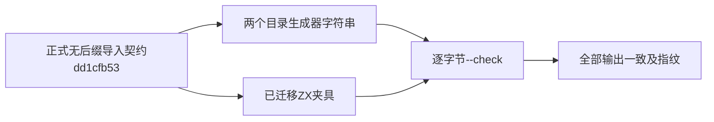
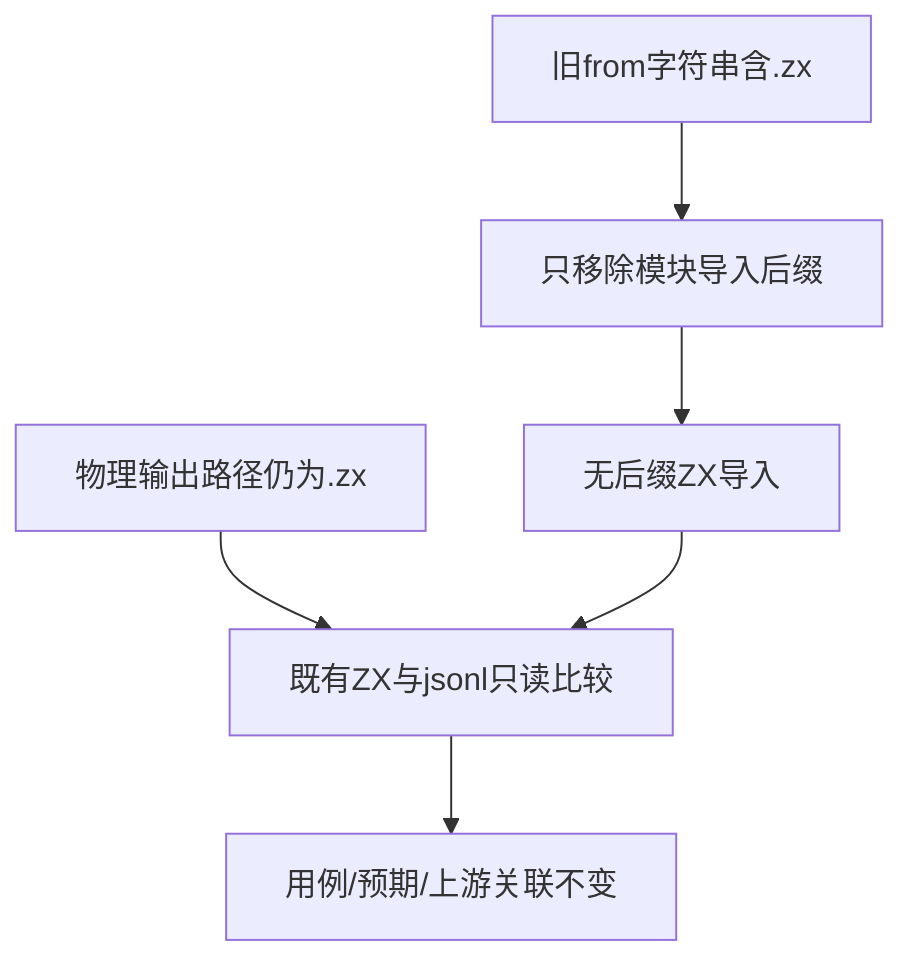

# 无后缀目录生成器对齐计划

## Intent：最终目标

修正两个正式目录生成器仍输出旧.zx导入后缀的问题，使生成结果与已提交的无后缀ZX夹具一致，恢复目录--check门禁。

## Data：可用证据

固定bd5b60f5根ReleaseSafe全量运行中，generate_match_modules与generate_call_arguments的--check在choose.zx和cases.zx报告outdated catalog。已核对dd1cfb53的正式导入规范迁移：对应夹具已使用../types、./nested/choose及./increment等无后缀导入，生成器字符串仍带.zx。这是较早迁移遗漏的测试生成器，不是自举解析器错误；真实输入、期望值与上游关联均无需改变。

## Edges：边界与限制

仅修改两个TS生成器中from字符串的.zx导入后缀，保留writeOutput的物理文件名与所有jsonl条目及诊断。不批量去掉代码或输出路径中的.zx，不写生产编译器，不改全量仍在运行的固定工作树。主检出对应输出目录先确认无WIP；在主检出运行两个--check，成功意味着全部已生成文件逐字节一致，不仅是最早报错文件。

## Answer：交付格式与成功标准

先保存两个同路径TS草稿，再同步已授权正式src文件。两项node --check通过后记录其退出码、生成器及输出目录指纹和实际差异数，独立提交push。固定全量回归继续保留原失败快照，结束后再切换包含这次修正的新提交复验，不把前后版本混合成通过证据。

## 自我批判

首次错误只指出每个生成器的第一个不一致文件，因此必须执行完整--check而不是只对那两个文件做替换。导入规范与物理文件路径职责不同，不能对所有.zx字符串做通用删除。该修正不计为新增Test262原文、用例或生产特性。

## 执行记录

两个正式生成器分别移除12处与1处from模块后缀，物理writeOutput路径保持不变。match完整--check及调用参数完整--check均exit 0；17个既有输出文件前后指纹一致，没有生成或重写用例。草稿与正式src字节相同，结果见[收录结果](无后缀目录生成器对齐/结果.json)。根全量仍使用原固定bd5b60f5，保留其真实失败证据，待完成后切换新检出复验。
