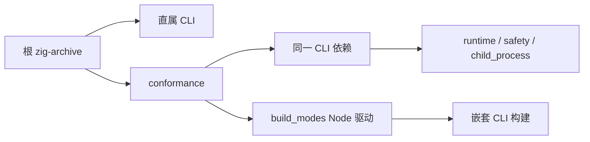

# 本地工具链归档传播修复

## Intent：最终目标

根回归指定的 zig-archive 传递到全部实际 CLI 构建，不因遗漏选项进入下载分支。

## Data：可用证据

根 build 仅传直属 CLI；conformance 不声明该选项，runtime/safety/child_process 重新创建未带参数的 CLI 依赖。build_modes 的 Node 驱动重新安装 CLI，未传归档。

## Edges：边界与限制

不运行完整回归，不增加用例，不绕过归档摘要检查，不捕获网络错误。tests/plugins 的旧动态插件驱动未被当前 build 注册，且依赖已经移除的运行库；不为了传参重新启用废弃功能。

## Answer：交付格式与成功标准

根传参给 conformance；测试包只创建一个带配置的 CLI 依赖，各 helper 接收它；build_modes 通过文件参数接收归档并显式传给嵌套 zig build。执行 help 验证选项接受及构建图配置，完整 Debug/Safe 回归由测试会话执行。

## 验证与自我复核

根目录与 packages/test 的 `zig build --help -Dzig-archive=/tmp/zxc-local-archive-probe` 均退出 0；测试包不再报告 invalid option。测试构建图只有一个 CLI dependency 创建点，runtime/safety/child_process 接收同一实例。build_modes 将归档作为 addFileArg 追踪，Node 驱动转成绝对路径后传入嵌套 build。

这只是参数及构建图预检，不宣称完成离线打包或完整回归；Debug/Safe build/test/dist 由测试会话继续执行。未运行全量测试、未增加测试用例、未更改归档校验或下载行为。
