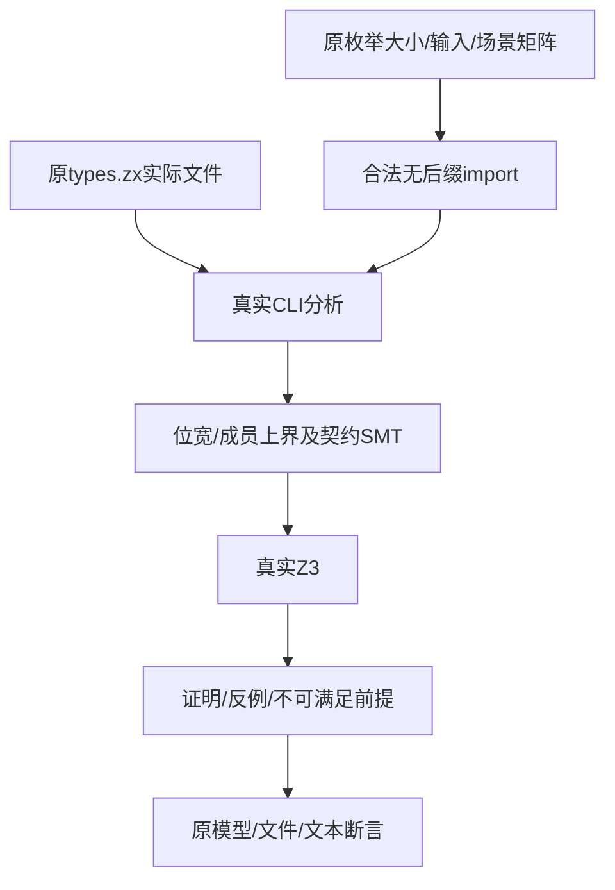
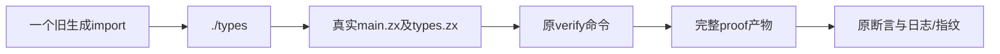

# 枚举证明导入来源同步计划

## Intent：最终目标

恢复既有有限枚举证明CLI门禁，使不同位宽、复合输入、穷尽域、真实反例、不可满足前提及无不动点轮换继续由真实Z3验证。

## Data：可用证据

根第二轮中的枚举证明门禁被共享cases.ts生成的import { Mode } from "./types.zx"拒绝，报project imports must omit the .zx extension。反例/不可满足场景预期status1，却尚未生成proof.smt2，因此读证明文件报ENOENT；并非已有反例模型错误。生成器原七种枚举成员数1/2/3/4/5/8/9、三种输入scalar/nested object/tuple及各scenarios不变。

## Edges：边界与限制

只同步cases.ts一处生成import文字为./types。真实落盘files['types.zx']、枚举成员、名字、输入结构、requires/ensures、返回表达式、场景筛选与预期结果不改。verify_test.ts的实际Z3调用、位宽和合法成员上界SMT断言、solver版本、source.json、precondition/result文本、反例模型最后成员值全部保持。不删除缺少proof文件的错误来让早期语法拒绝冒充预期反例。

## Answer：交付格式与成功标准

一份正式/草稿/固定检出一致，固定版本设置既有ZXC_TEST_SOLVER，执行现有test-enum-verification，ReleaseSafe、-j1。全部原Node参数化声明必须真实生成证明并满足原断言；记录实际数量、退出码与缓存，成功后独立提交push核验哈希。新增测试声明、目录案例、Test262审阅0。

## 自我批判

反例预期退出1不能代表达到求解阶段，必须保留proof文件、位宽、成员范围和model断言。只去掉共享import后缀，不能根据失败输入改枚举宽度或预填sat/unsat。生成源和类型文件是不同路径角色，files键继续types.zx；任何剩余证明失败独立归因。

## 最终执行记录

固定4a513351，设置既有ZXC_TEST_SOLVER，test-enum-verification在ReleaseSafe退出0，31/31构建步骤，原74个Node参数化声明全部实际通过，无Node运行缓存。七种枚举成员数与三种输入形状不变；39项proved、21项counterexample、14项infeasible均由原真实Z3和完整证明文件断言验证。

位宽、成员上界、source证据、solver版本、前提/结果文本和反例最后成员值全部原样通过。没有顶层Zig run test步骤；新增测试声明、目录案例和Test262审阅0。正式/草稿/固定检出一致；唯一来源差异为生成import去后缀，types.zx实际文件键与场景矩阵不变。
