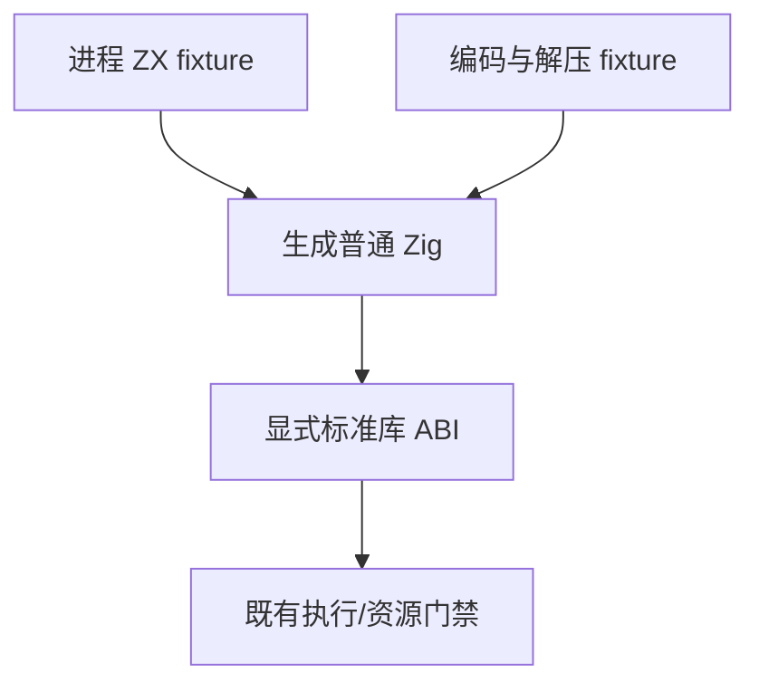

# 标准库夹具导入分组同步计划

## Intent：最终目标

恢复现有标准库生成代码执行与资源门禁，验证进程、编码/摘要及解压缩 API 的原始语义。

## Data：可用证据

根第二轮 child_process、encoding_crypto、gunzip/inflate/inflate_raw 被 spacing 诊断阻断。lint/imports/order.zig 明确普通导入先于 type_only，同类路径按字典序排列；querystring/parse/cases.zx 已有普通/类型分组间空行。child_input 同职责共享夹具也有同样遗漏。URL api 的 library_test.ts 动态 consumer 同样未分开 library 普通/类型导入；保留公开 Input/Output 与原 6193 个 published library 对照。

## Edges：边界与限制

只同步六份正常 ZX fixture 和一份动态 ZX consumer 来源 的导入顺序与组间空行，函数体与公开签名不改。保留同步/带输入子进程执行、验证、生成代码、资源清理与分配失败检查，保留原压缩输入、解压错误、长度限制和摘要/编码结果。不生成新测试，不调整故意验证 formatting 的材料，不改生产实现。

## Answer：交付格式与成功标准

按 IDEA 保留计划、完整草稿、原材料、指纹与固定检出日志。执行 test-child-process、test-child-input、test-zlib、test-standard-runtime、test-url-api-library 的 ReleaseSafe 门禁，记录真实退出和实际/缓存。通过后独立提交 push；两图为架构与数据流。

## 自我批判

spacing 的来源是导入前缀，不是函数体实现；不可用大规模 formatter 重写全部业务表达式。child_input 的原 fixture 同样遵守当前契约，但其编译驱动与 child_process 不同，要分别执行既有门禁才能声称覆盖。

## 最终执行记录

固定 5428317a 加七份最终来源，ReleaseSafe 的 test-child-process、test-child-input、test-zlib、test-standard-runtime、test-url-api-library 全部退出 0，297/297 构建步骤、18876/18876 Zig 原声明实例实际通过。67 个实际 Zig 测试运行步骤无缓存；三个 zlib 在另一门禁下重复引用同一步骤，不重复计入实例。

URL 原 6193 个对照另分别通过独立 Zig 库消费和发布后 ZX 库消费，两次 Node driver 均真实执行；这些脚本行级对照与 Zig 声明实例分别记录。进程结果/验证/生成代码/分配失败/清理、原压缩数据及解压边界、编码/摘要和 URL 输出/错误断言全部保留。

七份来源只改 imports 前缀的顺序与空行；最终源码、完整草稿及固定检出一致。没有新增声明、目录案例、Test262 审阅或运行层，没有改业务函数体与生产标准库。不得用不同消费路线的重复对照计为新增案例或整体根成功。
