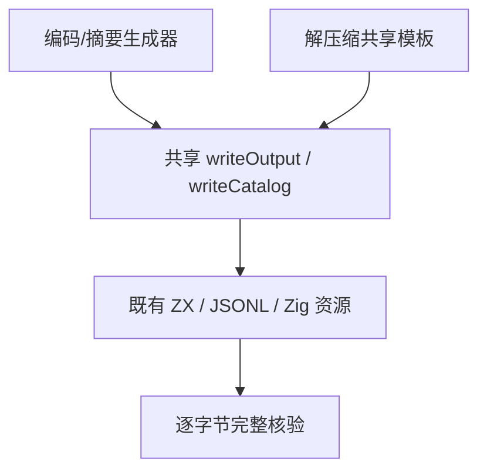

# 标准生成器导入模板同步计划

## Intent：最终目标

恢复编码/摘要及解压缩生成器的完整 --check 门禁，使生成模板与已经通过执行回归的正常夹具保持一致。

## Data：可用证据

第三轮固定 a8895db4 根日志报告 generate_standard.ts --check 的 values.zx 过期，以及 generate_zlib.ts --check 的 gunzip/cases.zx 过期。标准夹具已在 a8895db4 完成导入顺序与组间空行同步，模板仍保存旧前缀。writeOutput 在 --check 下逐字节比较全部输出，不写入文件；writeCatalog 同样逐字节比较完整 JSONL。

## Edges：边界与限制

只改两份生成器中的 ZX 字符串导入前缀：crypto 在 encoding 前，zlib 普通/类型导入之间空行。共享解压模板覆盖三个格式。不改源生成矩阵、案例身份、预期输出、JSONL、资源及正式 ZX 夹具，不新增测试，不修改生产实现。两个正在运行的根检出保持固定，修复另用隔离检出验证。

## Answer：交付格式与成功标准

按 IDEA 保存原来源、完整草稿、指纹、真实日志和结果。两个原始生成器 --check 均退出 0，全部目标输出指纹在前后保持一致；独立提交并 push。随后新固定检出运行根测试及发行，当前失败轮次不可改称通过。

## 自我批判

仅手改 fixture 无法保持可重复生成，是前一部分遗漏的来源边界。本部分必须核验所有输出，不能只检查日志首先报错的文件；也不能运行无 --check 的生成器覆盖输出来消除差异。对既有 TS 不作范围外命名重构，formatter 如改变布局须如实说明。

## 最终执行记录

固定 a8895db4 的两个 --check 分别真实退出 1，精确复现 values.zx 与 gunzip/cases.zx 的模板不同步。仅覆盖两份最终模板后，两个同命令均退出 0；共九份 ZX、JSONL 与 Zig 资源的 SHA-256 在验证前后完全一致，所有原目录案例及预期输出保持不变。Prettier 核验两份生成器均未改布局。此部分新增覆盖 0，不代表第三轮根回归通过。
